# SeedCore — Reasoning Infrastructure for the Physical World

[Run Tests](https://github.com/NeilLi/seedcore/actions/workflows/tests.yml)

SeedCore is an AI-native orchestration system that turns complex real-world environments into reasoning-capable systems.

Instead of treating AI as a chatbot or UI feature, SeedCore treats **reasoning as infrastructure**. It provides the execution, safety, and feedback loops required for large reasoning models—such as **Gemini 3**—to plan, act, and adapt in the physical world.

SeedCore transforms real-world environments into **Intelligent Centers**: living systems where creative, ambiguous, high-surprise requests can be safely planned, executed, and continuously adapted by AI.

## Who This Repository Is For

- **Evaluators / reviewers** → read [Why SeedCore Exists](#why-seedcore-exists), [How It Works](#how-seedcore-works-high-level), and [Closed-Loop Execution](#closed-loop-execution-the-core-loop)
- **System builders / contributors** → jump to [Quick Start](#-quick-start-kubernetes--kuberay), [Architecture Overview](#-architecture-overview), and [Deployment](#-deployment-options)
- **Researchers / architects** → see [Advanced Architecture](docs/architecture/overview/architecture.md) and [Design Notes](docs/design-notes.md)

## Why SeedCore Exists

Most AI applications stop at **generation**:

- text replies
- images
- recommendations

But real environments require **agency**:

- policies must be enforced
- tools must be authorized
- robots and systems must act
- failures must be handled
- intent must be preserved across time

**SeedCore fills this gap.**

**Reasoning models (e.g., Gemini 3) reason. SeedCore executes.**

Together, they form a closed-loop system:

**Intent → Reasoning → Execution → Feedback → Replanning**

**If reasoning models are removed, the system loses planning and replanning.**  
**If SeedCore is removed, reasoning cannot safely reach the real world.**

## How SeedCore Works (High-Level)

SeedCore is built on Ray and modern distributed-systems principles.  
It cleanly separates **thinking** from **doing**.

### 🧠 Reasoning Models — Planning & Reasoning Supervisor

Large reasoning models (e.g., Gemini 3) are integrated as **planning and reasoning engines**, not chatbots.

Reasoning models are responsible for:

- Interpreting complex, multimodal intent
- Reasoning across constraints, policies, and capabilities
- Decomposing intent into a **Task Graph (DAG)**
- Performing dynamic replanning when execution fails

Reasoning models never directly control tools, robots, or infrastructure.

### 🧩 SeedCore — Orchestration & Agency Layer

SeedCore provides everything required to safely turn plans into action:

- **TaskPayload v2.5+** — a structured execution envelope
- **High-surprise detection** — decides when deep reasoning is required
- **Policy Knowledge Graph (PKG)** — deny-by-default safety guardrails
- **Eventization & routing** — converts plans into executable events
- **JIT agent spawning** — materializes capabilities on demand
- **RBAC & tool boundaries** — enforces what agents may do
- **Telemetry & provenance** — records what actually happened
- **Holon Memory** — hierarchical state preservation across guests, devices, and sessions

Every AI decision is **executable, auditable, and reversible**.

## Closed-Loop Execution (The Core Loop)

**The SeedCore Loop:**

1. **Intent** — High-ambiguity request received via TaskPayload v2.5+.
2. **Surprise Check** — System determines if standard logic suffices or if deep reasoning is needed.
3. **Reasoning** — Gemini 3 (or equivalent) decomposes intent into a **Task Graph (DAG)**.
4. **Safety** — Policy Knowledge Graph (PKG) verifies the plan against "deny-by-default" rules.
5. **Execution** — JIT agents materialize to perform tasks.
6. **Adaptation** — Telemetry feeds back to the model for **dynamic replanning** if reality drifts.

This loop is the foundation of **Industrialized Intelligence** — AI systems that can safely operate in the real world.

## Core Architectural Planes

SeedCore uses a **Planes of Control** architecture to separate concerns cleanly.

```mermaid
flowchart TB
    subgraph Intelligence["🧠 Intelligence Plane"]
        A[Reasoning Interface\nContext · Cognition · Model Connectors]
    end
    subgraph Control["🎮 Control Plane"]
        B[Orchestration\nSurprise · Policy · Plan → Execute → Audit]
    end
    subgraph Execution["⚡ Execution Plane"]
        C[Agent Runtime\nCapabilities · RBAC · Telemetry]
    end
    subgraph Infrastructure["⚙️ Infrastructure Plane"]
        D[Substrate\nDrift · Regime · HGNN · Health]
    end
    A --> B
    B --> C
    C --> D
    D -.-> A
```



### 🧠 Intelligence Plane

The reasoning interface layer. It hydrates context, manages long-running cognition, and connects reasoning models (e.g., Gemini 3) to the rest of the system.

### 🎮 Control Plane

The orchestration brain. It detects surprise, enforces policies, decomposes plans, and governs the **Plan → Execute → Audit** cycle.

### ⚡ Execution Plane

A distributed agent runtime. Agents:

- advertise capabilities and skills
- enforce RBAC and tool boundaries
- execute tasks with low latency
- report telemetry and failures

### ⚙️ Infrastructure Plane

The computational substrate. Hosts:

- drift detection (when reality changes)
- regime classification (what mode the system is in)
- structural reasoning (HGNN)
- performance and health monitoring

## Key Capabilities

- **Reasoning-Aware Orchestration** — invokes deep reasoning only when required
- **High-Surprise Handling** — escalates ambiguity into structured planning
- **Policy-First Execution** — no action without authorization
- **Dynamic Capability Management** — agents and skills are spawned just-in-time
- **Memory & Continuity** — **Holon Memory** (hierarchical state preservation across devices and sessions) preserves intent across time and failures

## Vision

SeedCore demonstrates a future where:

- **Reasoning models** (e.g., Gemini 3) provide intellect
- **SeedCore** provides agency
- Physical environments become **adaptive systems**
- AI moves from **generation → execution**

SeedCore is model-agnostic and can integrate with any reasoning-capable model that supports planning and replanning.

*This is not a demo app.*  
*It is reasoning infrastructure.*

---

## 🚀 Quick Start (Kubernetes + KubeRay)

### Prerequisites

- **Kubernetes Tools**: `kubectl`, `kind`, `helm`
- **Docker**: For building and loading images
- **System Requirements**: 16GB+ RAM, 4+ CPU cores recommended
- **Operating System**: Linux with Docker support

### Option 1: Complete Automated Deployment

```bash
# Clone and setup
git clone https://github.com/NeilLi/seedcore.git
cd seedcore

# Configure environment
cp docker/env.example docker/.env

# (Optional) Install dependencies for Ubuntu users
# ./deploy/init-dev-ubuntu.sh

# Run complete deployment pipeline
./deploy/deploy-all.sh
```

### Option 2: Step-by-Step Manual Deployment

See [Deployment Options](#-deployment-options) below for the full manual walkthrough.

### Verify Installation

```bash
# Check Ray dashboard
curl http://localhost:8265/api/version

# Check API health
curl http://localhost:8002/health

# Check Ray Serve services
curl http://localhost:8000/ml/health
curl http://localhost:8000/pipeline/health
curl http://localhost:8000/organism/health
curl http://localhost:8000/cognitive/health
curl http://localhost:8000/ops/state/health
curl http://localhost:8000/ops/energy/health
```

## 🏗️ Architecture Overview

SeedCore Architecture

SeedCore implements a distributed **Control/Execution Plane** architecture using Ray Serve for service orchestration and Ray Actors for distributed computation.

For full technical depth — runtime registry, TaskPayload v2.5+, HGNN, PKG, migrations, and service wiring — see:

- **[Advanced Architecture](docs/architecture/overview/architecture.md)** — Planes of Control, organism runtime, task workflow, and system relationships
- **[Design Notes](docs/design-notes.md)** — Neuro-symbolic framing, biological design principles, and energy-driven dynamics

## 🚀 Deployment Options

### 1. Complete Automated Deployment (Recommended)

```bash
# Clone and setup
git clone https://github.com/NeilLi/seedcore.git
cd seedcore

# Configure environment
cp docker/env.example docker/.env

# (Optional) Install dependencies for Ubuntu users
# ./deploy/init-dev-ubuntu.sh

# Run complete deployment pipeline
./deploy/deploy-all.sh
```

### 2. Step-by-Step Manual Deployment

Dependency order: **Cluster → Core Services → Databases → Storage/RBAC → Ray → Bootstrap → API → Ingress.**


#### 1. Clone and Setup

```bash
git clone https://github.com/NeilLi/seedcore.git
cd seedcore
```

#### 2. Build Docker Image

```bash
./build.sh
```

#### 3. Start the Kubernetes Cluster

```bash
cd deploy
./setup-kind-only.sh
```

#### 4. Deploy Core Services

```bash
./setup-cores.sh
```

#### 5. Initialize Databases

```bash
./init-databases.sh
```

#### 6. Deploy Storage and RBAC

```bash
kubectl apply -f k8s/seedcore-data-pvc.yaml
kubectl apply -f k8s/seedcore-serviceaccount.yaml
kubectl apply -f k8s/seedcore-rolebinding.yaml
kubectl apply -f k8s/allow-api-egress.yaml
kubectl apply -f k8s/allow-api-to-ray-serve.yaml
kubectl apply -f k8s/xgb-pvc.yaml
```

#### 7. Deploy Ray Services

```bash
./setup-ray-serve.sh
kubectl apply -f ray-stable-svc.yaml
```

#### 8. Bootstrap System Components

```bash
./bootstrap.sh
```

```bash
./setup-hal.sh
```

#### 9. Deploy SeedCore API

```bash
./deploy-seedcore-api.sh
```

#### 10. Deploy Ingress & Port Forwarding

```bash
./port-forward.sh
```

## 🔧 Configuration

### Environment Variables

```bash
# Core
SEEDCORE_NS=seedcore-dev
SEEDCORE_STAGE=dev
RAY_ADDRESS=ray://seedcore-svc-head-svc:10001
RAY_NAMESPACE=seedcore-dev

# Databases
POSTGRES_HOST=postgresql
MYSQL_HOST=mysql
REDIS_HOST=redis-master
NEO4J_HOST=neo4j
```

### Ray

- **Ray Version**: 2.33.0
- **Head**: 2 CPU, 16Gi memory (limits)
- **Workers**: 2 CPU, 4Gi memory (limits), replicas via `WORKER_REPLICAS`

## 📊 Monitoring and Management

- **Ray Dashboard**: `kubectl port-forward svc/seedcore-svc-head-svc 8265:8265 -n seedcore-dev` → [http://localhost:8265](http://localhost:8265)
- **Service status**: `kubectl get svc,pods -n seedcore-dev`
- **Logs**: `kubectl logs -l app=seedcore-api -n seedcore-dev -f` (and similar for other components)

## 🛠️ Development Workflow

1. **Start environment**: `./build.sh` then deploy steps above (or `./deploy/deploy-seedcore.sh`).
2. **Code is mounted** at `/project` in-cluster; changes are available without rebuild when configured.
3. **Test**: `curl http://localhost:8000/ml/health` and `curl http://localhost:8002/health`.
4. **Cleanup**: `kind delete cluster --name seedcore-dev` when done.

## 🔍 Troubleshooting

- **Pod not starting**: `kubectl describe pod <pod-name> -n seedcore-dev` and check pod logs.
- **Service unreachable**: `kubectl get endpoints -n seedcore-dev` and service descriptions.
- **Ray issues**: `kubectl exec -it <ray-head-pod> -n seedcore-dev -- ray status`.

See [Operation Manual](docs/OPERATION-MANUAL.MD) and [KIND Cluster Reference](deploy/KIND_CLUSTER_REFERENCE.md) for more.

## 📚 API Reference

### Ray Serve (Port 8000)


| Service     | Path          | Role                                               | Stability |
| ----------- | ------------- | -------------------------------------------------- | --------- |
| ML          | `/ml`         | Regime detection, XGBoost                          | Stable    |
| Cognitive   | `/cognitive`  | Intelligence Plane — reasoning, hydration          | Alpha     |
| Coordinator | `/pipeline`   | Control Plane — `POST /pipeline/route-and-execute` | Alpha     |
| Organism    | `/organism`   | Execution Plane — agents, tools                    | Alpha     |
| State       | `/ops/state`  | State aggregation                                  | Stable    |
| Energy      | `/ops/energy` | Energy/compute                                     | Stable    |


### Standalone API (Port 8002)

- `GET /health`, `GET /readyz`, `GET /healthz/energy`, `GET /healthz/runtime-registry`

Detailed endpoints (health, execute, route-and-execute, metrics) are in [Architecture Overview](docs/architecture/overview/architecture.md) and service code.

## 📖 Additional Documentation


| Doc                                                                      | Description                                              |
| ------------------------------------------------------------------------ | -------------------------------------------------------- |
| [Advanced Architecture](docs/architecture/overview/architecture.md)      | Full Planes of Control, TaskPayload, HGNN, PKG, registry |
| [Design Notes](docs/design-notes.md)                                     | Neuro-symbolic and biological design principles          |
| [Architecture Migration Summary](docs/ARCHITECTURE_MIGRATION_SUMMARY.MD) | System evolution and schema                              |
| [Ray Centralization Guide](docs/RAY_CENTRALIZATION_GUIDE.MD)             | Ray config and deployment                                |
| [Configuration Summary](docs/CONFIGURATION-SUMMARY.MD)                   | Database and service config                              |
| [Database Migrations](deploy/migrations/MIGRATIONS_SUMMARY.md)           | Schema and migrations                                    |


## 🤝 Contributing

1. Fork the repository
2. Create a feature branch
3. Make your changes and test (e.g. via Kubernetes setup)
4. Submit a pull request

## 📄 License

This project is licensed under the terms specified in the [LICENSE](LICENSE) file.

## 🆘 Support

1. Check the [Troubleshooting](#-troubleshooting) section and [Operation Manual](docs/OPERATION-MANUAL.MD)
2. Review [docs/](docs/) and [deploy/](deploy/)
3. Open an issue on GitHub

