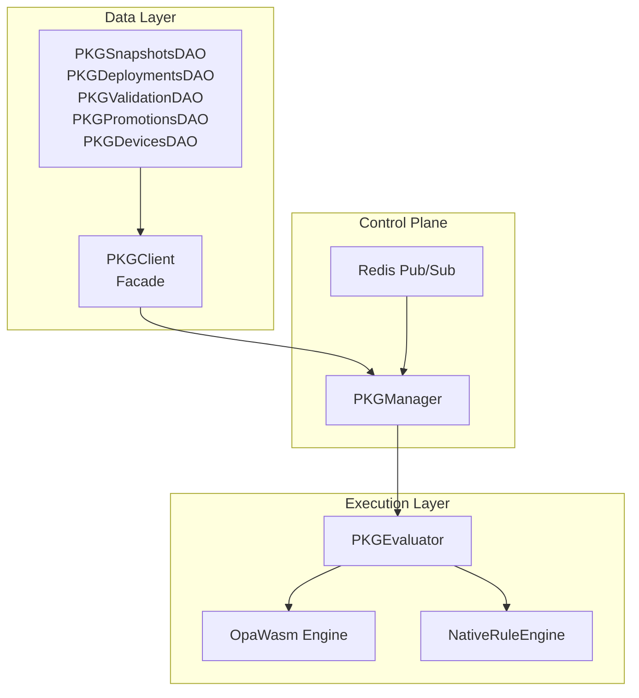
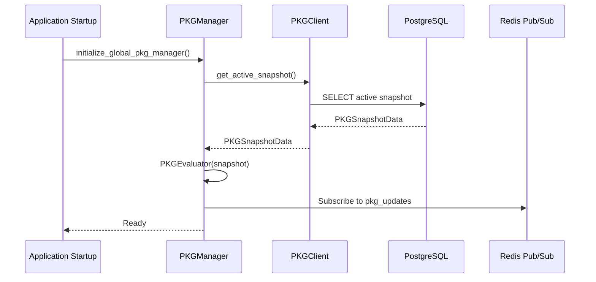
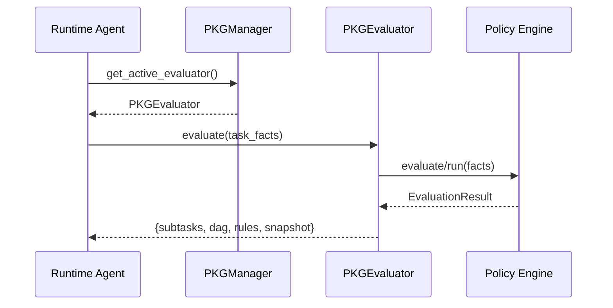
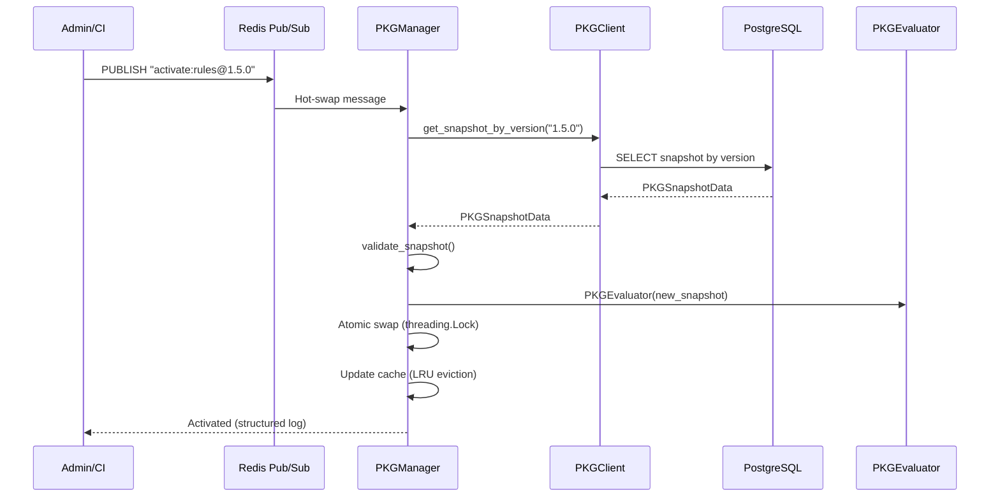

# PKG Module Architecture Documentation

**Policy Knowledge Graph (PKG) Subsystem - Complete Architecture Reference**

## Table of Contents

1. [Purpose and Role](#purpose-and-role)
2. [Core Architectural Components](#core-architectural-components)
3. [Data Flow Overview](#data-flow-overview)
4. [Detailed Component Summaries](#detailed-component-summaries)
5. [Data Model Overview](#data-model-overview)
6. [Runtime Behavior Summary](#runtime-behavior-summary)
7. [Concurrency & Reliability Model](#concurrency--reliability-model)
8. [Observability and Diagnostics](#observability-and-diagnostics)
9. [Extensibility Blueprint](#extensibility-blueprint)
10. [API Reference](#api-reference)
11. [Usage Examples](#usage-examples)

---

## Purpose and Role

The **Policy Knowledge Graph (PKG)** module is an autonomous policy orchestration and reasoning subsystem within the SeedCore distributed platform. It provides:

### Core Capabilities

- **Governance Intelligence**: Dynamic rule enforcement, validation, and promotion tracking
- **Hot-Swappable Policy Logic**: Supports both WASM (OPA-based) and native Python rule engines
- **Policy Lifecycle Automation**: Load, validate, activate, and roll back snapshots safely
- **Unified Evaluation Interface**: Consistent API for all runtime agents, regardless of engine type

### System Integration

The PKG module bridges three critical layers:

```
┌─────────────────┐
│   PostgreSQL    │ ← Persistent State (snapshots, rules, metadata)
└────────┬────────┘
         │
         ▼
┌─────────────────┐
│   PKG Module    │ ← Live Execution (in-memory evaluators)
└────────┬────────┘
         │
         ▼
┌─────────────────┐
│  Redis Pub/Sub  │ ← Dynamic Propagation (hot-swap coordination)
└─────────────────┘
```

---

## Core Architectural Components

### Module Structure

| Layer | Module | Responsibility | Key Classes |
|-------|--------|--------------|--------------|
| **Persistence / DAO** | `ops/pkg/dao.py` | Direct PostgreSQL interaction, snapshot composition | `PKGSnapshotsDAO`, `PKGDeploymentsDAO`, `PKGValidationDAO`, `PKGPromotionsDAO`, `PKGDevicesDAO` |
| **Facade** | `ops/pkg/client.py` | Unified client interface, composes DAOs | `PKGClient` |
| **Evaluation Engine** | `ops/pkg/evaluator.py` | Executes policies using WASM or native rule engine | `PKGEvaluator`, `OpaWasm`, `NativeRuleEngine` |
| **Orchestration / Control Plane** | `ops/pkg/manager.py` | Lifecycle manager, hot-swap control, Redis integration | `PKGManager` |

### Component Responsibilities



---

## Data Flow Overview

### Initialization Flow



### Evaluation Flow



### Hot-Swap Flow



---

## Detailed Component Summaries

### A. PKGClient — Policy Data Access Layer

**Location**: `ops/pkg/client.py`

A unified facade client that composes specialized DAOs for PKG operations.

#### Responsibilities

- **Snapshot Management**: Fetch active or versioned snapshots
- **Engine Resolution**: Automatically determines `wasm` or `native` engine type
- **Hierarchical Data Assembly**: Builds complete rule structure:
  - Rules → Conditions → Emissions → Subtask Types
- **Metadata Operations**: Manage validation, promotion, deployment, and device telemetry

#### Key Features

- **Unified Interface**: Single entry point for all PKG operations
- **DAO Composition**: Delegates to specialized DAOs while maintaining backward compatibility
- **Direct DAO Access**: Supports `client.snapshots.get_active_snapshot()` for advanced usage

#### Data Structures

```python
@dataclass(frozen=True)
class PKGSnapshotData:
    id: int
    version: str
    engine: str  # 'wasm' or 'native'
    wasm_artifact: Optional[bytes]
    checksum: Optional[str]
    rules: List[Dict[str, Any]]  # For native engine
```

#### Usage Example

```python
from seedcore.ops.pkg import PKGClient

client = PKGClient()

# Get active snapshot
snapshot = await client.get_active_snapshot()

# Get deployments
deployments = await client.get_deployments(target="router")

# Direct DAO access
coverage = await client.deployments.get_deployment_coverage()
```

---

### B. PKGEvaluator — Policy Execution Core

**Location**: `ops/pkg/evaluator.py`

Encapsulates one loaded snapshot and provides a unified `evaluate()` entrypoint regardless of engine backend.

#### Supported Engines

##### 1. OPA WASM Engine (`OpaWasm`)

- Executes precompiled Rego policies via `wasmtime`
- Fallback mode available when `wasmtime` is absent
- WASM caching by checksum for performance
- Supports OPA standard entrypoints (`evaluate`, `opa_eval`)

**Initialization**:
```python
engine = OpaWasm.load_from_bytes(wasm_bytes, checksum="sha256-abc")
```

##### 2. Native Rule Engine (`NativeRuleEngine`)

- Interprets `pkg_policy_rules` with hierarchical conditions and emissions
- Uses `PredicateEvaluator` for declarative condition evaluation
- Supports condition types: `TAG`, `SIGNAL`, `FACT`, `VALUE`
- Generates subtasks, rule provenance, and task DAG

**Rule Evaluation**:
- Processes rules in priority order
- Evaluates conditions using type-aware logic
- Processes emissions to generate subtasks
- Builds DAG from relationship types (`EMITS`, `ORDERS`, `GATE`)

#### Output Format

```python
{
    "subtasks": [
        {
            "name": "escalate_vip",
            "type": "escalate",
            "params": {"level": "high"},
            "rule_id": "rule-001",
            "rule_name": "high_priority_vip"
        }
    ],
    "dag": [
        {
            "from": "task1",
            "to": "task2",
            "type": "sequential",
            "rule": "rule-001"
        }
    ],
    "rules": [
        {
            "rule_id": "rule-001",
            "rule_name": "high_priority_vip",
            "rule_priority": 10,
            "matched_conditions": 1,
            "emissions_count": 1
        }
    ],
    "snapshot": "rules@1.4.0"
}
```

#### Advanced Design Features

- **Engine Protocol**: `PolicyEngine` protocol for consistent interfaces
- **Dynamic Registry**: `ENGINE_REGISTRY` for extensible engine types
- **Structured Logging**: Performance timing and evaluation metrics
- **Operator Support**: `=`, `!=`, `>=`, `<=`, `>`, `<`, `IN`, `EXISTS`, `MATCHES` (regex)

#### Usage Example

```python
from seedcore.ops.pkg import PKGEvaluator, PKGSnapshotData

snapshot = PKGSnapshotData(
    id=1,
    version="rules@1.4.0",
    engine="native",
    wasm_artifact=None,
    checksum="sha256-abc",
    rules=[...]
)

evaluator = PKGEvaluator(snapshot)

task_facts = {
    "tags": ["vip", "allergen"],
    "signals": {"x2": 0.8, "x6": 0.95},
    "context": {"domain": "hotel_ops", "task_type": "guest_request"}
}

result = evaluator.evaluate(task_facts)
```

---

### C. PKGManager — Lifecycle & Governance Controller

**Location**: `ops/pkg/manager.py`

Acts as the runtime control plane for PKG snapshots, managing lifecycle, hot-swapping, and providing thread-safe access.

#### Responsibilities

1. **Initialization**: Load active policy snapshot from PostgreSQL on startup
2. **Hot-Swapping**: Subscribe to Redis channel (`pkg_updates`) for dynamic updates
3. **Thread Safety**: Atomic evaluator pointer swap using `threading.Lock`
4. **Metadata**: Provide introspective information about current policy state
5. **Multi-Version Caching**: Maintain LRU cache of evaluators for A/B testing and rollback

#### Key Features

- **Thread-Safe Evaluator Access**: `get_active_evaluator()` is lock-guarded
- **Resilient Redis Listener**: Auto-reconnect with exponential backoff and jitter
- **Automatic Validation**: Snapshot validation before activation
- **Global Singleton**: System-wide PKG access via `get_global_pkg_manager()`
- **Async Context Manager**: Clean resource management

#### Optimizations

- **Multi-Version Evaluator Registry**: Caches up to 3 versions for quick rollback
- **LRU Cache Eviction**: Timestamp-based eviction (not lexicographic)
- **Structured JSON Logging**: Lifecycle events with timing metrics
- **Exponential Backoff**: Redis reconnection resilience
- **Health Status Tracking**: Degraded mode detection and reporting

#### Configuration Constants

```python
PKG_REDIS_CHANNEL = "pkg_updates"
MAX_EVALUATOR_CACHE_SIZE = 3
MAX_RECONNECT_BACKOFF = 60  # seconds
```

#### Usage Example

```python
from seedcore.ops.pkg import PKGClient, initialize_global_pkg_manager

# Initialize global manager
manager = await initialize_global_pkg_manager()

# Get active evaluator
evaluator = manager.get_active_evaluator()
if evaluator:
    result = evaluator.evaluate(task_facts)

# Get metadata
metadata = manager.get_metadata()
print(f"Active version: {metadata['version']}")
print(f"Cached versions: {metadata['cached_versions']}")

# Get health status
health = manager.get_health_status()
print(f"Healthy: {health['healthy']}")
print(f"Redis connected: {health['redis_connected']}")

# Async context manager
async with PKGManager(pkg_client, redis_client) as manager:
    evaluator = manager.get_active_evaluator()
    result = evaluator.evaluate(task_facts)
```

#### Hot-Swap Command

To trigger a hot-swap from external system:

```bash
redis-cli PUBLISH pkg_updates "activate:rules@1.5.0"
```

---

## Data Model Overview

### Core Tables

#### `pkg_snapshots`
Versioned policy snapshots (governance root).

| Column | Type | Description |
|--------|------|-------------|
| `id` | SERIAL | Primary key |
| `version` | TEXT | Unique version string (e.g., `rules@1.4.0`) |
| `env` | pkg_env | Environment (`prod`, `staging`, `dev`) |
| `checksum` | TEXT | SHA256 checksum (64 hex chars) |
| `is_active` | BOOLEAN | Active flag (only one per env) |
| `created_at` | TIMESTAMPTZ | Creation timestamp |

#### `pkg_snapshot_artifacts`
Binary policy packages (WASM/Rego bundles).

| Column | Type | Description |
|--------|------|-------------|
| `snapshot_id` | INT | Foreign key to `pkg_snapshots` |
| `artifact_type` | pkg_artifact_type | `wasm_pack` or `rego_bundle` |
| `artifact_bytes` | BYTEA | Binary artifact data |
| `sha256` | TEXT | SHA256 checksum |

#### `pkg_policy_rules`
Native rule definitions.

| Column | Type | Description |
|--------|------|-------------|
| `id` | UUID | Primary key |
| `snapshot_id` | INT | Foreign key to `pkg_snapshots` |
| `rule_name` | TEXT | Rule identifier |
| `priority` | INT | Evaluation priority (higher = first) |
| `rule_source` | TEXT | Source code (YAML/Datalog/Rego) |
| `disabled` | BOOLEAN | Disabled flag |

#### `pkg_rule_conditions`
Rule condition definitions.

| Column | Type | Description |
|--------|------|-------------|
| `rule_id` | UUID | Foreign key to `pkg_policy_rules` |
| `condition_type` | pkg_condition_type | `TAG`, `SIGNAL`, `VALUE`, `FACT` |
| `condition_key` | TEXT | Field path or key |
| `operator` | pkg_operator | `=`, `!=`, `>=`, `<=`, `>`, `<`, `IN`, `EXISTS`, `MATCHES` |
| `value` | TEXT | Comparison value |
| `position` | INT | Evaluation order |

#### `pkg_rule_emissions`
Action/subtask definitions emitted by rules.

| Column | Type | Description |
|--------|------|-------------|
| `rule_id` | UUID | Foreign key to `pkg_policy_rules` |
| `subtask_type_id` | UUID | Foreign key to `pkg_subtask_types` |
| `relationship_type` | pkg_relation | `EMITS`, `ORDERS`, `GATE` |
| `params` | JSONB | Subtask parameters |
| `position` | INT | Emission order |

#### `pkg_subtask_types`
Metadata for subtask types.

| Column | Type | Description |
|--------|------|-------------|
| `id` | UUID | Primary key |
| `snapshot_id` | INT | Foreign key to `pkg_snapshots` |
| `name` | TEXT | Subtask type name |
| `default_params` | JSONB | Default parameters |

### Operational Tables

#### `pkg_deployments`
Canary deployments and targeted rollouts.

| Column | Type | Description |
|--------|------|-------------|
| `id` | BIGSERIAL | Primary key |
| `snapshot_id` | INT | Foreign key to `pkg_snapshots` |
| `target` | TEXT | Target identifier (`router`, `edge:door`) |
| `region` | TEXT | Geographic region |
| `percent` | INT | Rollout percentage (0-100) |
| `is_active` | BOOLEAN | Active deployment flag |

#### `pkg_promotions`
Promotion/rollback audit trail.

| Column | Type | Description |
|--------|------|-------------|
| `id` | BIGSERIAL | Primary key |
| `snapshot_id` | INT | Foreign key to `pkg_snapshots` |
| `from_version` | TEXT | Previous version |
| `to_version` | TEXT | New version |
| `actor` | TEXT | Who performed the action |
| `action` | TEXT | `promote` or `rollback` |
| `metrics` | JSONB | Performance metrics (p95, validation summary) |
| `success` | BOOLEAN | Whether promotion succeeded |

#### `pkg_validation_runs`
Policy validation results.

| Column | Type | Description |
|--------|------|-------------|
| `id` | BIGSERIAL | Primary key |
| `snapshot_id` | INT | Foreign key to `pkg_snapshots` |
| `started_at` | TIMESTAMPTZ | Validation start time |
| `finished_at` | TIMESTAMPTZ | Validation completion time |
| `success` | BOOLEAN | Validation result |
| `report` | JSONB | Detailed validation report |

#### `pkg_device_versions`
Edge telemetry records.

| Column | Type | Description |
|--------|------|-------------|
| `device_id` | TEXT | Primary key (e.g., `door:D-1510`) |
| `device_type` | TEXT | Device type (`door`, `robot`) |
| `region` | TEXT | Geographic region |
| `snapshot_id` | INT | Foreign key to `pkg_snapshots` |
| `version` | TEXT | Version string |
| `last_seen` | TIMESTAMPTZ | Last heartbeat timestamp |

### Database Views

#### `pkg_active_artifact`
Active artifact per environment.

```sql
SELECT env, snapshot_id, version, artifact_type, size_bytes, sha256
FROM pkg_active_artifact
WHERE env = 'prod'
```

#### `pkg_rules_expanded`
Rules with emissions flattened (audit-friendly).

#### `pkg_deployment_coverage`
Deployment coverage statistics showing devices on intended snapshot vs total.

### Database Functions

#### `pkg_check_integrity()`
Validates PKG data consistency (cross-snapshot emission mismatches).

#### `pkg_active_snapshot_id(env)`
Quick helper to get active snapshot ID for an environment.

#### `pkg_promote_snapshot(snapshot_id, env, actor, reason)`
Promotes a snapshot to active with audit trail.

---

## Runtime Behavior Summary

### Initialization Phase

```python
# Application startup
manager = await initialize_global_pkg_manager(
    pkg_client=PKGClient(),
    redis_client=redis_client
)

# Manager internally:
# 1. Loads active snapshot from PostgreSQL
# 2. Creates PKGEvaluator from snapshot
# 3. Subscribes to Redis channel "pkg_updates"
# 4. Starts background listener task
```

### Evaluation Phase

```python
# Runtime agent evaluation
manager = get_global_pkg_manager()
evaluator = manager.get_active_evaluator()

if evaluator:
    task_facts = {
        "tags": ["vip"],
        "signals": {"x2": 0.8},
        "context": {"domain": "hotel_ops"}
    }
    
    result = evaluator.evaluate(task_facts)
    # Returns: {subtasks, dag, rules, snapshot}
```

### Hot-Swap Phase

```bash
# External trigger (CI/CD, admin tool)
redis-cli PUBLISH pkg_updates "activate:rules@1.5.0"
```

**Internal Sequence**:
1. Redis listener receives message
2. Manager fetches new snapshot from database
3. Validates snapshot (WASM artifact, checksum, etc.)
4. Creates new `PKGEvaluator` instance
5. Performs atomic pointer swap (threading.Lock)
6. Updates LRU cache (evicts oldest if needed)
7. Logs structured event with timing

### Validation & Promotion Phase

```python
# Create validation run
run_id = await client.create_validation_run(snapshot_id=1)

# Run validation tests
for fixture in fixtures:
    result = evaluator.evaluate(fixture['input'])
    assert result == fixture['expect']

# Finish validation
await client.finish_validation_run(
    run_id=run_id,
    success=True,
    report={"passed": 10, "failed": 0}
)

# Promote snapshot
promo_id = await client.create_promotion(
    snapshot_id=1,
    actor="admin",
    action="promote",
    reason="All validation tests passed",
    metrics={"p95": 50, "validation": "passed"}
)
```

### Telemetry Phase

```python
# Device heartbeat update
await client.update_device_heartbeat(
    device_id="door:D-1510",
    device_type="door",
    snapshot_id=1,
    version="rules@1.4.0",
    region="us-west"
)

# Get deployment coverage
coverage = await client.get_deployment_coverage(target="router")
# Returns: {devices_on_snapshot: 45, devices_total: 50}
```

---

## Concurrency & Reliability Model

### Concurrency Model

**Hybrid Async/Sync Design**:

- **Async I/O**: Database queries and Redis operations use `asyncio`
- **Thread-Safe Swaps**: Atomic pointer swaps use `threading.Lock` (not `asyncio.Lock`)
- **Cross-Boundary Safety**: `threading.Lock` ensures consistency across sync/async contexts

**Rationale**:
- `threading.Lock` works for both sync and async code paths
- `asyncio.Lock` only works within async context
- Runtime agents may call `get_active_evaluator()` from sync code

### Reliability Model

#### State Management

- **Ephemeral In-Memory State**: Evaluators are cached in memory, not persisted
- **Database as Source of Truth**: All state is reconstructable from PostgreSQL
- **Redis for Coordination**: Used for hot-swap triggers, not state storage

#### Failure Modes

1. **Database Unavailable**:
   - Manager starts in degraded mode
   - Logs error, continues without active policy
   - Health status reflects degraded state

2. **Redis Unavailable**:
   - Manager starts without hot-swap capability
   - Logs warning, continues with manual activation
   - Hot-swap can be re-enabled when Redis recovers

3. **Snapshot Load Failure**:
   - Manager marks itself as degraded
   - Continues operation with previous evaluator (if available)
   - Logs structured error event

4. **WASM Runtime Unavailable**:
   - OpaWasm engine falls back to no-op mode
   - Returns empty evaluation result
   - Logs warning about fallback mode

#### Recovery Mechanisms

- **Automatic Redis Reconnection**: Exponential backoff with jitter
- **Snapshot Revalidation**: Always validates before activation
- **Graceful Degradation**: Continues operation in degraded mode when possible

### Thread Safety Guarantees

```python
# Thread-safe evaluator access
def get_active_evaluator(self) -> Optional[PKGEvaluator]:
    with self._swap_lock:  # threading.Lock
        return self._evaluators.get(self._active_version)[0]
```

**Guarantees**:
- No race conditions during hot-swap
- Consistent evaluator reference during swap
- Atomic pointer update (O(1) operation)

---

## Observability and Diagnostics

### Structured Logging

All major events emit structured JSON logs:

#### Lifecycle Events

```python
# Snapshot load
{
    "event": "snapshot_load_start",
    "version": "rules@1.4.0",
    "source": "startup",
    "timestamp": 1234567890.123
}

# Snapshot activation
{
    "event": "snapshot_activated",
    "version": "rules@1.4.0",
    "previous_version": "rules@1.3.0",
    "source": "redis",
    "swap_duration_ms": 45.2,
    "timestamp": 1234567890.123
}

# Evaluation
{
    "event": "pkg_evaluation_complete",
    "snapshot": "rules@1.4.0",
    "engine": "native",
    "duration_ms": 12.5,
    "subtasks_count": 3,
    "rules_matched": 2
}
```

#### Error Events

```python
{
    "event": "snapshot_activation_failed",
    "version": "rules@1.5.0",
    "source": "redis",
    "error": "Snapshot missing WASM artifact",
    "error_type": "ValueError",
    "duration_ms": 5.1,
    "timestamp": 1234567890.123
}
```

### Metadata API

#### `PKGManager.get_metadata()`

Returns comprehensive metadata about active snapshot and manager state:

```python
{
    "version": "rules@1.4.0",
    "loaded_at": 1234567890.123,
    "engine": "wasm",
    "loaded": True,
    "error": None,
    "last_activation": 1234567890.123,
    "cached_versions": ["rules@1.4.0", "rules@1.3.0"],
    "cache_size": 2,
    "cache_limit": 3,
    "healthy": True,
    "degraded_mode": False,
    "last_error": None
}
```

#### `PKGManager.get_health_status()`

Returns health indicators for monitoring:

```python
{
    "healthy": True,
    "degraded_mode": False,
    "last_error": None,
    "last_activation": 1234567890.123,
    "active_version": "rules@1.4.0",
    "cached_versions_count": 2,
    "redis_connected": True
}
```

### Database Views for Operational Insights

#### Deployment Coverage Query

```sql
SELECT * FROM pkg_deployment_coverage
WHERE target = 'router' AND region = 'global';

-- Returns:
-- devices_on_snapshot: 45
-- devices_total: 50
-- snapshot_version: 'rules@1.4.0'
```

#### Active Artifact Query

```sql
SELECT * FROM pkg_active_artifact
WHERE env = 'prod';

-- Returns:
-- version: 'rules@1.4.0'
-- artifact_type: 'wasm_pack'
-- size_bytes: 1048576
-- sha256: 'abc123...'
```

### Metrics (Recommended)

**Suggested Metrics to Track**:

- `pkg_snapshot_load_duration_seconds` (histogram)
- `pkg_evaluation_duration_seconds` (histogram, by engine type)
- `pkg_hotswap_count` (counter)
- `pkg_redis_reconnect_count` (counter)
- `pkg_active_version` (gauge)
- `pkg_cached_versions_count` (gauge)
- `pkg_degraded_mode` (gauge, 0 or 1)

---

## Extensibility Blueprint

### Near-Term Extensions

#### 1. Multi-Engine Orchestration

Combine WASM and native evaluations in hybrid mode:

```python
class HybridEngine:
    def evaluate(self, task_facts):
        wasm_result = self.wasm_engine.evaluate(task_facts)
        native_result = self.native_engine.evaluate(task_facts)
        
        # Merge results with conflict resolution
        return self._merge_results(wasm_result, native_result)
```

#### 2. Policy Simulation Sandbox

Dry-run evaluations for version testing:

```python
# Create sandbox evaluator without activating
sandbox_evaluator = PKGEvaluator(snapshot)
result = sandbox_evaluator.evaluate(test_facts)

# Compare with expected results
assert result == expected_output
```

#### 3. Graph Memory Embedding

Represent rules and dependencies as semantic knowledge graph:

- Store rule relationships in Neo4j or DGL
- Enable graph-based rule discovery
- Support similarity search for rule matching

### Long-Term Extensions

#### 4. Distributed PKG Cache

Cluster-wide shared snapshot memory:

- Use Redis Streams or NATS for coordination
- Shared memory cache across nodes
- Consistent snapshot version across cluster

#### 5. LLM-Based Rule Engine

Register new engine type:

```python
class LLMRuleEngine:
    def evaluate(self, task_facts):
        # Use LLM to generate policy decisions
        prompt = self._build_prompt(task_facts)
        response = self.llm_client.complete(prompt)
        return self._parse_response(response)

register_engine("llm", LLMRuleEngine)
```

#### 6. Audit Service

Signed promotion and validation events:

- Cryptographic signatures for promotions
- Immutable audit log
- Compliance-ready event trail

#### 7. Policy Versioning Strategy

- Semantic versioning for snapshots
- Dependency tracking between versions
- Automatic rollback on regression detection

---

## API Reference

### PKGClient

```python
class PKGClient:
    # Snapshots
    async def get_active_snapshot() -> Optional[PKGSnapshotData]
    async def get_snapshot_by_version(version: str) -> Optional[PKGSnapshotData]
    async def get_active_artifact(env: str = "prod") -> Optional[Dict[str, Any]]
    
    # Deployments
    async def get_deployments(
        snapshot_id: Optional[int] = None,
        target: Optional[str] = None,
        region: Optional[str] = None,
        active_only: bool = True
    ) -> List[Dict[str, Any]]
    async def get_deployment_coverage(
        target: Optional[str] = None,
        region: Optional[str] = None
    ) -> List[Dict[str, Any]]
    
    # Validation
    async def get_validation_fixtures(snapshot_id: int) -> List[Dict[str, Any]]
    async def create_validation_run(
        snapshot_id: int,
        started_at: Optional[datetime] = None
    ) -> int
    async def finish_validation_run(
        run_id: int,
        success: bool,
        report: Optional[Dict[str, Any]] = None
    ) -> None
    async def get_validation_runs(
        snapshot_id: Optional[int] = None,
        limit: int = 100
    ) -> List[Dict[str, Any]]
    
    # Promotions
    async def get_promotions(
        snapshot_id: Optional[int] = None,
        limit: int = 100
    ) -> List[Dict[str, Any]]
    async def create_promotion(
        snapshot_id: int,
        actor: str,
        action: str = "promote",
        reason: Optional[str] = None,
        metrics: Optional[Dict[str, Any]] = None,
        success: bool = True
    ) -> int
    
    # Devices
    async def get_device_versions(
        device_type: Optional[str] = None,
        region: Optional[str] = None,
        snapshot_id: Optional[int] = None
    ) -> List[Dict[str, Any]]
    async def update_device_heartbeat(
        device_id: str,
        device_type: str,
        snapshot_id: Optional[int] = None,
        version: Optional[str] = None,
        region: str = "global"
    ) -> None
    
    # Helpers
    async def check_integrity() -> Dict[str, Any]
```

### PKGEvaluator

```python
class PKGEvaluator:
    def __init__(snapshot: PKGSnapshotData)
    
    def evaluate(task_facts: Dict[str, Any]) -> Dict[str, Any]:
        """
        Returns:
            {
                "subtasks": List[Dict],
                "dag": List[Dict],
                "rules": List[Dict],
                "snapshot": str
            }
        """
    
    # Properties
    version: str
    engine_type: str
    loaded_at: float
```

### PKGManager

```python
class PKGManager:
    def __init__(pkg_client: PKGClient, redis_client: Any)
    
    # Lifecycle
    async def start() -> None
    async def stop() -> None
    async def __aenter__(self) -> "PKGManager"
    async def __aexit__(self, exc_type, exc_val, exc_tb) -> None
    
    # Public API
    def get_active_evaluator() -> Optional[PKGEvaluator]
    def get_evaluator_by_version(version: str) -> Optional[PKGEvaluator]
    def get_metadata() -> Dict[str, Any]
    def get_health_status() -> Dict[str, Any]
```

### Global Functions

```python
def get_global_pkg_manager() -> Optional[PKGManager]

async def initialize_global_pkg_manager(
    pkg_client: Optional[PKGClient] = None,
    redis_client: Optional[Any] = None
) -> PKGManager
```

---

## Usage Examples

### Example 1: Basic Usage

```python
from seedcore.ops.pkg import (
    initialize_global_pkg_manager,
    get_global_pkg_manager,
    PKGClient
)

# Initialize at application startup
async def startup():
    manager = await initialize_global_pkg_manager()
    return manager

# Use in runtime agent
async def process_request(task_facts):
    manager = get_global_pkg_manager()
    if not manager:
        return None
    
    evaluator = manager.get_active_evaluator()
    if not evaluator:
        return None
    
    result = evaluator.evaluate(task_facts)
    return result
```

### Example 2: Hot-Swap Deployment

```python
# In CI/CD pipeline
import redis.asyncio as aioredis

async def deploy_new_policy(version: str):
    redis_client = aioredis.from_url("redis://localhost:6379")
    
    # Publish activation message
    await redis_client.publish("pkg_updates", f"activate:{version}")
    
    # Verify activation
    manager = get_global_pkg_manager()
    if manager:
        metadata = manager.get_metadata()
        assert metadata['version'] == version
```

### Example 3: A/B Testing

```python
# Get evaluator for specific version
manager = get_global_pkg_manager()
test_evaluator = manager.get_evaluator_by_version("rules@1.5.0-beta")

if test_evaluator:
    # Test new version
    result = test_evaluator.evaluate(test_facts)
    
    # Compare with active version
    active_evaluator = manager.get_active_evaluator()
    active_result = active_evaluator.evaluate(test_facts)
    
    # Analyze differences
    compare_results(result, active_result)
```

### Example 4: Validation Pipeline

```python
async def validate_snapshot(snapshot_id: int):
    client = PKGClient()
    
    # Get fixtures
    fixtures = await client.get_validation_fixtures(snapshot_id)
    
    # Create validation run
    run_id = await client.create_validation_run(snapshot_id)
    
    # Get snapshot
    snapshot = await client.get_snapshot_by_version(...)
    evaluator = PKGEvaluator(snapshot)
    
    # Run validation
    passed = 0
    failed = 0
    for fixture in fixtures:
        result = evaluator.evaluate(fixture['input'])
        if result == fixture['expect']:
            passed += 1
        else:
            failed += 1
    
    # Finish validation
    await client.finish_validation_run(
        run_id=run_id,
        success=(failed == 0),
        report={"passed": passed, "failed": failed}
    )
```

### Example 5: Monitoring Integration

```python
from prometheus_client import Gauge, Histogram

# Metrics
pkg_active_version = Gauge('pkg_active_version', 'Active PKG snapshot version')
pkg_evaluation_duration = Histogram('pkg_evaluation_duration_seconds', 'PKG evaluation duration')

async def monitor_pkg():
    manager = get_global_pkg_manager()
    if not manager:
        return
    
    # Update metrics
    metadata = manager.get_metadata()
    health = manager.get_health_status()
    
    # Set version label
    pkg_active_version.set(1 if metadata['version'] else 0)
    
    # Track evaluation
    evaluator = manager.get_active_evaluator()
    if evaluator:
        with pkg_evaluation_duration.time():
            result = evaluator.evaluate(test_facts)
```

---

## Summary Statement

The **PKG module** constitutes a complete, production-ready policy intelligence subsystem that integrates:

- **Declarative Governance**: Versioned policy snapshots with full audit trail
- **Dynamic Reasoning**: Hot-swappable WASM and native rule engines
- **Distributed Lifecycle Control**: Redis-based coordination for multi-node deployments

### Architectural Achievements

✅ **Clean Separation of Concerns**: Persistence (DAO), Execution (Evaluator), Orchestration (Manager)  
✅ **Unified Async/Sync API**: Thread-safe access across sync/async boundaries  
✅ **Extensible Engine Design**: Protocol-based architecture for future engines (LLM, graph-based)  
✅ **Production-Ready Resilience**: Degraded mode, automatic recovery, structured observability  
✅ **Operational Excellence**: Multi-version caching, LRU eviction, health monitoring

### In Architectural Terms

The PKG module operates as a **micro-governance kernel**: a self-contained, hot-swappable, and auditable policy brain that enables dynamic policy orchestration across distributed agent swarms.

---

## Related Documentation

- [Database Migrations](../deploy/migrations/013_pkg_core.sql) - PKG schema definition
- [PKG Deployment Guide](../deploy/PKG_DEPLOYMENT_GUIDE.md) - Deployment procedures
- [Architecture Migration Summary](./ARCHITECTURE_MIGRATION_SUMMARY.MD) - Overall system architecture

---

**Last Updated**: 2024  
**Version**: 1.0.0  
**Maintainer**: SeedCore Team

