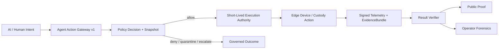

# SeedCore One-Page Overview

## Executive Summary

Agent frameworks help AI decide what to do.

Prompt guardrails control what AI says.

SeedCore controls what AI is allowed to execute.

SeedCore is a governed execution runtime for autonomous systems. It sits
between AI intent and real-world execution, verifying delegation, policy scope,
asset state, hardware authority, custody telemetry, and evidence requirements
before execution authority can exist.

Unlike an AI agent framework or a prompt guardrail, SeedCore is a deterministic
execution gate. It rejects ambient authority, mints short-lived
scope-bound execution authority only when policy admits the action, and
produces replayable evidence chains that can be verified after the fact.

The core runtime is already implemented and contract-tested, including Agent
Action Gateway v1, scoped execution authority, Policy Decision Points,
evidence bundles, result verification, generic Restricted Custody Transfer
proof surfaces, and replay verification primitives. We are packaging this into
a rare-shoe Restricted Custody Transfer demo to show how SeedCore binds
authentication, delegated AI intent, custody telemetry, and verifier closure
into one replayable proof chain for investor and pilot conversations.

## What We Do

SeedCore builds the trust/runtime layer for autonomous systems. As AI agents
and robotic workflows begin initiating real-world actions, enterprises need
infrastructure that can turn business policy into executable authority.

SeedCore receives agentic intent, evaluates it through a Policy Decision Point,
checks explicit delegation and approval envelopes, validates source
registration and asset state, and confirms physical scope, hardware identity,
custody state, and evidence requirements before any execution authority can
exist.

SeedCore rejects ambient authority: a logged-in agent, tool call, or workflow
step is not automatically authorized to act. Authority must be explicit,
scoped, time-bounded, asset-bound, and evidence-conditioned, so that execution
is governed rather than assumed.

After execution, SeedCore binds signed telemetry back to the evaluated request
and produces replayable proof surfaces for public verification and operator
forensics. This turns autonomous execution into a verifiable workflow rather
than a loose operational log.

## Four Critical Questions

- **Who authorized this action?** SeedCore verifies explicit delegation and
  approval envelopes so authority is attributable and scoped.
- **Was the action policy-admissible?** The Policy Decision Point
  deterministically evaluates whether the requested operation is allowed under
  current policy and state.
- **Did the physical-world evidence match the approved intent?** Signed
  telemetry and evidence requirements must match the evaluated request and
  permitted scope.
- **Can the workflow be replayed and verified later?** SeedCore produces
  replayable evidence chains and proof surfaces for audit, dispute resolution,
  and forensics.

## Execution Flow

```text
AI Intent
-> Agent Action Gateway
-> Policy Decision Point
-> Bounded Execution Authority
-> Signed Telemetry
-> Result Verifier
-> Public Proof + Operator Forensics
```



Every decision can be reconstructed from the request, policy snapshot, approval
envelope, authority token, evidence bundle, receipts, and verifier outcome. If
any gate fails, such as scope mismatch, stale telemetry, missing approvals, or
inconsistent evidence, the workflow denies or quarantines. There are no silent
failures.

## Why SeedCore Is Different

- **Policy is the execution gate, not advice.** SeedCore does not merely
  recommend allow or deny. The policy decision controls whether scoped
  execution authority is minted, making policy part of the runtime rather than
  an after-the-fact compliance report.
- **Authority is explicit and bounded.** A logged-in agent still needs
  delegated, scoped, time-bounded, asset-bound authority before execution can
  occur.
- **Policy is tied to physical evidence.** SeedCore extends policy evaluation
  to custody state, signed telemetry, hardware identity, signer provenance,
  physical-scope matching, and closure proof.
- **Decisions are replayable.** SeedCore turns execution into a replayable
  proof chain rather than a loose operational log.
- **The system fails closed.** If scope mismatches, telemetry is stale, replay
  fails, authority expires, or evidence is inconsistent, SeedCore denies or
  quarantines instead of silently continuing.

## Implemented Baseline

- scoped execution-authority lifecycle
- Policy Decision Points
- Agent Action Gateway v1
- generic Restricted Custody Transfer runtime
- evidence bundle primitives
- result verification flow
- trust signing posture
- generic proof rendering
- operator/proof surfaces
- replay verification foundation
- generic RCT signoff fixtures

## Rare-Shoe Verticalization Status

- `CollectibleShoeRegistration` read model
- rare-shoe deterministic fixture set
- rare-shoe gateway adapter
- NFC clone / tamper fail-closed semantics
- happy-path replay bundle
- toxic-path tests for cross-asset replay and delayed telemetry
- public/operator proof redaction mapping
- demo walkthrough assets
