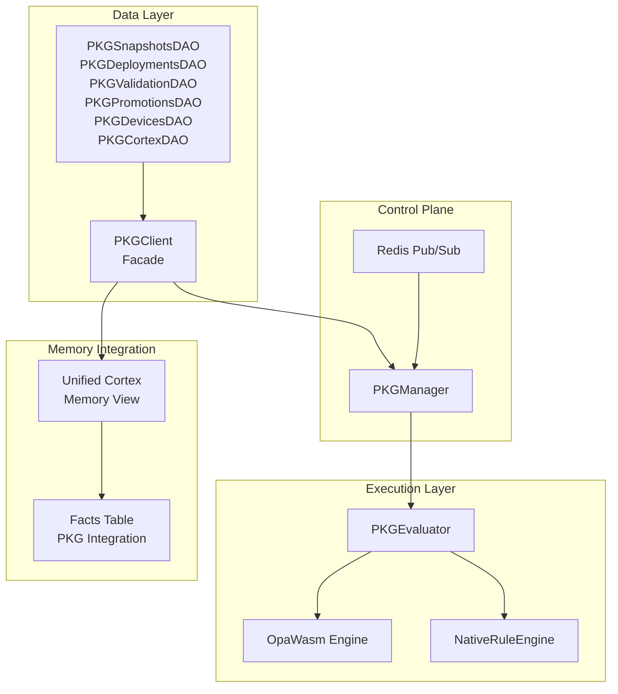

# PKG Module: Complete Introduction

**Policy Knowledge Graph (PKG) - Comprehensive Module Documentation**

## Table of Contents

1. [Overview](#overview)
2. [Architecture](#architecture)
3. [Database Schema](#database-schema)
4. [Core Components](#core-components)
5. [Integration Points](#integration-points)
6. [Key Features](#key-features)
7. [Usage Patterns](#usage-patterns)
8. [Migration Guide](#migration-guide)

---

## Overview

The **Policy Knowledge Graph (PKG)** module is a sophisticated policy orchestration and governance subsystem within SeedCore. It provides dynamic, versioned policy management with hot-swappable rule engines, enabling runtime policy updates without service restarts.

### Core Purpose

PKG serves as the **governance intelligence layer** that:

- **Enforces Business Rules**: Evaluates tasks against policy rules to determine allowed actions and subtasks
- **Manages Policy Lifecycle**: Versioned snapshots with validation, promotion, and rollback capabilities
- **Provides Semantic Context**: Integrates with Unified Memory (Cortex) for context-aware policy decisions
- **Supports Multiple Engines**: WASM (OPA/Rego) and native Python rule engines
- **Enables Hot-Swapping**: Dynamic policy updates via Redis pub/sub without downtime

### System Integration

PKG bridges three critical layers:

```
┌─────────────────┐
│   PostgreSQL    │ ← Persistent State (snapshots, rules, metadata, facts)
└────────┬────────┘
         │
         ▼
┌─────────────────┐
│   PKG Module    │ ← Live Execution (in-memory evaluators)
│  (Manager +     │
│   Evaluator)    │
└────────┬────────┘
         │
         ▼
┌─────────────────┐
│  Redis Pub/Sub  │ ← Dynamic Propagation (hot-swap coordination)
└─────────────────┘
         │
         ▼
┌─────────────────┐
│ Unified Cortex  │ ← Semantic Memory Integration
│  (Embeddings)   │
└─────────────────┘
```

---

## Architecture

### Module Structure

The PKG module is organized into four main layers:

| Layer | Module | Responsibility | Key Classes |
|-------|--------|----------------|-------------|
| **Persistence** | `ops/pkg/dao.py` | Direct PostgreSQL interaction, snapshot composition | `PKGSnapshotsDAO`, `PKGDeploymentsDAO`, `PKGValidationDAO`, `PKGPromotionsDAO`, `PKGDevicesDAO`, `PKGCortexDAO` |
| **Facade** | `ops/pkg/client.py` | Unified client interface, composes DAOs | `PKGClient` |
| **Evaluation Engine** | `ops/pkg/evaluator.py` | Executes policies using WASM or native rule engine | `PKGEvaluator`, `OpaWasm`, `NativeRuleEngine` |
| **Orchestration** | `ops/pkg/manager.py` | Lifecycle manager, hot-swap control, Redis integration | `PKGManager` |

### Component Responsibilities



---

## Database Schema

The PKG module uses five migration files to establish its complete database schema:

### Migration 013: PKG Core (`013_pkg_core.sql`)

Establishes the foundational PKG catalog structure.

#### Enums

- **`pkg_env`**: Environment types (`prod`, `staging`, `dev`)
- **`pkg_engine`**: Engine types (`wasm`, `native`)
- **`pkg_condition_type`**: Condition types (`TAG`, `SIGNAL`, `VALUE`, `FACT`)
- **`pkg_operator`**: Comparison operators (`=`, `!=`, `>=`, `<=`, `>`, `<`, `EXISTS`, `IN`, `MATCHES`)
- **`pkg_relation`**: Relationship types (`EMITS`, `ORDERS`, `GATE`)
- **`pkg_artifact_type`**: Artifact types (`rego_bundle`, `wasm_pack`)

#### Core Tables

**`pkg_snapshots`** - Versioned policy snapshots (governance root)
- `id`: SERIAL PRIMARY KEY
- `version`: TEXT UNIQUE (e.g., `rules@1.4.0`)
- `env`: pkg_env (default: `prod`)
- `entrypoint`: TEXT (OPA/Rego entrypoint, default: `data.pkg`)
- `schema_version`: TEXT (default: `1`)
- `checksum`: TEXT (SHA256, 64 hex chars)
- `size_bytes`: BIGINT
- `signature`: TEXT (optional Ed25519/PGP)
- `is_active`: BOOLEAN (only one per env)
- `notes`: TEXT
- `created_at`: TIMESTAMPTZ

**`pkg_subtask_types`** - Subtask type definitions
- `id`: UUID PRIMARY KEY
- `snapshot_id`: INT → `pkg_snapshots(id)`
- `name`: TEXT (subtask type name)
- `default_params`: JSONB
- `created_at`: TIMESTAMPTZ

**`pkg_policy_rules`** - Policy rule definitions
- `id`: UUID PRIMARY KEY
- `snapshot_id`: INT → `pkg_snapshots(id)`
- `rule_name`: TEXT
- `priority`: INT (higher = evaluated first)
- `rule_source`: TEXT (YAML/Datalog/Rego source)
- `compiled_rule`: TEXT (optional compiled form)
- `engine`: pkg_engine (default: `wasm`)
- `rule_hash`: TEXT (hash of rule_source)
- `metadata`: JSONB
- `disabled`: BOOLEAN
- `created_at`: TIMESTAMPTZ

**`pkg_rule_conditions`** - Rule condition predicates
- `rule_id`: UUID → `pkg_policy_rules(id)`
- `condition_type`: pkg_condition_type (`TAG`, `SIGNAL`, `VALUE`, `FACT`)
- `condition_key`: TEXT (e.g., `vip`, `x6`, `subject`)
- `operator`: pkg_operator (default: `EXISTS`)
- `value`: TEXT (comparison value)
- `position`: INT (evaluation order)

**`pkg_rule_emissions`** - Rule action/subtask emissions
- `rule_id`: UUID → `pkg_policy_rules(id)`
- `subtask_type_id`: UUID → `pkg_subtask_types(id)`
- `relationship_type`: pkg_relation (`EMITS`, `ORDERS`, `GATE`)
- `params`: JSONB (subtask parameters)
- `position`: INT (emission order)

**`pkg_snapshot_artifacts`** - Binary policy packages
- `snapshot_id`: INT PRIMARY KEY → `pkg_snapshots(id)`
- `artifact_type`: pkg_artifact_type (`wasm_pack`, `rego_bundle`)
- `artifact_bytes`: BYTEA (binary artifact data)
- `size_bytes`: BIGINT (generated from BYTEA length)
- `sha256`: TEXT (SHA256 checksum, 64 hex chars)
- `created_at`: TIMESTAMPTZ
- `created_by`: TEXT (default: `system`)

#### Constraints

- **Unique active snapshot per env**: `ux_pkg_active_per_env` ensures only one active snapshot per environment
- **Unique subtask name per snapshot**: `ux_pkg_subtask_name_snapshot` prevents duplicate subtask types
- **Checksum validation**: `checksum` must be exactly 64 hex characters (SHA256)

### Migration 014: PKG Operations (`014_pkg_ops.sql`)

Establishes operational tables for deployments, facts, validation, and telemetry.

#### Operational Tables

**`pkg_deployments`** - Canary deployments and targeted rollouts
- `id`: BIGSERIAL PRIMARY KEY
- `snapshot_id`: INT → `pkg_snapshots(id)`
- `target`: TEXT (e.g., `router`, `edge:door`, `edge:robot`)
- `region`: TEXT (default: `global`)
- `percent`: INT (0-100, rollout percentage)
- `is_active`: BOOLEAN
- `activated_at`: TIMESTAMPTZ
- `activated_by`: TEXT (default: `system`)
- **Constraint**: Unique `(target, region)` per deployment lane

**`pkg_facts`** - Temporal policy facts (e.g., temporary access)
- `id`: BIGSERIAL PRIMARY KEY
- `snapshot_id`: INT → `pkg_snapshots(id)` (optional)
- `namespace`: TEXT (default: `default`)
- `subject`: TEXT (e.g., `guest:Ben`)
- `predicate`: TEXT (e.g., `hasTemporaryAccess`)
- `object`: JSONB (e.g., `{"service":"lounge"}`)
- `valid_from`: TIMESTAMPTZ (default: `now()`)
- `valid_to`: TIMESTAMPTZ (NULL = indefinite)
- `created_at`: TIMESTAMPTZ
- `created_by`: TEXT (default: `system`)

**`pkg_validation_fixtures`** - Test fixtures for policy validation
- `id`: BIGSERIAL PRIMARY KEY
- `snapshot_id`: INT → `pkg_snapshots(id)`
- `name`: TEXT (fixture name)
- `input`: JSONB (evaluator input)
- `expect`: JSONB (expected outputs/properties)
- `created_at`: TIMESTAMPTZ
- **Constraint**: Unique `(snapshot_id, name)`

**`pkg_validation_runs`** - Validation execution records
- `id`: BIGSERIAL PRIMARY KEY
- `snapshot_id`: INT → `pkg_snapshots(id)`
- `started_at`: TIMESTAMPTZ
- `finished_at`: TIMESTAMPTZ
- `success`: BOOLEAN
- `report`: JSONB (validation report)

**`pkg_promotions`** - Promotion/rollback audit trail
- `id`: BIGSERIAL PRIMARY KEY
- `snapshot_id`: INT → `pkg_snapshots(id)`
- `from_version`: TEXT
- `to_version`: TEXT
- `actor`: TEXT (who performed the action)
- `action`: TEXT (`promote` | `rollback`)
- `reason`: TEXT
- `metrics`: JSONB (eval p95, validation summary)
- `created_at`: TIMESTAMPTZ
- `success`: BOOLEAN

**`pkg_device_versions`** - Edge device telemetry
- `device_id`: TEXT PRIMARY KEY (e.g., `door:D-1510`)
- `device_type`: TEXT (`door` | `robot` | `shuttle` | ...)
- `region`: TEXT (default: `global`)
- `snapshot_id`: INT → `pkg_snapshots(id)` (nullable)
- `version`: TEXT
- `last_seen`: TIMESTAMPTZ (heartbeat timestamp)

**`pkg_rollout_events`** - Rollout event audit (canary control history)
- `id`: BIGSERIAL PRIMARY KEY
- `target`: TEXT
- `region`: TEXT (default: `global`)
- `snapshot_id`: INT → `pkg_snapshots(id)`
- `from_percent`: INT
- `to_percent`: INT
- `is_rollback`: BOOLEAN
- `actor`: TEXT (default: `system`)
- `validation_run_id`: BIGINT → `pkg_validation_runs(id)` (nullable)
- `reason`: TEXT
- `created_at`: TIMESTAMPTZ

### Migration 015: PKG Views & Functions (`015_pkg_views_functions.sql`)

Provides helper views and functions for operational queries and integrity checks.

#### Views

**`pkg_active_artifact`** - Active artifact per environment
```sql
SELECT env, snapshot_id, version, artifact_type, size_bytes, sha256
FROM pkg_active_artifact
WHERE env = 'prod'
```

**`pkg_rules_expanded`** - Rules with emissions flattened (audit-friendly)
- Joins `pkg_policy_rules`, `pkg_rule_emissions`, `pkg_subtask_types`, and `pkg_snapshots`
- Provides flattened view for auditing and reporting

**`pkg_deployment_coverage`** - Deployment coverage statistics
- Shows devices on intended snapshot vs total devices
- Handles router, edge:robot, edge:door targets correctly
- Calculates coverage percentage per deployment lane

#### Functions

**`pkg_check_integrity()`** - Validates PKG data consistency
- Checks for cross-snapshot emission mismatches
- Returns `(ok BOOLEAN, msg TEXT)`

**`pkg_active_snapshot_id(p_env pkg_env)`** - Quick helper to get active snapshot ID
- Returns snapshot ID for specified environment

**`pkg_promote_snapshot(p_snapshot_id INT, p_env pkg_env, p_actor TEXT, p_reason TEXT)`** - Promotes snapshot to active
- Deactivates current active snapshot
- Activates new snapshot
- Creates audit trail in `pkg_promotions`

### Migration 016: Fact PKG Integration (`016_fact_pkg_integration.sql`)

Integrates PKG governance fields into the `facts` table for policy-driven fact management.

#### Added Columns to `facts` Table

- `snapshot_id`: INTEGER → `pkg_snapshots(id)` (FK, nullable)
- `namespace`: TEXT NOT NULL DEFAULT `'default'`
- `subject`: TEXT (e.g., `guest:john_doe`)
- `predicate`: TEXT (e.g., `hasTemporaryAccess`)
- `object_data`: JSONB (fact object data)
- `valid_from`: TIMESTAMPTZ (validity start time)
- `valid_to`: TIMESTAMPTZ (validity end time, NULL = indefinite)
- `created_by`: TEXT NOT NULL DEFAULT `'system'`
- `pkg_rule_id`: TEXT (PKG rule that created this fact)
- `pkg_provenance`: JSONB (PKG rule provenance data)
- `validation_status`: TEXT (PKG validation status)

#### Indexes

- `idx_facts_subject` - Subject lookup
- `idx_facts_predicate` - Predicate lookup
- `idx_facts_namespace` - Namespace filtering
- `idx_facts_temporal` - Temporal validity queries (`valid_from`, `valid_to`)
- `idx_facts_snapshot` - Snapshot filtering
- `idx_facts_created_by` - Creator audit queries
- `idx_facts_pkg_rule` - Rule provenance queries
- `idx_facts_validation_status` - Validation status filtering
- Composite indexes for common query patterns

#### Constraints

- **Temporal validity**: `chk_facts_temporal` ensures `valid_from <= valid_to` when both are set
- **Namespace not empty**: `chk_facts_namespace_not_empty` ensures namespace is non-empty
- **Created by not empty**: `chk_facts_created_by_not_empty` ensures creator is non-empty

#### Views

**`active_temporal_facts`** - View of non-expired temporal facts with status indicator
- Filters facts with temporal validity
- Adds computed `status` column (`indefinite`, `active`, `expired`)

#### Functions

**`get_facts_by_subject(p_subject TEXT, p_namespace TEXT, p_include_expired BOOLEAN)`** - Get facts for a subject
- Returns facts with temporal filtering
- Includes computed `is_temporal` and `is_expired` flags

**`cleanup_expired_facts(p_namespace TEXT, p_dry_run BOOLEAN)`** - Cleanup expired temporal facts
- Supports dry-run mode for safety
- Returns count of expired facts

**`get_fact_statistics(p_namespace TEXT)`** - Get comprehensive fact statistics
- Returns total facts, temporal facts, PKG-governed facts, expired facts, active temporal facts
- Includes namespace list

### Migration 017: Unified Cortex (`017_unified_cortex.sql`)

Creates the Unified Memory integration view that merges multimodal embeddings with graph embeddings.

#### Key Views

**`v_unified_cortex_memory`** - Unified Memory View (The Unified Cortex)
- **TIER 1: Multimodal Event Memory** (`event_working`) - Perception events (voice, vision, sensor)
- **TIER 2: Knowledge Graph Tasks** (`knowledge_base`) - Tasks linked through graph_node_map
- **TIER 3: General Graph Entities** (`knowledge_base`) - All other graph nodes (agents, organs, artifacts)

The view uses TEXT casting for polymorphic IDs to resolve UUID/BIGINT impedance mismatch.

**`task_embeddings_primary_1024`** - Enhanced view with `memory_tier` and `memory_label` columns
- Provides `knowledge_base` memory tier classification
- Includes `memory_label` from `graph_embeddings_1024`

**`tasks_missing_any_embedding_1024`** - Identifies tasks missing 1024d embeddings
- Shows missing type: `both`, `multimodal`, or `graph`

#### Performance Optimization

**`idx_tasks_multimodal_fast`** - Partial GIN index for multimodal tasks
- Only indexes tasks containing `params.multimodal`
- Dramatically reduces index size and improves query performance
- For production databases with 100K+ tasks, recreate with `CONCURRENTLY`

---

## Core Components

### PKGClient

**Location**: `src/seedcore/ops/pkg/client.py`

Unified facade client that composes specialized DAOs for PKG operations.

#### Responsibilities

- **Snapshot Management**: Fetch active or versioned snapshots
- **Engine Resolution**: Automatically determines `wasm` or `native` engine type
- **Hierarchical Data Assembly**: Builds complete rule structure (Rules → Conditions → Emissions → Subtask Types)
- **Cortex Integration**: Provides semantic context queries via `PKGCortexDAO`
- **Metadata Operations**: Manage validation, promotion, deployment, and device telemetry

#### Key Methods

```python
# Snapshots
async def get_active_snapshot() -> Optional[PKGSnapshotData]
async def get_snapshot_by_version(version: str) -> Optional[PKGSnapshotData]

# Cortex / Unified Memory
async def get_semantic_context(
    embedding: List[float],
    limit: int = 5,
    min_similarity: float = 0.8,
    exclude_task_id: Optional[str] = None
) -> List[Dict[str, Any]]

# Deployments
async def get_deployments(...) -> List[Dict[str, Any]]
async def get_deployment_coverage(...) -> List[Dict[str, Any]]

# Validation
async def get_validation_fixtures(snapshot_id: int) -> List[Dict[str, Any]]
async def create_validation_run(...) -> int
async def finish_validation_run(...) -> None

# Promotions
async def create_promotion(...) -> int
async def get_promotions(...) -> List[Dict[str, Any]]

# Devices
async def update_device_heartbeat(...) -> None
async def get_device_versions(...) -> List[Dict[str, Any]]
```

### PKGEvaluator

**Location**: `src/seedcore/ops/pkg/evaluator.py`

Encapsulates one loaded snapshot and provides a unified `evaluate()` entrypoint regardless of engine backend.

#### Supported Engines

**1. OPA WASM Engine (`OpaWasm`)**
- Executes precompiled Rego policies via `wasmtime`
- Fallback mode available when `wasmtime` is absent
- WASM caching by checksum for performance
- Supports OPA standard entrypoints (`evaluate`, `opa_eval`)

**2. Native Rule Engine (`NativeRuleEngine`)**
- Interprets `pkg_policy_rules` with hierarchical conditions and emissions
- Uses `PredicateEvaluator` for declarative condition evaluation
- Supports condition types: `TAG`, `SIGNAL`, `FACT`, `VALUE`
- Generates subtasks, rule provenance, and task DAG

#### Evaluation Output

```python
{
    "subtasks": [
        {
            "name": "escalate_vip",
            "type": "escalate",
            "params": {"level": "high"},
            "rule_id": "rule-001",
            "rule_name": "high_priority_vip"
        }
    ],
    "dag": [
        {
            "from": "task1",
            "to": "task2",
            "type": "sequential",
            "rule": "rule-001"
        }
    ],
    "rules": [
        {
            "rule_id": "rule-001",
            "rule_name": "high_priority_vip",
            "rule_priority": 10,
            "matched_conditions": 1,
            "emissions_count": 1
        }
    ],
    "snapshot": "rules@1.4.0"
}
```

### PKGManager

**Location**: `src/seedcore/ops/pkg/manager.py`

Acts as the runtime control plane for PKG snapshots, managing lifecycle, hot-swapping, and providing thread-safe access.

#### Responsibilities

1. **Initialization**: Load active policy snapshot from PostgreSQL on startup
2. **Hot-Swapping**: Subscribe to Redis channel (`pkg_updates`) for dynamic updates
3. **Thread Safety**: Atomic evaluator pointer swap using `threading.Lock`
4. **Semantic Context Hydration**: Bridges Perception (Current Task) with Policy (Historical Context/KG)
5. **Multi-Version Caching**: Maintain LRU cache of evaluators for A/B testing and rollback

#### Key Features

- **Control vs Advisory Modes**: 
  - `CONTROL`: Strict deny-by-default, no semantic hydration
  - `ADVISORY`: Permissive, allows hydration, graceful degradation
- **Strict Schema Validation**: Closed-world execution model with allowlist validation
- **Explicit Return Values**: Always returns `ok`/`meta` instead of "empty means fine"
- **Resilient Redis Listener**: Auto-reconnect with exponential backoff
- **Global Singleton**: System-wide PKG access via `get_global_pkg_manager()`

#### Usage Example

```python
from seedcore.ops.pkg import initialize_global_pkg_manager, get_global_pkg_manager

# Initialize at application startup
manager = await initialize_global_pkg_manager()

# Use in runtime agent
manager = get_global_pkg_manager()
evaluator = manager.get_active_evaluator()

if evaluator:
    task_facts = {
        "tags": ["vip"],
        "signals": {"x2": 0.8},
        "context": {"domain": "hotel_ops"}
    }
    
    # With semantic context hydration (if embedding provided)
    result = await manager.evaluate_task(task_facts, embedding=task_embedding)
    # Returns: {ok: bool, meta: dict, subtasks: list, dag: list, rules: list, snapshot: str}
```

---

## Integration Points

### Facts Table Integration

The `facts` table is enhanced with PKG governance fields (Migration 016):

- **Policy-Driven Facts**: Facts can be created by PKG rules (`pkg_rule_id`, `pkg_provenance`)
- **Temporal Validity**: Facts support time-based validity windows (`valid_from`, `valid_to`)
- **Namespace Organization**: Facts are organized by namespace for access control
- **Subject-Predicate-Object Model**: Standard RDF-style fact representation
- **Validation Status**: Facts track PKG validation status

### Unified Cortex Integration

The Unified Cortex view (`v_unified_cortex_memory`) merges three memory tiers:

1. **Multimodal Event Memory** (`event_working`): Perception events (voice, vision, sensor)
2. **Knowledge Graph Tasks** (`knowledge_base`): Structural knowledge and task relationships
3. **General Graph Entities** (`knowledge_base`): Broader knowledge base context

PKG can query the Unified Cortex for semantic context hydration, enabling policies to make grounded decisions based on historical context.

### Task Integration

Tasks are evaluated against PKG policies:

- **Task Facts**: Tasks provide `tags`, `signals`, and `context` for policy evaluation
- **Subtask Generation**: PKG rules emit subtasks that become child tasks
- **DAG Construction**: PKG rules define task dependencies via `EMITS`, `ORDERS`, `GATE` relationships
- **Multimodal Support**: Tasks with multimodal embeddings can leverage semantic context hydration

---

## Key Features

### 1. Hot-Swappable Policies

Policies can be updated at runtime without service restarts:

```bash
# Trigger hot-swap via Redis
redis-cli PUBLISH pkg_updates "activate:rules@1.5.0"
```

The PKGManager automatically:
1. Receives the hot-swap message
2. Fetches the new snapshot from the database
3. Validates the snapshot
4. Creates a new evaluator
5. Performs atomic pointer swap
6. Updates LRU cache

### 2. Multi-Engine Support

PKG supports multiple rule engines:

- **WASM Engine**: Precompiled Rego policies for high performance
- **Native Engine**: Python-based rule evaluation with hierarchical conditions
- **Extensible**: Engine registry allows adding new engine types (e.g., LLM-based)

### 3. Semantic Context Hydration

PKG can hydrate policy evaluation with semantic context from Unified Memory:

```python
# Task with embedding enables semantic context hydration
result = await manager.evaluate_task(
    task_facts={
        "tags": ["vip"],
        "signals": {"x2": 0.8},
        "context": {"domain": "hotel_ops"}
    },
    embedding=task_embedding  # 1024d embedding vector
)

# PKGManager internally:
# 1. Queries Unified Cortex for similar tasks/contexts
# 2. Injects semantic_context into task_facts
# 3. Evaluates policy with enriched context
```

### 4. Temporal Facts

PKG supports time-based fact validity:

```sql
-- Create temporal fact
INSERT INTO pkg_facts (subject, predicate, object, valid_from, valid_to)
VALUES (
    'guest:Ben',
    'hasTemporaryAccess',
    '{"service":"lounge"}'::jsonb,
    NOW(),
    NOW() + INTERVAL '2 hours'
);

-- Query active temporal facts
SELECT * FROM active_temporal_facts
WHERE subject = 'guest:Ben';
```

### 5. Canary Deployments

PKG supports gradual rollouts:

```sql
-- Deploy to 10% of routers
INSERT INTO pkg_deployments (snapshot_id, target, percent, is_active)
VALUES (5, 'router', 10, TRUE);

-- Check deployment coverage
SELECT * FROM pkg_deployment_coverage
WHERE target = 'router';
```

### 6. Validation & Promotion

PKG provides validation and promotion workflows:

```python
# Create validation run
run_id = await client.create_validation_run(snapshot_id=5)

# Run validation tests
for fixture in fixtures:
    result = evaluator.evaluate(fixture['input'])
    assert result == fixture['expect']

# Finish validation
await client.finish_validation_run(
    run_id=run_id,
    success=True,
    report={"passed": 10, "failed": 0}
)

# Promote snapshot
await client.create_promotion(
    snapshot_id=5,
    actor="admin",
    action="promote",
    reason="All validation tests passed"
)
```

---

## Usage Patterns

### Pattern 1: Basic Policy Evaluation

```python
from seedcore.ops.pkg import get_global_pkg_manager

# Get manager (assumes already initialized)
manager = get_global_pkg_manager()
if not manager:
    raise RuntimeError("PKG Manager not initialized")

# Get active evaluator
evaluator = manager.get_active_evaluator()
if not evaluator:
    raise RuntimeError("No active PKG evaluator")

# Prepare task facts
task_facts = {
    "tags": ["vip", "allergen"],
    "signals": {"x2": 0.8, "x6": 0.95},
    "context": {
        "domain": "hotel_ops",
        "task_type": "guest_request",
        "task_id": str(task.id)
    }
}

# Evaluate policy
result = evaluator.evaluate(task_facts)

# Process result
if result["subtasks"]:
    for subtask in result["subtasks"]:
        # Create child task from subtask
        create_child_task(subtask)
```

### Pattern 2: Semantic Context Hydration

```python
from seedcore.ops.pkg import get_global_pkg_manager

manager = get_global_pkg_manager()
if not manager:
    return

# Task with embedding for semantic context
task_facts = {
    "tags": ["vip"],
    "signals": {"x2": 0.8},
    "context": {"domain": "hotel_ops"}
}

# Evaluate with semantic context hydration
result = await manager.evaluate_task(
    task_facts=task_facts,
    embedding=task_embedding  # 1024d embedding vector
)

# Result includes semantic context in meta
if result["ok"]:
    semantic_context = result["meta"].get("semantic_context", [])
    # Use semantic context for enhanced decision-making
```

### Pattern 3: Hot-Swap Deployment

```python
import redis.asyncio as aioredis
from seedcore.ops.pkg import get_global_pkg_manager

# In CI/CD pipeline
async def deploy_new_policy(version: str):
    redis_client = aioredis.from_url("redis://localhost:6379")
    
    # Publish activation message
    await redis_client.publish("pkg_updates", f"activate:{version}")
    
    # Wait for activation (with timeout)
    import asyncio
    for _ in range(10):  # 10 attempts
        await asyncio.sleep(1)
        manager = get_global_pkg_manager()
        if manager:
            metadata = manager.get_metadata()
            if metadata.get("version") == version:
                print(f"✅ Policy {version} activated")
                return
    
    raise RuntimeError(f"Failed to activate policy {version}")
```

### Pattern 4: A/B Testing

```python
from seedcore.ops.pkg import get_global_pkg_manager

manager = get_global_pkg_manager()
if not manager:
    return

# Get evaluator for specific version
test_evaluator = manager.get_evaluator_by_version("rules@1.5.0-beta")
active_evaluator = manager.get_active_evaluator()

if test_evaluator and active_evaluator:
    # Test new version
    test_result = test_evaluator.evaluate(test_facts)
    
    # Compare with active version
    active_result = active_evaluator.evaluate(test_facts)
    
    # Analyze differences
    differences = compare_results(test_result, active_result)
    if differences:
        print(f"Found {len(differences)} differences")
```

### Pattern 5: Temporal Fact Management

```python
from seedcore.ops.pkg import PKGClient
from datetime import datetime, timedelta

client = PKGClient()

# Create temporal fact
async def grant_temporary_access(subject: str, service: str, hours: int):
    valid_from = datetime.now()
    valid_to = valid_from + timedelta(hours=hours)
    
    # Insert into pkg_facts (via direct SQL or DAO)
    # This would typically be done via a service layer
    pass

# Query active temporal facts
async def get_active_access(subject: str):
    # Use the get_facts_by_subject function
    facts = await client.snapshots.get_facts_by_subject(
        subject=subject,
        namespace="default",
        include_expired=False
    )
    return [f for f in facts if f["is_temporal"] and not f["is_expired"]]
```

---

## Migration Guide

### Applying Migrations

The PKG module requires five migrations in order:

1. **013_pkg_core.sql** - Core PKG catalog (snapshots, rules, conditions, emissions, artifacts)
2. **014_pkg_ops.sql** - Operational tables (deployments, facts, validation, promotions, devices)
3. **015_pkg_views_functions.sql** - Helper views and functions
4. **016_fact_pkg_integration.sql** - Facts table PKG integration
5. **017_unified_cortex.sql** - Unified Memory integration

### Migration Order Dependencies

- **013** must run first (establishes core schema)
- **014** depends on **013** (references `pkg_snapshots`)
- **015** depends on **013** and **014** (uses tables from both)
- **016** depends on **013** (references `pkg_snapshots`) and requires `facts` table to exist
- **017** depends on **002** (`graph_embeddings_128`), **003** (`task_multimodal_embeddings`), **007** (`graph_node_map`)

### Post-Migration Setup

After applying migrations:

1. **Create Initial Snapshot**: Insert a snapshot into `pkg_snapshots`
2. **Load Artifacts**: If using WASM engine, insert artifacts into `pkg_snapshot_artifacts`
3. **Define Rules**: Insert rules, conditions, and emissions for native engine
4. **Activate Snapshot**: Set `is_active = TRUE` for the initial snapshot
5. **Initialize PKGManager**: Call `initialize_global_pkg_manager()` at application startup

### Rollback Considerations

- Migrations are designed to be idempotent (safe to run multiple times)
- Use `IF NOT EXISTS` clauses to prevent errors on re-runs
- Dropping PKG tables will cascade delete related data (use with caution)
- Consider backing up `pkg_snapshots` and `pkg_snapshot_artifacts` before major changes

---

## Summary

The PKG module is a comprehensive policy governance system that provides:

✅ **Versioned Policy Management**: Snapshots with full audit trail  
✅ **Hot-Swappable Updates**: Runtime policy changes without downtime  
✅ **Multi-Engine Support**: WASM and native rule engines  
✅ **Semantic Context Integration**: Unified Memory hydration for context-aware policies  
✅ **Temporal Facts**: Time-based fact validity and management  
✅ **Canary Deployments**: Gradual rollout support  
✅ **Validation & Promotion**: Testing and governance workflows  
✅ **Operational Excellence**: Views, functions, and telemetry for monitoring

The module integrates seamlessly with SeedCore's task system, facts table, and Unified Memory (Cortex), providing a complete policy orchestration solution for distributed agent systems.

---

**Related Documentation**:
- [PKG Module Architecture](./legacy/extensions/pkg_module_architecture.md) - Detailed architecture reference
- [Database Migrations](../deploy/migrations/) - SQL migration files
- [Task Router Payload](./references/task_router_payload.md) - Task schema reference

**Last Updated**: 2024  
**Version**: 1.0.0  
**Maintainer**: SeedCore Team
