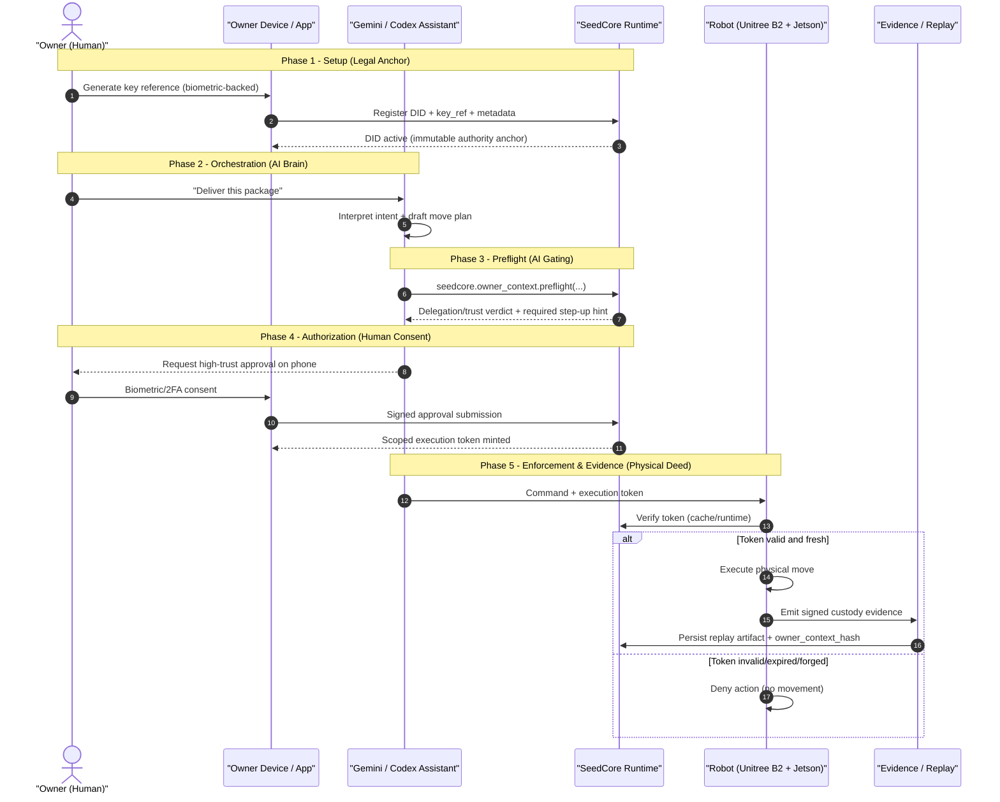

# Sequence Of Trust: Zero-Trust Physical Custody

This note explains how Codex/Gemini assistants, SeedCore, a human owner, and a physical robot (for example Unitree B2) interact in a legally defensible zero-trust flow.

Core boundary:

- assistants orchestrate intent
- SeedCore authorizes
- robot enforces token validity
- replay artifacts prove what happened

## End-To-End Sequence

## Five Phases And Control Objectives

### 1) Setup (Legal Anchor)

- Owner registers DID and key metadata directly with SeedCore.
- This is the root authority binding for later approvals.

Control objective: no assistant-originated authority without owner DID/key anchor.

### 2) Orchestration (AI Brain)

- Assistant converts natural language into an action draft.
- Assistant remains advisory/orchestration; no direct actuator authority.

Control objective: separate planning from authorization.

### 3) Preflight (AI Gating)

- Assistant must call `seedcore.owner_context.preflight` before physical command dispatch.
- SeedCore checks delegation/trust constraints and returns predicted required gates.

Control objective: identify trust/delegation blockers before execution path.

Implementation note:

- `seedcore.owner_context.preflight` is predictive.
- token authority is issued only through governed evaluate + approval flow.

### 4) Authorization (Human Consent)

- If step-up is required, owner provides biometric/2FA-backed consent.
- SeedCore verifies owner identity bindings and issues a scoped execution token.

Control objective: strong user consent for high-trust actions.

### 5) Enforcement & Evidence (Physical Deed)

- Robot enforces token validity at execution boundary.
- Robot writes signed evidence; SeedCore stores replay artifacts.

Control objective: cryptographic non-repudiation and forensic replay.

## Why This Is Legally Defensible

- Authority is delegated and revocable, never implicit.
- High-consequence actions require explicit verified approval.
- Execution is token-gated at hardware/runtime boundary, not chat-trusted.
- Immutable evidence chain preserves policy, identity, and outcome context.
- `owner_context_hash` gives cross-artifact integrity linkage for owner-bound decisions.

## Mapping To SeedCore Surfaces

- Owner identity: `seedcore.identity.owner.upsert/get`
- Creator profile: `seedcore.creator_profile.upsert/get`
- Delegation lifecycle: `seedcore.delegation.grant/get/revoke`
- Trust preferences: `seedcore.trust_preferences.upsert/get`
- Owner-context preflight: `seedcore.owner_context.preflight`
- Governed simulation: `seedcore.agent_action.preflight`
- Trust/replay evidence: `/api/v1/trust/*`, `/api/v1/verify/*`, replay artifacts
