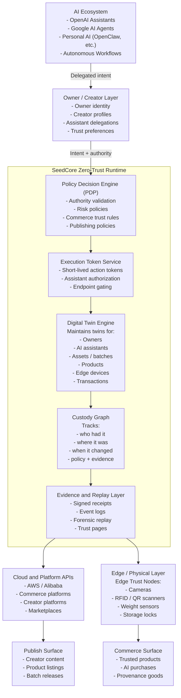

# SeedCore Architecture: Zero-Trust Custody and Digital-Twin Runtime

This document presents an investor-ready view of how AI assistants, creators, cloud platforms, and physical systems interact through SeedCore's zero-trust custody and digital-twin runtime.

## Diagram



### ASCII Fallback (GitHub-safe fixed-width)

```text
                        ┌──────────────────────────────────┐
                        │          AI Ecosystem            │
                        │                                  │
                        │  • OpenAI Assistants             │
                        │  • Google AI Agents              │
                        │  • Personal AI (OpenClaw etc.)   │
                        │  • Autonomous Workflows          │
                        └───────────────┬──────────────────┘
                                        │
                                        │ Delegated Intent
                                        ▼
                        ┌──────────────────────────────────┐
                        │       Owner / Creator Layer      │
                        │                                  │
                        │  • Owner Identity                │
                        │  • Creator Profiles              │
                        │  • Assistant Delegations         │
                        │  • Trust Preferences             │
                        └───────────────┬──────────────────┘
                                        │
                                        │ Intent + Authority
                                        ▼
        ┌────────────────────────────────────────────────────────────┐
        │                SeedCore Zero-Trust Runtime                 │
        │                                                            │
        │  ┌──────────────────────────────────────────────────────┐  │
        │  │  Policy Decision Engine (PDP)                        │  │
        │  │  • Authority validation                              │  │
        │  │  • Risk policies                                     │  │
        │  │  • Commerce trust rules                              │  │
        │  │  • Publishing policies                               │  │
        │  └──────────────────────────────────────────────────────┘  │
        │                                                            │
        │  ┌──────────────────────────────────────────────────────┐  │
        │  │  Execution Token Service                             │  │
        │  │  • Short-lived action tokens                         │  │
        │  │  • Assistant authorization                           │  │
        │  │  • Endpoint gating                                   │  │
        │  └──────────────────────────────────────────────────────┘  │
        │                                                            │
        │  ┌──────────────────────────────────────────────────────┐  │
        │  │  Digital Twin Engine                                 │  │
        │  │  Maintains twins for:                                │  │
        │  │  • Owners                                            │  │
        │  │  • AI Assistants                                     │  │
        │  │  • Assets / batches                                  │  │
        │  │  • Products                                          │  │
        │  │  • Edge devices                                      │  │
        │  │  • Transactions                                      │  │
        │  └──────────────────────────────────────────────────────┘  │
        │                                                            │
        │  ┌──────────────────────────────────────────────────────┐  │
        │  │  Custody Graph                                       │  │
        │  │  Tracks:                                             │  │
        │  │  • who had it                                        │  │
        │  │  • where it was                                      │  │
        │  │  • when it changed                                   │  │
        │  │  • policy + evidence                                 │  │
        │  └──────────────────────────────────────────────────────┘  │
        │                                                            │
        │  ┌──────────────────────────────────────────────────────┐  │
        │  │  Evidence & Replay Layer                             │  │
        │  │  • signed receipts                                   │  │
        │  │  • event logs                                        │  │
        │  │  • forensic replay                                   │  │
        │  │  • trust pages                                       │  │
        │  └──────────────────────────────────────────────────────┘  │
        └───────────────┬───────────────────────────┬────────────────┘
                        │                           │
                        │                           │
                        ▼                           ▼

        ┌────────────────────────────┐   ┌────────────────────────────┐
        │   Cloud & Platform APIs    │   │     Edge / Physical Layer  │
        │                            │   │                            │
        │  • AWS / Alibaba           │   │  Edge Trust Nodes          │
        │  • Commerce platforms      │   │  • Cameras                 │
        │  • Creator platforms       │   │  • RFID / QR scanners      │
        │  • Marketplaces            │   │  • Weight sensors          │
        │                            │   │  • Storage locks           │
        └───────────────┬────────────┘   └───────────────┬────────────┘
                        │                                │
                        │                                │
                        ▼                                ▼

               ┌─────────────────────┐          ┌─────────────────────┐
               │   Publish Surface   │          │   Commerce Surface  │
               │                     │          │                     │
               │  • Creator content  │          │  • Trusted products │
               │  • Product listings │          │  • AI purchases     │
               │  • Batch releases   │          │  • Provenance goods │
               │                     │          │                     │
               └─────────────────────┘          └─────────────────────┘
```

## How To Read The Diagram

### Top Layer: AI Assistants

Represents the agentic future across proprietary and open ecosystems. Assistants generate intents (publish, list, buy, unlock, release, move custody) but do not execute directly. All execution must pass through SeedCore governance.

### Owner / Creator Layer

Each owner has a digital twin that defines delegated permissions, purchase policies, publishing authority, risk thresholds, and custody preferences. Assistants can only act inside this delegated authority.

### SeedCore Zero-Trust Runtime

This is the trust and execution control core:

- `Policy Decision Engine (PDP)`: evaluates authority, trust level, provenance requirements, commerce rules, and custody conditions.
- `Execution Token Service`: issues short-lived execution tokens when policy passes; endpoints reject unauthorized calls.
- `Digital Twin Engine`: keeps governed state for owners, assistants, products, batches, edge nodes, transactions, and assets.
- `Custody Graph`: records ownership, storage, transfer, release, and handling transitions for provenance and disputes.
- `Evidence and Replay Layer`: produces signed, timestamped, replayable evidence for auditability and trust transparency.

### Cloud Platform Layer

SeedCore integrates with cloud providers, commerce systems, creator platforms, and marketplaces. It acts as a trust layer between AI decisions and platform execution.

### Edge / Physical Layer

Optional edge trust nodes add hardware-rooted trust signals (camera, RFID/QR, weight, lock, and related telemetry) to bind digital decisions to real-world state.

### Publish Surface

Creators release verified content, batch products, trust pages, and provenance-backed listings.

### Commerce Surface

AI assistants can purchase on behalf of owners under policy guardrails, with trusted merchants, provenance checks, and replayable transactions.

## Strategic Message

SeedCore is the zero-trust runtime that allows AI assistants to safely publish, transact, and operate in the real world with provable authority and custody.
