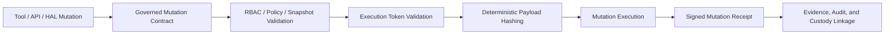

# SeedCore Design Notes: Zero-Trust Execution Substrate

This document is the enduring design anchor for SeedCore. It is intentionally architectural rather than procedural: it explains what SeedCore is, what boundaries it must preserve, and what implementation invariants every serious runtime component must satisfy.

SeedCore is not a chat interface with tools attached. It is a zero-trust execution substrate for custody-aware digital twins, where AI judgment, policy authority, physical execution, and replay evidence are deliberately separated.

## 1. Core Architectural Intent

SeedCore exists to make physical-world and platform-bound AI operations accountable.

The runtime is built on three non-negotiable pillars:

- **Advisory AI**: intelligence is allowed to reason, plan, and recommend, but not to directly execute high-consequence actions
- **Policy-Verified Authorization**: every governed state transition requires explicit policy evaluation over pinned inputs
- **Immutable Evidence**: every governed action must produce replayable evidence that can survive disputes, audits, and verification

This intent is not aspirational. It is the core runtime posture that architecture, APIs, tools, and product surfaces must preserve.

Current execution context matters:

- the must-win workflow remains **Restricted Custody Transfer**
- the first durable product surface is the **proof / verification surface**
- the PDP decision boundary is synchronous and stateless at decision time
- stateful context, custody, approval, and replay systems sit around that boundary rather than inside it

## 2. The Four-Plane Model

SeedCore uses a practical four-plane model to keep boundaries crisp without pretending the codebase is organized as a perfect taxonomy.

| Plane | Responsibility |
| :--- | :--- |
| **Intelligence** | Context hydration, reasoning, planning, and intent preparation. |
| **Control** | Policy evaluation, drift or surprise gating, approval checks, and execution decisioning. |
| **Execution** | Accountable agents, tool invocations, actuator handoff, and endpoint enforcement. |
| **Infrastructure** | Distributed runtime substrate, storage, queues, telemetry, and operational services. |

The plane model is useful because it prevents conceptual collapse:

- intelligence should not quietly inherit authority
- control should not be treated as merely advisory
- execution should not bypass governance
- infrastructure should not be mistaken for business authorization

### Runtime Control Stack

Within that plane model, the architecture docs consistently describe a common zero-trust runtime stack:

- **Policy Decision Engine (PDP)**: final authority evaluation over pinned policy and context inputs
- **Execution Token Service (ETS)**: short-lived action authority for downstream enforcement
- **Digital Twin Engine (DTE)**: authoritative state for owners, assistants, assets, products, transactions, and devices
- **Custody Graph (CG)**: lineage for who had what, where it moved, and which artifacts justify the transition
- **Evidence and Replay Layer (ER)**: signed receipts, replay artifacts, trust surfaces, and verification outputs

For the current custody implementation, one clarification matters:

- `custody_transition_event` plus `asset_custody_state` are the canonical custody truth surfaces
- the Postgres custody graph tables are a derived investigation projection over that truth
- custody reconciliation and reprojection are therefore explicit operational responsibilities rather than implicit fail-closed guarantees on every governed mutation
- dispute linkage is append-only; historical dispute edges remain in the graph while current dispute meaning comes from dispute-case status and event history

These subsystem names should remain consistent across architecture, development, and product-facing documents.

## 3. Judgment vs. Authority

The most important boundary in SeedCore is the split between recommendation and action.

- **`TaskPayload`** carries planning and routing context. It explains what is being attempted and why.
- **`ActionIntent`** carries the accountable action contract. It is the policy-evaluable runtime shape that expresses who is acting, on what, under what scope, and until when.
- **The authority gap** is closed only after policy validation and tokenized handoff. SeedCore must remain deny-by-default until that handoff is complete.

This boundary is why the system is legally and operationally defensible:

- assistants orchestrate intent
- SeedCore authorizes
- endpoints and robots enforce token validity
- replay artifacts prove what happened

The same principle applies to ingress. If delegated intent arrives over Kafka or another transport, that transport is ingress only. It is not an alternate policy engine or a bypass around the authoritative `agent-actions` runtime.

## 4. Governed Execution Substrate

SeedCore is converging on a shared governed-mutation model for all meaningful side effects. High-consequence mutations should pass through a common execution boundary rather than bespoke code paths.

This is the architectural answer to three recurring risks:

- direct LLM-to-actuator bypass
- state mutation without signed proof
- replay surfaces that depend on ambient runtime behavior

### Governed Mutation Flow

1. **Contract lookup**: identify the mutation contract and its declared requirements such as effect class, token requirement, signed receipt requirement, snapshot binding, and replay mode.
2. **Validation**: perform RBAC checks, policy binding checks, and execution-token validation as required by the contract.
3. **Deterministic hashing**: compute a stable payload hash so execution and proof can be bound to the same mutation semantics.
4. **Mutation execution**: perform the side effect only after the governed preconditions are satisfied.
5. **Proof emission**: emit a signed mutation receipt and link it into evidence, audit, and custody records where applicable.

This flow should be read as a substrate pattern, not a single implementation detail. It applies across:

- governed tool execution
- direct API mutations
- HAL-backed actuation evidence
- replay and verification correlation surfaces

### Product Boundary vs Runtime Boundary

The external **Agent Action Gateway** is a product boundary contract. It is not a replacement for the internal runtime accountability model.

Its role is to:

- receive agent-originated governed requests
- normalize them deterministically into runtime contracts such as `ActionIntent`
- preserve proof and replay correlation from the first external request onward

That distinction matters. Public-facing contracts may evolve by workflow. The governed execution substrate must remain internally coherent across workflows.

## 5. Architectural Invariants

The following invariants are not convenience checks. They are the design rules that keep the runtime zero-trust.

### Fail-Closed Enforcement

Mutating paths should not depend on tool-name patterns or informal discipline for safety.

Required direction:

- known mutating paths declare or derive a valid governed mutation contract
- missing or invalid contract state is treated as denial, not as soft fallback
- RBAC and token failures are deny outcomes on governed paths
- actuator-bound token enforcement remains enabled at the execution boundary

### Standardized Signed Proof

Side effects must generate proof that is useful beyond logging.

Required direction:

- each governed side effect emits a signed receipt
- receipts carry stable identifiers and payload hashes
- receipt chains preserve predecessor linkage where mutation history matters
- audit and evidence bundles link mutation proof into broader replay surfaces

### Unified Mutation Entrypoints

SeedCore should not accumulate multiple mutation regimes.

Required direction:

- tools, API mutations, and HAL-associated mutation paths converge on shared governed execution boundaries
- direct state changes outside governed entrypoints are treated as architectural debt
- new component onboarding starts from the contract and evidence model, not from convenience wrappers

### Deterministic Replay

High-consequence workflows must be reproducible from artifacts, not from ambient runtime conditions.

Required direction:

- replay-sensitive services inject time providers rather than calling ambient time directly
- replay-sensitive services inject ID generators rather than relying on ambient UUID creation
- snapshot and policy references are pinned when workflow semantics depend on them
- fallback replay identifiers are derived from stable payload data when upstream identifiers are absent

### Deterministic Trust-Surface Services

Replay determinism is not only the responsibility of the replay service.

Required direction:

- custody-lineage services expose deterministic hooks where they shape replayable artifacts
- dispute and verification flows avoid unnecessary ambient randomness
- services adjacent to trust pages, verification results, and audit surfaces preserve stable artifact semantics

## 6. Admission Contract For New Components

Before a side-effecting component is merged into SeedCore, it should satisfy the following admission contract:

1. Declare a formal governed mutation contract.
2. Require an execution token for high-consequence actions.
3. Emit a signed receipt for every governed state change.
4. Persist enough lineage to connect the mutation to audit, evidence, custody, or trust surfaces.
5. Decouple decision logic from IO adapters so replay can run from artifacts instead of live dependencies.
6. Inject time and ID dependencies anywhere deterministic replay or verification matters.
7. Add replay-oriented tests that assert stable outputs for stable inputs.

If a component cannot meet these expectations, that should be treated as an explicit architectural exception with a stated risk, not as an informal shortcut.

## 7. Document Role In The Corpus

This note is the architectural anchor, not the complete implementation manual.

Use it to answer:

- what SeedCore is fundamentally trying to preserve
- where authority actually lives
- what invariants new runtime components must respect

Use the linked documents for workflow-specific contracts, execution wedges, deployment posture, and external product surfaces.

## Canonical References

- [Architecture Overview](architecture/overview/architecture.md)
- [Zero-Trust Custody and Digital-Twin Runtime](architecture/overview/zero_trust_custody_digital_twin_runtime.md)
- [Sequence Of Trust: Zero-Trust Physical Custody](architecture/overview/sequence_of_trust_zero_trust_physical_custody.md)
- [SeedCore 2026 Execution Plan](development/seedcore_2026_execution_plan.md)
- [Agent Action Gateway Contract](development/agent_action_gateway_contract.md)
- [Owner / Creator External SDK and Plugin Surface](development/owner_creator_external_sdk_and_plugin_surface.md)
