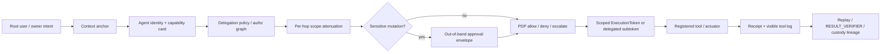

# Agentic Delegation Control Plane

Date: 2026-05-28
Status: Architecture alignment memo and implementation roadmap
Scope: Recursive agent delegation, Agent Action Gateway, `ExecutionToken`
attenuation, workflow v1 saga lane, owner approval, replay, and operator
visibility.

## Purpose

This memo updates SeedCore's architecture for the agentic pattern that is
becoming dominant in 2026: a primary agent decomposes work, delegates subtasks
to specialist agents, those agents may delegate again, and each hop crosses a
new trust boundary.

The CSA / Okta article "Control the Chain, Secure the System: Fixing AI Agent
Delegation" frames the core risk clearly: agent handoffs can turn into lateral
movement when authority is inherited broadly, lineage is unverifiable, context
drifts, sensitive actions are hidden, and no independent approval channel exists.

SeedCore should respond by making recursive delegation a governed control plane,
not a loose orchestration convenience.

Core operating rule:

```text
Agent delegation may decompose intent.
It must never expand authority.
Every hop must be narrower, attributable, context-bound, visible, and replayable.
```

## CSA Pressure Test

The article identifies five architectural requirements SeedCore should treat as
first-class:

| Requirement | CSA risk pattern | SeedCore architecture response |
| :--- | :--- | :--- |
| Scope attenuation at every hop | A sub-agent inherits a parent tool or action it should not have. | Parent `ExecutionToken` can produce only narrower delegated subtokens; workflow nodes carry per-node policy decisions and constraints. |
| Verifiable delegation lineage | By later hops, the resource sees a token but not who initiated or narrowed the chain. | Governed receipts, authz graph paths, approval binding hashes, custody graph lineage, and future `capability_chain` metadata preserve parent-child authority. |
| Context grounding | A multi-turn agent drifts from the original task and executes beyond intent. | A root task anchor and node-level context hash become execution preconditions; semantic drift can escalate before minting. |
| Out-of-band confirmation | Sensitive actions are approved inside the same compromised chat or agent channel. | Approval envelopes, step-up review, dual-control, and future operator confirmation channels remain outside delegated agent control. |
| User and operator visibility | Hidden tool calls or smuggled instructions succeed because execution is opaque. | Tool calls, policy decisions, delegated handoffs, subtokens, receipts, and verifier outcomes must surface through replay and verification APIs. |

## Target Architecture

SeedCore should expose two ingress lanes behind one delegation control plane.

| Lane | Contract | Purpose | Delegation posture |
| :--- | :--- | :--- | :--- |
| RCT high-assurance lane | `seedcore.intent.delegated.v0` + `seedcore.agent_action_gateway.v1` | Current Restricted Custody Transfer path | One strict handoff into PDP, no broad workflow autonomy. |
| Agentic workflow lane | `seedcore.intent.workflow.v1` | Multi-node agent workflows | Saga persistence first; per-node admission, scoped execution, verifier closure, and child-run tracking. |

The control plane sits across both lanes:



## Control-Plane Components

### 1. Root Context Anchor

Every agentic workflow needs a durable root anchor created before any delegated
node executes.

Minimum fields:

- `root_intent_id`
- `root_context_hash`
- `owner_id`
- `initiating_agent_id`
- `requested_goal_summary_hash`
- `allowed_operations`
- `forbidden_operations`
- `created_at`
- `expires_at`

Policy use:

- Every workflow node references the same root anchor.
- Every delegated subtoken carries the root anchor hash.
- A node whose action, asset, zone, endpoint, or goal class drifts from the
  anchor is denied or escalated before token minting.
- LLM or semantic drift detection can produce a trust gap, but the enforcement
  comparison must use structured fields and hashes.

Current SeedCore anchors to reuse:

- `request_id`, `idempotency_key`, `policy_snapshot_ref`
- `_canonical_gateway_payload_hash`
- `execution_preconditions.context_token`
- replay bundle and governed receipt hashes

### 2. Agent Identity And Capability Cards

Delegated agents should present stable identity and declared capabilities before
they receive work.

Minimum fields:

- `agent_id`
- `issuer`
- `public_key_fingerprint`
- `role_profile`
- `allowed_tool_names`
- `allowed_operation_tiers`
- `allowed_delegation_depth`
- `hardware_fingerprint` or execution substrate ref
- `credential_expires_at`
- `signature_ref`

Policy use:

- A workflow node can target only an agent whose declared capabilities cover the
  node operation.
- The policy decision records the identity credential used.
- A downstream agent cannot discover and enlist higher-privileged peers unless
  the authz graph and owner delegation explicitly allow that hop.

Current SeedCore anchors to reuse:

- `principal.agent_id`
- `principal.role_profile`
- `principal.hardware_fingerprint`
- `CapabilityRegistry`
- `CompiledAuthzIndex.resolve_subject_paths`

### 3. Capability Chain And Attenuation

SeedCore's stable runtime artifact remains `ExecutionToken`. The next
architecture increment is to add an optional, shadow-mode `capability_chain`
beside it for delegated execution.

Minimum fields:

- `root_token_id`
- `parent_token_id`
- `child_token_id`
- `delegator_agent_id`
- `delegate_agent_id`
- `attenuation_reason`
- `added_caveats`
- `removed_capabilities`
- `root_context_hash`
- `parent_constraints_hash`
- `child_constraints_hash`
- `issued_at`
- `expires_at`
- `chain_head`

Invariant:

```text
child_constraints must be a subset of parent_constraints.
child TTL must be no later than parent TTL.
child operation tier must be no broader than parent operation tier.
child asset, zone, endpoint, and tool set must be equal or narrower.
```

Policy use:

- Deny when a child token attempts to add a tool, zone, asset, endpoint,
  operation tier, or TTL that the parent did not have.
- Deny when lineage is missing for any recursive delegation beyond depth 1.
- Record the chain head in governed receipts and replay artifacts.

Current SeedCore anchors to reuse:

- `_mint_delegated_subtoken`
- `ExecutionToken.constraints`
- `ExecutionToken.execution_preconditions`
- `DelegatedIntentPayload`
- token revocation and RESULT_VERIFIER fail-closed paths

### 4. Out-Of-Band Approval For Sensitive Actions

Sensitive actions must be confirmed outside the agent channel that proposed
them.

Sensitive action classes:

- physical custody transfer
- financial commitment
- external system mutation
- process spawn or termination
- policy change
- agent config or tool registry change
- quarantine clearance or enforcement promotion

Policy use:

- An in-chat or same-agent "approval" is never sufficient for sensitive action
  classes.
- Approval envelopes must bind the owner, action class, asset or resource,
  value/risk tier, expiry, and policy snapshot.
- Step-up review pauses the workflow rather than letting the agent continue
  with inherited authority.

Current SeedCore anchors to reuse:

- transfer approval envelopes and transition history
- `approval_binding_hash`
- `required_approvals`
- owner delegation `requires_step_up`
- policy dispositions `deny`, `escalate`, and `quarantine`

### 5. Visible Tool Calls And Replay

Every delegated hop and tool call should be visible to operators and replay.
Visibility is not a logging nicety; it is a security control against hidden
instructions.

Minimum event fields:

- `workflow_run_id`
- `node_id`
- `parent_node_id`
- `agent_id`
- `tool_name`
- `operation`
- `request_hash`
- `policy_receipt_id`
- `execution_token_id`
- `capability_chain_head`
- `approval_envelope_id`
- `disposition`
- `result_ref`
- `created_at`

Policy use:

- A mutating tool call without a visible policy receipt is invalid.
- Replay can reconstruct parent-child delegation and tool execution order.
- The operator console can show hidden or unexpected actions as trust gaps.

Current SeedCore anchors to reuse:

- governed execution audit
- replay service
- custody graph lineage
- verification API and operator console
- policy outcome Kafka topic

## Workflow V1 Additions

The existing `agentic_intent_orchestration_plan.md` should keep its lane split.
To align with recursive delegation, the workflow v1 data model should add:

- `root_context_hash` on the workflow run
- `delegation_depth` on each node
- `parent_node_id` on each node
- `delegation_chain_head` on each node
- `capability_chain_head` on each token-bearing node
- `agent_identity_ref` and `agent_capability_ref` on each node
- `visible_tool_call_refs` for node execution
- `requires_out_of_band_confirmation` for sensitive nodes
- `context_drift_status` with `none`, `warn`, `escalate`, or `deny`

Workflow limits should be explicit policy inputs:

- maximum delegation depth
- maximum DAG nodes
- maximum child branches per node
- allowed operation tiers
- allowed delegate namespaces
- sensitive operation classes requiring approval
- timeout for child closure

## PDP Gate Additions

The PDP should eventually include these recursive delegation gates:

| Gate | Deny or escalate when |
| :--- | :--- |
| `delegation_lineage_missing` | A child agent claims authority without parent token, root context, or delegation chain reference. |
| `delegation_scope_widened` | Child constraints include assets, zones, endpoints, operation tiers, tools, or TTL beyond the parent. |
| `delegate_identity_unverified` | Delegate lacks a valid identity/capability credential for the requested node. |
| `delegation_depth_exceeded` | The handoff exceeds policy-defined recursive delegation depth. |
| `context_anchor_mismatch` | The node no longer matches the root task anchor or required context token. |
| `sensitive_action_missing_oob_approval` | A sensitive node lacks an out-of-band approval envelope. |
| `hidden_tool_call` | A mutating tool call lacks a visible policy receipt, token id, or replay event. |
| `child_closure_timeout` | A delegated child run does not close before the parent token or child TTL expires. |

## Implementation Roadmap

### Phase A: Documentation And Contracts

- Keep the current RCT lane unchanged.
- Add this memo to the canonical development docs map.
- Extend `policy_gate_matrix.md` with recursive delegation gates.
- Extend `agentic_intent_orchestration_plan.md` with root context, delegation
  depth, chain head, and visible tool-call fields.

### Phase B: Persisted Workflow Foundation

- Add workflow run, intent node, and workflow event persistence.
- Persist root context hash before any downstream call.
- Record node parentage, delegation depth, and status transitions append-only.

### Phase C: Shadow Capability Chain

- Generate `capability_chain` metadata when `_mint_delegated_subtoken` runs.
- Verify subset invariants in tests without making the chain runtime-critical.
- Surface the chain head in governed receipts and replay artifacts.

### Phase D: Enforcement Gates

- Enforce no-widening of child constraints.
- Enforce delegation-depth policy.
- Require agent identity/capability credential refs for delegated workflow
  nodes.
- Require out-of-band approval for sensitive operation classes.

### Phase E: Operator Visibility

- Add delegated handoff and tool-call timelines to the verification API.
- Highlight hidden, missing, timed-out, or widened child actions as trust gaps.
- Provide a replay view that reconstructs root intent, parent node, child node,
  token lineage, approval, execution, and verifier outcome.

## Source Notes

This memo adapts the CSA / Okta blog's delegation threat model to SeedCore's
current architecture:

- CSA / Okta, "Control the Chain, Secure the System: Fixing AI Agent
  Delegation", 2026-03-25:
  https://cloudsecurityalliance.org/blog/2026/03/25/control-the-chain-secure-the-system-fixing-ai-agent-delegation

Related SeedCore docs:

- `agent_action_gateway_contract.md`
- `agentic_intent_orchestration_plan.md`
- `verifying_delegation_frontier_ai_architectures.md`
- `execution_token_lifecycle_management.md`
- `policy_gate_matrix.md`
- `q2_2026_audit_trail_ui_spec.md`
