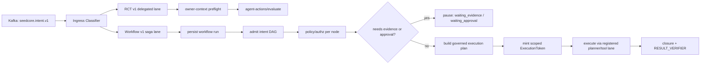

# Agentic Intent Orchestration Plan

Date: 2026-05-22
Status: Proposed implementation plan

## Purpose

SeedCore's current Kafka external-intent ingress is intentionally narrow:
`seedcore.intent.delegated.v0` accepts a delegated intent envelope, runs owner
context preflight, and forwards a strict
`seedcore.agent_action_gateway.v1` request into the Restricted Custody Transfer
gateway.

That lane should stay intact. It is the high-assurance RCT lane.

The next step is to add a broader, stateful agentic orchestration lane beside
it, without letting agent autonomy become ambient authority.

Operating rule:

```text
Agents may propose multi-step work.
SeedCore admits, pauses, narrows, executes, and verifies each governed step.
```

## Design Stance

Do not loosen the existing RCT ingress in place.

Instead, split the external surface into two lanes:

| Lane | Contract | Purpose | Authority posture |
|---|---|---|---|
| RCT v1 high-assurance lane | `seedcore.intent.delegated.v0` + `seedcore.agent_action_gateway.v1` | Current delegated Restricted Custody Transfer ingress | Strict, synchronous preflight/evaluate |
| Agentic workflow v1 lane | `seedcore.intent.workflow.v1` | Multi-intent, stateful, policy-admitted agent workflows | Admission-first, saga-driven, per-node execution authority |

The v2-style lane should accept broader intent proposals, but it should not
mint execution authority until a node has passed policy, authz, planner, token,
evidence, and verifier gates.

## Non-Goals

- Do not ingest raw chain-of-thought as an authority artifact.
- Do not allow Kafka messages to directly execute physical or digital mutation.
- Do not convert broad `GovernedOperation` enum support into broad execution
  support.
- Do not allow a dynamic LLM plan to bypass planner registration, policy
  compilation, execution-token constraints, or replay evidence.
- Do not retire the existing RCT gateway while the agentic lane is being built.

## Target Architecture



## Core New Concepts

### 1. Intent Workflow Run

Persist every agentic workflow as a durable run before evaluating or executing
any node.

Minimum fields:

- `workflow_run_id`
- `contract_version`
- `external_request_id`
- `producer`
- `owner_id`
- `assistant_namespace`
- `status`
- `current_node_id`
- `created_at`
- `updated_at`
- `correlation_id`
- `idempotency_key`
- `raw_envelope_hash`
- `admission_summary`

Suggested statuses:

- `received`
- `admission_rejected`
- `admitted`
- `waiting_evidence`
- `waiting_approval`
- `waiting_policy_refresh`
- `ready_to_plan`
- `ready_to_execute`
- `executing`
- `completed`
- `quarantined`
- `failed`
- `cancelled`

### 2. Intent Node

A node is a single governed proposal inside a workflow DAG.

Minimum fields:

- `node_id`
- `workflow_run_id`
- `node_type`
- `operation`
- `action_intent`
- `depends_on`
- `status`
- `policy_decision`
- `planner_type`
- `execution_plan_hash`
- `execution_token_id`
- `evidence_requirements`
- `evidence_refs`
- `result_ref`
- `failure_reason`

Node statuses:

- `pending`
- `blocked`
- `admitted`
- `needs_evidence`
- `needs_approval`
- `planned`
- `token_minted`
- `executing`
- `succeeded`
- `denied`
- `quarantined`
- `failed`

### 3. Policy-Admitted Broad Operations

The workflow lane may accept proposals for broader operations, but only as
admission candidates.

Initial operation admission tiers:

| Tier | Operations | Execution posture |
|---|---|---|
| Tier 0 | `TRANSFER_CUSTODY` | Existing RCT lane and planners |
| Tier 1 | `SCAN`, `READ` | Admit as evidence-gathering/read-only nodes first |
| Tier 2 | `MOVE`, `PICK`, `PLACE`, `PACK`, `RELEASE` | Admit only when a registered planner/tool contract exists |
| Tier 3 | `SPAWN_PROCESS`, `TERMINATE`, generic `MUTATE` | Admission-only until a separate process authority contract exists |

Graduation rule:

```text
An operation is executable only when it has:
1. schema contract
2. policy/authz rule
3. planner implementation
4. execution-token constraint mapping
5. tool/runtime contract
6. evidence and replay model
7. toxic-path tests
```

## Contract Plan

### Keep Current Contract

Keep `seedcore.intent.delegated.v0` as-is:

- `owner_context_preflight`
- `gateway_request`
- strict `seedcore.agent_action_gateway.v1`
- RCT workflow only

This remains the production RCT fast lane.

### Add Workflow Contract

Introduce `seedcore.intent.workflow.v1`.

Draft shape:

```json
{
  "stream": "intent",
  "payload_schema_version": "seedcore.intent.workflow.v1",
  "workflow_run_id": "wf-agentic-001",
  "request_id": "req-agentic-001",
  "correlation_id": "corr-agentic-001",
  "assistant_namespace": "agent:planner-01",
  "owner_context_preflight": {
    "owner_id": "did:seedcore:owner:abc",
    "assistant_id": "agent:planner-01",
    "delegation_id": "deleg-001"
  },
  "intent_graph": {
    "nodes": [
      {
        "node_id": "scan-origin",
        "operation": "SCAN",
        "action_intent": {},
        "depends_on": []
      },
      {
        "node_id": "transfer-custody",
        "operation": "TRANSFER_CUSTODY",
        "action_intent": {},
        "depends_on": ["scan-origin"]
      }
    ]
  },
  "metadata": {}
}
```

Rules:

- `intent_graph.nodes[*].action_intent` must be structured, not free-form.
- Every node has its own policy decision.
- Every mutating node has its own execution token.
- Dependencies must form a DAG.
- The workflow hash must cover node order, dependencies, owner context, and
  action intent payloads.

## Implementation Phases

### Phase 0: Freeze And Protect RCT v1

Goal: make the current rigid lane explicit and regression-proof.

Tasks:

- Add a short "lane split" note to `docs/development/kafka_delegated_intent_ingress.md`.
- Add tests proving `seedcore.intent.delegated.v0` still forwards only to:
  - `/api/v1/owner-context/preflight`
  - `/api/v1/agent-actions/evaluate`
- Add a contract test that non-RCT `workflow.type` is rejected in the v1 lane.
- Keep `scripts/host/verify_kafka_ingress_non_bypass.py` as the non-bypass gate.

Acceptance:

- Existing RCT Kafka ingress tests pass.
- No legacy `/api/v1/intents/submit-signed` bypass appears in the Kafka worker.
- No workflow v1 code path changes current v1 response shape.

### Phase 1: Add Saga Persistence

Goal: persist agentic workflow runs before downstream calls.

Tasks:

- Add migrations for:
  - `agentic_workflow_run`
  - `agentic_intent_node`
  - `agentic_workflow_event`
- Add DAO/service layer:
  - `src/seedcore/coordinator/agentic_workflow_dao.py`
  - `src/seedcore/services/agentic_workflow_service.py`
- Add workflow event append helper for status transitions.
- Add idempotency on `(producer, request_id)` and `(workflow_run_id)`.

Acceptance:

- A workflow envelope can be persisted and replay-read without executing.
- Duplicate request produces the existing run, not a second workflow.
- Status transition history is append-only.

### Phase 2: Add Workflow Ingress Classifier

Goal: route Kafka events by payload schema version.

Tasks:

- Extend `src/seedcore/infra/kafka/delegated_intent.py` or add
  `src/seedcore/infra/kafka/workflow_intent.py`.
- Update `intent_ingress.py` to classify:
  - `seedcore.intent.delegated.v0` -> current v1 path
  - `seedcore.intent.workflow.v1` -> persist workflow run and enqueue saga
- Keep the Kafka consumer short-lived: persist, enqueue, commit.
- Add an outbox table/list for workflow runs needing orchestration.

Acceptance:

- Workflow v1 Kafka message is acknowledged after durable persistence.
- Worker does not block waiting for approvals, telemetry, or execution.
- Delegated v0 behavior is unchanged.

### Phase 3: Admission Engine For Intent DAGs

Goal: validate and classify each node before planning.

Tasks:

- Add DAG validation:
  - unique node IDs
  - no cycles
  - dependencies exist
  - one root minimum
- Add per-node policy admission:
  - owner context
  - delegation
  - authz graph
  - operation tier
  - evidence requirements
- Introduce `admission_disposition`:
  - `admit`
  - `deny`
  - `quarantine`
  - `needs_evidence`
  - `needs_approval`
  - `unsupported_operation`

Acceptance:

- `SCAN -> TRANSFER_CUSTODY` can be admitted as a two-node workflow.
- Unsupported mutating operations are stored with `unsupported_operation`, not
  silently dropped or executed.
- Missing evidence pauses the workflow instead of failing the Kafka message.

### Phase 4: Reuse RCT Planner As First Executable Node

Goal: make `TRANSFER_CUSTODY` the first executable workflow node by delegating
to the existing Agent Action Gateway path.

Tasks:

- Add node adapter from workflow node to `AgentActionEvaluateRequest`.
- Reuse existing:
  - owner preflight
  - `evaluate_pdp_hot_path`
  - execution planner registry
  - execution token binding
  - closure/result verifier path
- Persist node-level `execution_plan`, `execution_token_id`, and governed
  receipt refs.

Acceptance:

- A workflow node with `TRANSFER_CUSTODY` produces the same policy behavior as
  the current RCT gateway.
- Workflow-level state advances only after node-level result is recorded.
- Deny/quarantine from the RCT gateway pauses or terminates the workflow with a
  clear node reason.

### Phase 5: Graduate Read/Scan Nodes

Goal: support safe evidence-gathering nodes before broader mutation.

Initial candidates:

- `READ`
- `SCAN`

Tasks:

- Define a read/scan node schema.
- Define evidence refs emitted by scan nodes.
- Add policy rules for owner/delegation-scoped read/scan.
- Add a non-mutating tool/runtime contract.
- Feed scan output into downstream RCT node evidence requirements.

Acceptance:

- `SCAN` can satisfy a downstream `TRANSFER_CUSTODY` evidence requirement.
- Scan nodes cannot mint physical actuation tokens.
- Scan evidence is replay-addressable and hash-bound.

### Phase 6: Graduate Physical Mutation Nodes One By One

Goal: add broader physical operations only when the safety stack exists.

Candidate order:

1. `MOVE`
2. `PICK`
3. `PLACE`
4. `PACK`
5. `RELEASE`

For each operation:

- define request schema
- define planner
- map operation to execution-token constraints
- define HAL/tool contract
- define mutation receipt and transition receipt requirements
- define result verifier expectations
- add happy-path and toxic-path fixtures

Acceptance:

- Each operation has a contract test proving it cannot execute without a valid
  execution token and policy receipt.
- Each operation has replay evidence sufficient for verifier closure.
- Each operation can be disabled by policy without code removal.

### Phase 7: Delegated Authority Outbox

Goal: make delegated authority truly asynchronous.

Current state:

- `delegated_authority` mints a constrained subtoken and returns a
  delegated intent envelope.

Next state:

- persist the delegated envelope to an outbox
- publish it to Kafka or a configured agent handoff transport
- track child workflow/run correlation
- revoke or expire subtokens when child execution does not close

Acceptance:

- Parent run can see child delegated run status.
- Subtoken expiry is enforced.
- Missing child closure produces quarantine/escalation, not silent success.

## Testing Strategy

Add tests in layers:

1. schema validation tests for workflow v1 envelope
2. DAG validation tests
3. DAO/idempotency tests
4. Kafka classifier tests
5. admission policy tests
6. RCT node adapter parity tests
7. workflow pause/resume tests
8. toxic-path tests:
   - unsupported operation
   - dependency cycle
   - missing evidence
   - stale telemetry
   - revoked delegation
   - replayed idempotency key
   - child delegated run timeout

Host gates to extend:

- `scripts/host/verify_kafka_ingress_non_bypass.py`
- `scripts/host/verify_external_surface.py`
- `scripts/host/verify_agent_action_gateway_productization_real_calls.py`
- `scripts/host/verify_q2_degraded_edge_drill_matrix.sh`

## Rollout Flags

Suggested environment controls:

- `SEEDCORE_AGENTIC_WORKFLOW_INGRESS_ENABLED=false`
- `SEEDCORE_AGENTIC_WORKFLOW_EXECUTE_ENABLED=false`
- `SEEDCORE_AGENTIC_WORKFLOW_ALLOWED_OPERATIONS=TRANSFER_CUSTODY,SCAN,READ`
- `SEEDCORE_AGENTIC_WORKFLOW_MAX_NODES=8`
- `SEEDCORE_AGENTIC_WORKFLOW_REQUIRE_OPERATOR_FOR_MUTATION=true`

Default posture:

- workflow ingress off
- workflow execution off
- admit-only in local/dev until tests and replay fixtures are mature

## First Milestone Checklist

The first useful milestone is deliberately small:

- keep v0 delegated RCT unchanged
- persist workflow v1 envelopes
- validate a two-node DAG
- admit `SCAN -> TRANSFER_CUSTODY`
- execute only the RCT node through the existing gateway path
- pause on missing scan evidence
- expose run/node status for operator and agent inspection

This gives SeedCore a real agentic orchestration foundation without expanding
physical execution authority prematurely.

