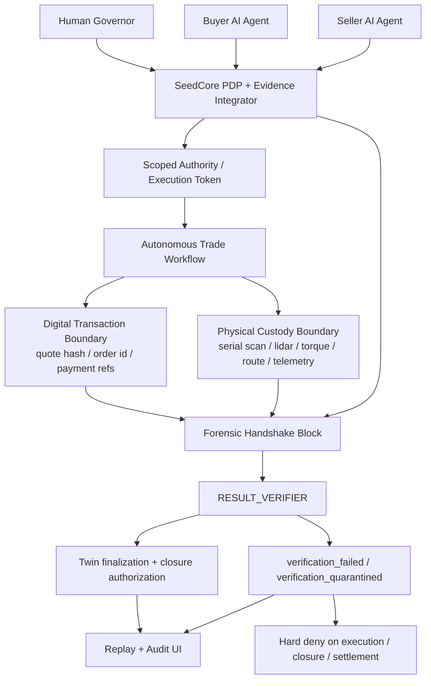

# SeedCore Autonomous Repair Transfer Demo Spec

**Focus:** autonomous AI-to-AI procurement plus robot custody transfer with
machine-native verification.

Date: 2026-04-07  
Status: Working flagship demo spec

## 1. Demo thesis

This demo should prove a category distinction, not just a better shopping flow.

The core claim is:

**SeedCore is not a marketplace, cloud control plane, or robotics app. It is
the trust boundary that decides whether autonomous commerce may become physical
reality.**

Traditional platforms stop at one of these:

- discovery and transaction convenience
- identity and access control
- device orchestration

SeedCore goes one layer deeper:

- bound the authority of autonomous agents before they act
- require economic and physical evidence to converge after they act
- fail closed automatically if the replay chain does not verify

This is the product distinction the demo must make obvious.

Durable thesis:

> SeedCore is the governed trust boundary for autonomous custody workflows. It
> does not replace agents, marketplaces, or robots. It determines whether
> delegated machine intent is within policy, whether the observed act satisfies
> the governed conditions, and whether closure is allowed after
> replay-verifiable evidence review.

## 1.1 Product invariant vs flagship scene

This document should be read in two layers.

**Layer A: Product invariant**

- Restricted Custody Transfer under bounded authority
- machine-readable approval lineage
- evidence-linked closure authorization
- deterministic replay
- fail-closed denial when trust breaks

**Layer B: Current flagship scene**

- **The 2:13 AM Repair Transfer**
- emergency industrial part replacement
- buyer AI, seller-side deterministic adapter, and courier robot
- toxic path based on a swapped serialized part plus actuator-side mismatch

Other future scenes can reuse the same invariant contract:

- lab consumables transfer
- secure tool checkout
- controlled inventory movement
- internal enterprise parts replacement

## 2. Positioning against traditional platforms

| System type | What it does well | What it does not prove |
| :--- | :--- | :--- |
| Alibaba / Shopify / standard commerce platforms | quote, cart, payment, order workflow | that an autonomous agent was truly authorized to buy, that the physical handoff happened correctly, or that a broken proof chain automatically stops the transfer |
| AWS / cloud IAM / workflow tools | identity, policy, service permissions, orchestration | that a robot in the physical world actually performed the allowed act and that economic + physical proof converged under one replayable chain |
| Robotics fleet / warehouse software | route execution, task dispatch, sensor capture | that the robot had cryptographically bounded commercial authority and that settlement should be allowed |
| **SeedCore** | policy-bounded authority + replay-verifiable proof + fail-closed enforcement | intentionally does **not** replace the marketplace, robot, or cloud; it governs and verifies the handshake between them |

One-line stage comparison:

> Alibaba can tell you what was ordered. AWS can tell you who had permission.
> SeedCore can tell you whether an autonomous machine was truly allowed to act,
> whether the act actually happened, and why the system stopped itself when
> trust broke.

## 2.1 Economic value

The point of this product is not only technical elegance. It is operational
admissibility.

SeedCore should help an organization:

- reduce manual trust-review cost around autonomous actions
- cut unsafe exceptions before they become physical incidents
- shorten audit and post-incident investigation time
- make higher-trust agentic automation acceptable in workflows that would
  otherwise remain human-gated

## 3. Canonical demo scenario

### Name

**The 2:13 AM Repair Transfer**

### Story

At `02:13`, a warehouse robot cell detects that one of its motor controller
modules is nearing failure. A buyer AI agent is allowed to source a replacement
within a narrow spend and vendor policy. A seller AI agent confirms inventory
and reserve window. A Unitree B2-class courier robot retrieves the part from a
locked storage zone. SeedCore allows closure or release authorization, and any
optional downstream settlement effects, only if:

- the request stayed inside delegated authority
- the approved seller and quote match the action scope
- the robot retrieved the correct serialized part
- the physical evidence chain matches the digital transaction chain
- the replay verifier confirms the result after the fact

Concrete stage assumption:

- the transferred part is a high-end industrial servo block weighing `2.1 kg`
- this keeps the on-stage payload comfortably inside a small manipulator
  envelope while still making weight and torque telemetry meaningful
- the toxic-path counterfeit example can then use a visibly wrong `1.5 kg`
  substitute, giving the verifier a concrete actuator-side discrepancy

### Why this scenario wins

- it feels near-future, not science fiction
- it is autonomous across **buyer AI**, **seller AI**, and **robot courier**
- it has real economic consequence without needing consumer theatrics
- it makes the physical-to-digital trust boundary impossible to ignore
- it naturally supports a dramatic fail-closed sibling path

## 4. What the demo must prove

The demo is successful only if an audience leaves believing all four of these:

1. humans no longer manually operate the flow; they govern it by policy
2. AI agents can transact, but only inside cryptographically bounded authority
3. physical proof and economic proof converge into one replayable trust chain
4. verification is automatic and fail-closed, not a human cleanup task

## 4.1 RCT and dual-control reconciliation

This demo must remain legible as **Restricted Custody Transfer**, not drift into
"generic autonomous shopping."

RCT rule for this scenario:

- the transfer still carries a **dual-control** story even though the live
  experience feels autonomous
- the human "governor" provides the standing approval and policy leg in advance
- the seller-side reserve or approval envelope provides the counterpart leg for
  the specific custody transfer
- buyer AI and seller AI operate inside those pre-authorized lanes rather than
  inventing authority at runtime

Stage simplification:

- the demo does not need to force a live human click for the second approval
- it should instead show that the workflow is autonomous **because** the
  approval and policy rails were frozen ahead of time
- if reviewers ask "why is this still RCT?", the answer is:
  this is a dual-controlled custody workflow with one human governance leg and
  one runtime transaction/counterparty leg, surfaced through the same governed
  approval lineage

## 4.2 Convergence definition

In this spec, "convergence" does **not** mean that economic and physical hashes
collapse into one literal value.

It means:

**policy-valid correspondence across intent, authority, economic commitment,
observed custody act, and closure conditions.**

The verifier story should therefore be explained through explicit checks:

- identity binding
- scope binding
- time-window validity
- custody evidence sufficiency
- closure eligibility
- replay determinism

This wording should be preferred over looser phrases like "economic and
physical truth converge" when explaining the trust contract to technical
reviewers.

## 4.3 Authoritative twin ontology

The authoritative twin in this workflow is the governed state object that binds
workflow identity, delegated authority, evidence lineage, verifier state, and
closure eligibility for one restricted custody transfer.

## 5. Architecture placement

The diagram and narration should always preserve this placement:

- top: humans and AI agents originate intent
- center: SeedCore is the trust boundary, PDP, evidence integrator, and replay
  authority
- bottom: commerce systems and robot/edge systems emit economic and physical
  evidence

Precision note:

- the trust claim should be described through signed authority artifacts,
  hashed evidence references, replay-verifiable lineage, and policy-enforced
  deny gates
- avoid language that implies a stronger or broader cryptographic guarantee
  than the current implementation actually provides

Stage architecture rule:

- the physical stage should have a **hybrid sim-to-real posture**
- the live Unitree B2-class robot is the visible physical actor
- Gazebo acts as the digital twin of the physical stage and renders the same
  movement/evidence story from ROS2 telemetry
- if the live robot degrades on stage, the demo may continue in Gazebo without
  changing the SeedCore trust-boundary claim
- this is not a fallback to a different story; it is proof that SeedCore can
  govern and verify the same custody workflow across simulated and physical
  execution surfaces

Sim-to-real control rule:

- the same high-level autonomy and evidence-emission path should be framed as
  running through a `ros2_control`-style hardware abstraction layer
- this keeps the Gazebo twin and the physical robot legible as two execution
  surfaces for the same governed workflow, rather than two unrelated demos
- if the physical robot loses stage connectivity or visual confidence, the
  simulation path may continue the digital-twin playback while preserving the
  SeedCore trust-boundary claim

Construction phasing rule:

- the **first construction slice** should use scripted or simulated physical
  evidence that exercises the same forensic handshake schema
- the live Unitree B2 plus Gazebo split-screen is an additive stage layer, not
  the blocker for proving the trust chain
- the trust boundary should be boringly reliable in sim/scripted mode before
  live robotics becomes mandatory for the flagship presentation



## 6. Demo flow

### Act 1: Policy, not micromanagement

The human sets governance once:

- approved vendors for emergency repair parts
- max spend and allowed part classes
- which buyer agent may initiate
- which seller agent roles may respond
- which robot may perform pickup
- required evidence types for custody transfer
- fail-closed conditions

The human does **not** manually approve the purchase in the live flow.

### Act 2: Autonomous intent and bounded authority

The buyer AI agent submits:

> "Robot cell `R-17` requires a replacement motor controller within `30`
> minutes to avoid downtime."

SeedCore converts that into a bounded governed action:

- workflow: `Restricted Custody Transfer`
- allowed vendor set
- price ceiling
- asset / SKU scope
- time window
- robot / facility / custody zone scope

### Act 3: Economic and physical handshake

The seller AI agent responds with:

- quote
- inventory hold
- shelf / bin location
- serial range

Implementation boundary:

- the seller side is a **deterministic adapter**, not a broad conversational
  agent product
- it may accept a simple API or GraphQL-shaped request and return a fixed
  commerce payload with `quote_ref`, `economic_hash`, reserve window, and
  serialized inventory binding
- the point of the demo is not to build a smarter store; it is to prove that
  SeedCore can govern and verify the handshake between commerce, agents, and
  robot execution

The robot then performs pickup and emits:

- bin or shelf location confirmation
- serial or label scan
- route hash
- lidar or visual presence evidence
- motor torque / weight telemetry
- handoff receipt

Hardware reality note:

- the robot story should assume a mobile base with a small manipulator, not a
  cinematic heavy-lift arm
- the demo evidence should explicitly reference `expected_weight_kg=2.1` for
  the approved servo block
- actuator telemetry should surface a weight or torque-derived payload check so
  the toxic path can fail before the robot "successfully" completes a false
  handoff

First-build posture:

- before full robot integration, these physical-evidence fields may come from a
  scripted adapter or simulated evidence generator as long as they populate the
  same closure and forensic-handshake shape
- the initial milestone is not "beautiful robotics"; it is deterministic trust
  evidence flowing through the same runtime contracts

### Act 4: Automatic machine-native verification

SeedCore builds the forensic handshake block.

`RESULT_VERIFIER` then replays the governed chain and either:

- passes: twin finalizes and closure or release may proceed
- fails: twin is marked `verification_failed` or
  `verification_quarantined`, `result_verifier_lockout` is written, and all
  downstream closure / settlement paths are denied

Settlement note:

- the primary term in this demo should be **closure authorization** or
  **release authorization**
- "settlement" should be treated as a secondary downstream effect, not the main
  trust-boundary action
- if external payment rails are stubbed or dry-run, the demo claim still holds
  as long as SeedCore clearly allows or denies the governed release transition

## 7. The killer moment

This demo must include both a clean path and a failure path.

### Pass A: convergent transfer

- approved quote matches policy
- robot retrieves the correct serialized part
- telemetry and transition receipts line up
- replay verification passes
- closure authorization and custody completion are shown as allowed

### Pass B: toxic transfer

Inject exactly one trust-breaking mismatch:

- wrong serial number
- stale quote used after reserve window
- broken seal / tampered evidence
- wrong shelf coordinates
- inconsistent physical effort or route evidence

The audience must watch SeedCore do all of this automatically:

- detect the mismatch through `RESULT_VERIFIER`
- mutate the authoritative twin to quarantine or verification failure
- write the verifier lockout
- deny downstream closure or settlement
- explain the break in the replay surface

Recommended default toxic path:

- the deterministic seller adapter returns a valid quote and reserve for one
  serialized part
- after reservation, the part presented to the robot is intentionally swapped
  for a different serialized unit
- the scanned physical identity and resulting actuator / presence evidence no
  longer match the expected asset binding carried through the governed economic
  artifacts
- the counterfeit example should weigh `1.5 kg` instead of the expected
  `2.1 kg`, so both identity and actuator-side telemetry disagree with the
  governed expectation

Cryptographic catch:

- the audience should briefly see the mismatch in the replay or forensic view
- show the expected commerce-bound identity and the observed physical evidence
  identity side by side
- the failure should be explained as a deterministic fingerprint-chain mismatch
  inside the forensic block / replay evidence, not as a hardcoded "red path"
- if possible, expose at least one concrete mismatching component such as the
  serialized asset binding, `economic_hash`, `physical_presence_hash`, or
  `actuator_hash` in the replay detail or export materialization

Technical guardrail:

- the demo should **not** claim that `economic_hash` and
  `physical_presence_hash` are supposed to be identical values
- the claim is that the economic-side asset/quote binding and the
  physical-side observed evidence must converge under one valid forensic
  handshake; when they describe different realities, `RESULT_VERIFIER` trips

Illustrative replay/export snapshot:

The toxic path should briefly expose a human-readable replay/export artifact
like this on screen before the deny summary:

```json
{
  "economic_evidence": {
    "quote_hash": "tx-hash-5521",
    "asset_identity": "servo-unit-z1-pro",
    "expected_weight_kg": 2.1
  },
  "physical_evidence": {
    "actuator_telemetry": {
      "measured_weight_kg": 1.5,
      "payload_verification": "mismatch"
    },
    "sensor_signatures": [
      {
        "sensor_id": "lidar-barcode-01",
        "signature": "counterfeit-part-x99"
      }
    ]
  },
  "verification_status": "result_verifier_lockout"
}
```

Presentation note:

- this should be framed as a **replay/export view** or JSON-LD-derived
  materialization, not the internal runtime contract itself
- keep it on screen for about `5` seconds so the audience can visually connect
  the fraud to the lockout

This second path is what makes the category distinction memorable.

## 8. Live demo script

### Recommended runtime length

`8` to `10` minutes total.

### Operational prerequisites

Before any public run, one canonical demo runbook should lock these conditions:

- which services must be up and healthy
- which ports or routes are used for the demo path
- whether the demo uses the verification UI, host verification scripts, or both
- whether the hot path is shown in `shadow` and how that is explained on stage
- whether closure/release is dry-run or wired to a stub downstream settlement signal
- which evidence source is active: scripted, Gazebo, live robot, or hybrid

Recommended operator stance:

- treat the first public-grade slice as a **SeedCore-centric proof demo**
- use the verification surface and replay views as the primary operator truth
- treat robot-camera and Gazebo views as supporting evidence, not the main UI

### Scene 1: The setup (`1` minute)

Show one slide with the architecture placement rule:

- humans and AI agents above
- commerce and robots below
- SeedCore in the middle

Narration:

> "This is not a shopping cart demo. This is autonomous procurement plus
> physical custody transfer under a trust boundary."

### Scene 2: Governance freeze (`1` minute)

Show the policy configuration or policy snapshot summary:

- spend limit
- vendor allowlist
- robot scope
- evidence requirements
- fail-closed rules

Narration:

> "The human’s job is governance, not live supervision."

### Scene 3: Buyer and seller agents transact (`1.5` minutes)

Show:

- buyer AI request
- seller AI quote / reserve
- SeedCore evaluation response

Mandatory call-out:

- the `ExecutionToken` exists only because the action is within bounded scope
- the seller side is intentionally deterministic and narrow so the audience
  sees SeedCore governing a trust chain, not improvising a vendor chatbot
- the approval or governance lineage for RCT is already frozen before the live
  action begins

### Scene 4: Robot pickup and evidence (`1.5` minutes)

Show:

- pickup location
- scanned serial
- route / telemetry snippets
- physical evidence capture
- split view: live camera feed on one side, Gazebo digital twin on the other

Execution note:

- the screen should show a hybrid proof view during pickup
- left: live camera or operator view of the Unitree B2-class robot
- right: Gazebo digital twin rendering synchronized ROS2 telemetry, route
  progress, and physical evidence generation
- this proves SeedCore is consuming machine evidence that can survive both
  physical and simulated execution contexts
- the sim-to-real story should explicitly reference the same `ros2_control`
  style control surface feeding both the physical and simulated evidence path
- if the live robot degrades mid-demo, the Gazebo side can carry the proof
  story forward without changing the trust-boundary narrative

Narration:

> "This is where normal commerce platforms stop being enough. The system now
> needs to prove that the physical act matched the digital permission."

### Scene 5: Happy-path proof (`1` minute)

Show the verification surface:

- request and scope
- decision and artifacts
- physical evidence and replay summary
- finalized twin / closure status

Implementation breadcrumb:

- this scene should line up with the current verification / replay surfaces,
  not a bespoke slide-only mockup

### Scene 6: Failure injection (`2` minutes)

Replay the flow with a single mismatch.

Best default mismatch:

- the seller swaps in a wrong serialized part after quote reservation

Show:

- verifier detects mismatch
- authoritative twin becomes quarantined or verification failed
- release or closure call is rejected
- no execution release survives the fail-closed gate
- replay or export view highlights the concrete fingerprint mismatch for a few
  seconds before the deny state is summarized
- the mismatch should call out both the wrong serialized identity and the
  actuator-side weight discrepancy (`2.1 kg` expected vs `1.5 kg` observed)

### Scene 7: Replay and explanation (`1` minute)

Open the audit / replay surface and show:

- exact mismatch reason
- policy and evidence lineage
- authority source
- final deny / lockout state

Final line:

> "SeedCore is not the robot. It is not the store. It is the referee that
> decides whether autonomous intent is allowed to become trusted reality."

## 8.1 Implementation breadcrumbs

To keep execution grounded in the current repo, the demo should map to concrete
runtime touchpoints:

- request entry: Agent Action Gateway evaluate boundary
- governed action close: closure path and settlement handoff
- fail-closed enforcement: `RESULT_VERIFIER` outcome plus downstream deny gates
- operator explanation: verification detail, replay, and runbook-linked views

This keeps the team building against existing contracts instead of inventing a
parallel demo-only stack.

## 9. Required product surfaces

The demo should use these surfaces only:

- policy snapshot / governance configuration summary
- agent action gateway evaluate response
- verification surface / replay detail
- digital twin or custody state summary
- one simple robot telemetry or route view
- one brief replay/export artifact panel showing the toxic-path mismatch

Avoid turning the demo into:

- a generic robot dashboard
- a marketplace UI tour
- a cloud infrastructure walkthrough

The trust boundary must stay at the center.

## 10. Required artifacts and proof points

The live flow should visibly produce or reference:

- `ActionIntent`
- approval envelope or approval lineage
- `PolicyDecision`
- `ExecutionToken`
- `PolicyReceipt`
- `TransitionReceipt`
- `EvidenceBundle`
- digital transaction fingerprint
- physical telemetry fingerprint
- `VerificationSurfaceProjection`
- `RESULT_VERIFIER` outcome

For the fail path, the demo must also show:

- `result_verifier_lockout`
- `verification_failed` or `verification_quarantined`
- explicit downstream deny

## 11. Acceptance criteria

This demo is ready when all of the following are true:

- the same workflow ID or audit ID ties together request, decision, closure,
  verification, and replay
- the happy path shows bounded authority, physical proof, and final closure authorization
- the toxic path shows machine-native verifier detection and automatic deny
- the operator can inspect the failure without reading source code
- an external reviewer can explain why this is not just "Shopify plus robots"

## 12. Explicit non-goals

This demo does not need to prove:

- broad consumer shopping UX
- generic robotics fleet management
- full marketplace depth
- generalized cloud orchestration
- full autonomous negotiation across every supplier
- a conversational or "sentient" seller AI; the seller side may remain a
  deterministic adapter returning pre-shaped commerce payloads for SeedCore to
  govern and verify
- real payment-rail settlement; a governed closure or release signal is enough
- full Unitree / ROS2 / Gazebo production integration before the SeedCore trust
  chain is already working in scripted or simulated form

It needs to prove one thing extremely well:

**autonomous trade can be governed, evidenced, replayed, and stopped without
trusting any single agent, robot, or platform.**

## 13. Recommended talk track

Use this narrative spine consistently:

1. a human sets policy, not button-by-button approvals
2. AI agents propose and negotiate inside bounded authority
3. the robot performs the physical act
4. SeedCore forces economic and physical truth to converge
5. the verifier automatically blocks the workflow when trust breaks

Short product line:

> SeedCore is the verifiable agentic ledger for autonomous trade.

Short technical line:

> It binds intent, authority, action, and proof into one replayable trust
> chain.

Short comparison line:

> This is not ecommerce with AI frosting. This is machine-governed trade with a
> physical circuit breaker.

Optional companion:

- if we build an interactive `RESULT_VERIFIER` explainer, it should be a
  separate companion page or presentation asset, not a custom Markdown-only
  block inside the core spec
- its purpose would be to let a reviewer vary scanned identity and measured
  payload telemetry and watch the verifier move between pass and lockout states

## 14. Implementation mapping for the current repo

This spec should stay aligned with current SeedCore implementation anchors:

- Restricted Custody Transfer remains the canonical workflow
- Agent Action Gateway is the clean external request boundary
- the verification surface is the first product-grade proof surface
- `RESULT_VERIFIER` is the machine-native replay and fail-closed layer
- authoritative twin mutation and downstream deny are part of the runtime claim

Related documents:

- [north_star_autonomous_trade_environment.md](./north_star_autonomous_trade_environment.md)
- [killer_demo_execution_spine.md](./archive/historical/killer_demo_execution_spine.md)
- [next_killer_demo_contract_freeze.md](./archive/historical/next_killer_demo_contract_freeze.md)
- [q2_2026_audit_trail_ui_spec.md](./q2_2026_audit_trail_ui_spec.md)
