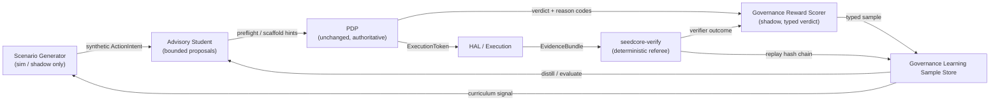

# Governance-Aware Learning Next Stage Plan

Date: 2026-05-21
Status: Priority implementation plan for autonomy-ready simulation and training; four-node loop topology and verdict-taxonomy grounded in accepted trust-runtime ADRs
Related:

- [ADR 0001: Keep the PDP Stateless and Synchronous at Decision Time](../architecture/adr/adr-0001-pdp-hot-path.md)
- [ADR 0004: Coordinator-Embedded RESULT_VERIFIER With Journal Polling and Fail-Closed Twin Mutation](../architecture/adr/adr-0004-result-verifier-runtime.md)
- [ADR 0005: Preserve Replayable Evidence for Governed Digital Twin State Transitions](../architecture/adr/adr-0005-replayable-evidence-governed-state-transitions.md)
- [ADR 0003: Adopt an IGX Thor Trusted Edge Profile for High-Regulation SeedCore Deployments](../architecture/adr/adr-0003-igx-thor-trusted-edge-profile.md)

## Purpose

This document defines the next higher implementation stage after the current
`Restricted Custody Transfer` hardening sequence:

**turn learned models from a black box into a compilable governance component
that strengthens SeedCore's trust slice without weakening the synchronous PDP
boundary.**

This plan exists because SeedCore is now at a point where the next meaningful
upgrade is not "add more model capability" in the abstract. The next upgrade is
to make learning systems useful inside the existing trust boundary:

- distillation to compress complex reasoning into bounded, replayable artifacts
- abstention tuning so models stop hallucinating authority
- governance-aware RL in simulation so robotics policies learn contract
  compliance natively
- proof/refinement loops that improve evidence quality without bypassing
  verification

## Priority Update (2026-05-21)

Governance-aware learning should move earlier in the roadmap because coding and
action agents now need safe environments where they can practice, diagnose, and
improve without gaining authority.

The first priority is not a broad RL platform. It is a compact autonomy-ready
simulation loop for SeedCore's RCT trust slice:

1. **Scenario Generator first.** Generate synthetic `ActionIntent` probes for
   stale telemetry, scope mismatch, approval gaps, coordinate redirect,
   evidence omission, outbox delay, and cross-asset replay. These probes run
   only in fixture, CI, host, simulation, or shadow lanes.
2. **Governance Reward Scorer second.** Convert PDP, replay, and
   `RESULT_VERIFIER` outcomes into typed verdicts and training samples. The
   scorer evaluates contract compliance, not business success, and never
   participates in live authorization.
3. **Learning Sample Store third.** Persist replay-linkable
   `GovernanceLearningSampleV1` records so coding/action agents can learn from
   admissible cases, near misses, and verifier failures without treating them
   as permission.
4. **Advisory Student later.** Distillation and abstention tuning consume the
   samples only after the scenario/scorer contracts are stable.

This plan also supports AI-led self-healing, but only in a staged form:
assistants may run drills, cluster failures, propose patches, and execute
verification gates. They may not patch production trust state, clear
quarantine, or promote enforce mode without the existing PDP/verifier/operator
promotion controls.

## Core Rule

The rule for this stage is:

> The model may learn. SeedCore still decides.

That means:

- the final governed `allow` / `deny` / `quarantine` / `escalate` decision
  stays in the pinned, synchronous hot path
- learned systems may propose, preflight, score, refine, explain, simulate, or
  abstain
- learned systems do not become an unbounded alternate authorization path

## Architectural Grounding

This plan is not an independent architectural track. It inherits from four
accepted or proposed trust-runtime ADRs, and every node in the governed
self-improvement loop (see *Loop Topology* below) is constrained by them.
Each ADR supplies a non-negotiable invariant that the learning program
preserves:

| ADR | Invariant it pins for this plan | How this plan preserves it |
| :--- | :--- | :--- |
| [ADR 0001](../architecture/adr/adr-0001-pdp-hot-path.md) — PDP stateless and synchronous at decision time | The final `allow` / `deny` / `quarantine` / `escalate` decision is a single synchronous, deterministic, fail-closed step over a pinned policy snapshot and bounded request context. Context staleness is a policy failure, not soft degradation. | The Advisory Student emits bounded, advisory outputs only. The Scenario Generator produces `ActionIntent` candidates that traverse the same synchronous PDP path. The Reward Scorer runs in shadow and never participates in the decision function. The verdict taxonomy's `stale_context` class is the direct expression of ADR 0001's freshness-as-policy-failure rule. |
| [ADR 0004](../architecture/adr/adr-0004-result-verifier-runtime.md) — Coordinator-embedded RESULT_VERIFIER, fail-closed twin mutation | Post-decision verification is authoritative; replay mismatches immediately mutate twin state to `verification_failed` or `verification_quarantined` with no auto-unquarantine. | `seedcore-verify` plus RESULT_VERIFIER remain the deterministic referee; the Reward Scorer consumes their outcome, not the other way around. The taxonomy's `verification_mismatch` verdict is the projection of ADR 0004's terminal-mismatch enforcement and is permanently fixed as a negative-only exemplar — no training configuration may promote it into positive-reward material. |
| [ADR 0005](../architecture/adr/adr-0005-replayable-evidence-governed-state-transitions.md) — Replayable evidence for governed twin transitions | Every governed mutation is explainable by a durable evidence package binding prior state, approved action, policy approval, execution result, and observational evidence; the replay unit is a state transition envelope, not just a receipt. | `GovernanceLearningSampleV1` is a projection of that replay envelope into a training sample. Every sample requires the pinned PKG snapshot hash, the decision-graph snapshot hash, the `EvidenceBundle` reference, and (where applicable) `state_binding_hash`. A sample that cannot be tied back to a replay envelope is not admissible for training or evaluation. |
| [ADR 0003](../architecture/adr/adr-0003-igx-thor-trusted-edge-profile.md) — Two-profile edge strategy (Prototype vs Trusted) | Simulation and early robotics iteration stay on Prototype Edge; high-consequence physical execution migrates to Trusted Edge where the node itself is part of the trust boundary. | Workstream 4 (governance-aware RL) runs only on the Prototype Edge profile and in simulation. No learned policy is exposed to a Trusted Edge deployment without passing shadow, canary, and enforce gates in that profile's posture, with the authority boundary still anchored by `ExecutionToken` issuance. |

### Derived binding rules

The invariants above collapse into five hard rules that apply across every
workstream, sample, and promotion gate in this plan:

1. **No learned component issues or emulates an `ExecutionToken`.** Authority
   flows only from the PDP under ADR 0001.
2. **No learned component overrides `seedcore-verify` or RESULT_VERIFIER.**
   The referee is deterministic under ADR 0004; the Reward Scorer is a shadow
   signal, not a veto and not an approval.
3. **No sample without a replay envelope.** Under ADR 0005, a
   `GovernanceLearningSampleV1` that lacks pinned snapshot, decision-graph, and
   evidence references is rejected at ingest time — not logged as a warning.
4. **No `verification_mismatch` in positive-reward material, ever.** This is
   the training-time projection of ADR 0004's fail-closed posture.
5. **No learned policy on Trusted Edge without the full promotion chain.**
   ADR 0003's edge profile split is the physical boundary for Workstream 4.

If a proposed ML feature, dataset, or promotion rule weakens any of these
five, it is out of scope regardless of the capability gain it offers.

## Why This Stage Exists

The repository already has the ingredients for a more serious learning loop:

- strict `seedcore.agent_action_gateway.v1` request boundaries
- replay-verifiable artifacts and strict triple-hash verification
- signed telemetry refs and closure evidence
- `seedcore-verify` and host verification scripts
- early distillation and tuning seams under `src/seedcore/ml/`
- simulation/training placeholders and VLA sidecar work

The missing piece is program shape. Today those seams are sidecar or exploratory.
This plan turns them into a bounded productization track.

## Non-Goals

This stage does not aim to:

- replace the PDP with an LLM
- let RL policies authorize physical execution on their own
- train a general foundation model inside SeedCore
- reopen the frozen RCT contracts just to make model training easier
- turn SeedCore into a broad robotics training platform

## What "Compilable Governance Component" Means

A learned component is acceptable in SeedCore only if it can be reduced to one
or more bounded outputs such as:

- typed scores
- typed reason-code predictions
- typed trust-gap predictions
- abstain / halt decisions
- contract-shaped evidence refinements
- simulator action policies that still require a valid `ExecutionToken`

Acceptable learned outputs are:

- schema-validated
- version-pinned
- replay-linkable
- promotable through shadow/canary style gates
- fail-closed when uncertain or out of scope

## Existing Repo Seams To Build On

These are the best entry points already present in the repo:

- `src/seedcore/ml/distillation/vla_distillation.py`
  - teacher escalation and trace-replay distillation orchestration
- `src/seedcore/tools/distillation_tools.py`
  - teacher and fine-tuning tool wrappers
- `src/seedcore/ml/distillation/sample_store.py`
  - sample persistence that can be extended from VLA traces to governance data
- `src/seedcore/ml/ml_service.py`
  - model serving, distillation, promotion, and shadow-scoring home
- `src/seedcore/tools/training_tools.py`
  - current placeholder training tools that can be upgraded into real simulation
    and reward plumbing
- `scripts/host/verify_rct_replay_strict.py` and `seedcore-verify`
  - verification feedback loop for trust-proof refinement
- `docs/development/vla_2026_optimizations.md`
  - useful robotics-side guidance, but it must remain subordinate to the trust
    slice

## Loop Topology

The five program objectives below are not independent tracks. They form a
bounded, governed self-improvement loop whose nodes all live inside the
existing zero-trust boundary. Read this section before the workstreams: it
explains why they are connected, not just co-located.

### The four nodes

1. **Scenario Generator** — the first implementation node. Observes recent
   evidence and verdict history, then emits new `ActionIntent` candidates
   shaped as governance probes (scope mismatch, stale-context, coordinate
   redirect, near-miss approvals, expired-TTL retries, telemetry/outbox delay).
   Runs only in simulation, CI, fixture, host, or shadow lanes. Home:
   `src/seedcore/ml/curriculum/` (new), feeding the existing red-team drill
   scripts referenced in `current_next_steps.md`.

2. **Governance Reward Scorer** — the second implementation node.
   Multi-signal evaluator of a completed attempt. Scores **contract
   compliance** rather than raw task success: zone compliance, token-scope
   compliance, E-STOP preference, evidence-capture completeness, replay
   consistency, outbox delivery posture, and mission completion. Emits a typed
   verdict (see next section), never a scalar. Home: upgrade the placeholders in
   `src/seedcore/tools/training_tools.py`; add
   `src/seedcore/ml/reward/governance_reward.py`.

3. **Governance Learning Sample Store** — the bounded experience database
   (`GovernanceLearningSampleV1`, formalized in Window G). Every sample carries
   the real hot-path verdict (`allow` / `deny` / `quarantine` / `escalate`),
   the verifier outcome, the pinned PKG snapshot hash, the decision-graph
   snapshot hash, and the `EvidenceBundle` reference so distillation and
   evaluation remain replay-linkable. Home: generalize
   `src/seedcore/ml/distillation/sample_store.py`; add an exporter from
   `EvidenceBundle` and `RESULT_VERIFIER` outputs.

4. **Advisory Student** — the distilled reasoning scaffold (Workstream 1 + 2).
   Emits bounded outputs (`reason_code`, `trust_gap_codes`, obligation
   suggestions, explanation scaffold, abstention codes). Never
   authority-bearing; consumed by the operator copilot and the preflight path.
   Home: `src/seedcore/ml/scaffolds/` (new) plus hooks in
   `src/seedcore/cognitive/advisory.py` and
   `src/seedcore/coordinator/core/advisory.py`.

### Conceptual flow



### Binding rules

Three rules are non-negotiable for this loop. They are the loop-level
restatement of the *Architectural Grounding* derived rules above:

- the PDP and `seedcore-verify` remain the **only** authoritative judges;
  the Governance Reward Scorer runs in shadow and informs training, never
  execution
  ([ADR 0001](../architecture/adr/adr-0001-pdp-hot-path.md),
  [ADR 0004](../architecture/adr/adr-0004-result-verifier-runtime.md))
- synthetic intents produced by the Scenario Generator travel through the
  same `ActionIntent → PDP → ExecutionToken → HAL` pipeline as any other
  intent; self-generation does not confer authority
  ([ADR 0001](../architecture/adr/adr-0001-pdp-hot-path.md))
- every sample stored in the Governance Learning Sample Store is
  replay-linkable — pinned PKG snapshot hash, decision-graph snapshot hash,
  and `EvidenceBundle` reference are required fields, not optional metadata
  ([ADR 0005](../architecture/adr/adr-0005-replayable-evidence-governed-state-transitions.md))

If a proposed change to any node weakens one of these three rules, it is
out of scope for this plan regardless of how it improves model behavior.

## Program Objectives

This next stage should deliver five outcomes.

### 1. Distilled Policy Scaffolds

Distill complex teacher reasoning into bounded student outputs that support the
stateless PDP rather than replacing it.

Target outputs:

- trust-gap prediction
- reason-code prediction
- obligation suggestion
- explanation scaffold
- preflight risk classification

### 2. HALT / Abstention Behavior

Tune model behavior so uncertainty about authority becomes an explicit,
contract-shaped abstention rather than improvisation.

Target outputs:

- `unsure_of_authority`
- `insufficient_evidence`
- `stale_context`
- `scope_mismatch`
- `requires_manual_review`

### 3. Trust-Proof Refinement

Use verification feedback to improve the generation and repair of
replay-verifiable bundles and `trust_proof` material.

Target outputs:

- higher first-pass verification success
- fewer malformed evidence bundles
- deterministic repair suggestions instead of free-form retries

Design boundary:

- the refiner consumes verifier reports; it does not reinterpret verifier
  outcomes
- candidate repairs are recommendations until strict replay verifies the
  patched candidate bundle
- production paths are read-only advisory; the refiner never mutates
  already-verified artifacts, clears quarantine, substitutes hashes, replaces
  signatures, or rewrites authority-bearing values

#### Refinement Safety Contract

Window J must treat proof refinement as a typed safety contract around the
deterministic verifier, not as an agentic repair oracle. The first
implementation should consume the structured `ReplayVerificationReport` /
`VerificationReport` shape emitted by `seedcore-proof-core` and the grouped
`seedcore-verify list-error-codes` manifest, then map verifier failures into
bounded recommendation classes.

The initial repair matrix is extensible, but it must classify at least the
current verifier families below:

| Verifier signal | Repair class | Patch surface | Auto-apply | Replay required | Manual review |
| :--- | :--- | :--- | :--- | :--- | :--- |
| `canonicalization_failed` caused by representation-only issues | `format_repair` | candidate patch | dev fixtures only | yes | if the normalized bytes differ in hash material |
| Missing optional non-authority metadata with a matching schema/provenance value | `schema_completion` | candidate patch | dev fixtures only | yes | yes unless `authority_effect` is `none` |
| `artifact_hash_mismatch`, `payload_hash_mismatch`, `snapshot_hash_mismatch`, `state_binding_hash_mismatch`, or related direct replay mismatch codes | `diagnostic_hash_recompute` | diagnostic metadata only | no | yes | yes |
| `replay_chain_mismatch` | `candidate_chain_reorder` | new candidate bundle only | no | yes | yes |
| `signature_mismatch`, `missing_key_ref`, `key_not_found`, `unsupported_signing_scheme`, `invalid_key_material`, `invalid_trust_anchor`, `key_ref_mismatch`, `invalid_key_algorithm`, `endpoint_binding_mismatch`, `missing_attestation_binding`, `revoked_signer`, `replayed`, transparency failures, and evidence co-signature failures | `not_agent_repairable` | none, diagnostic only | no | yes | yes |
| Rust verifier timeout or unavailable retry codes | `verifier_retry` | no proof mutation | retry verifier only | yes | if retry still fails |

`diagnostic_hash_recompute` may compute and display the hash the verifier saw,
but it must not replace declared artifact hashes in production records.
`candidate_chain_reorder` may propose a reordered candidate bundle only when
the original artifacts are preserved byte-for-byte and the suggestion is tied
to the original bundle hash. Signature, key, trust-anchor, attestation,
revocation, replay, and transparency failures are not agent-repairable.

Every recommendation must include an `authority_effect`:

- `none` — no change to authority-bearing values
- `format_only` — representation normalization only, with no semantic or hash
  material change
- `changes_hash_material` — any proposed edit changes bytes covered by a hash
  or signature
- `changes_chain_order` — artifact ordering or predecessor links change
- `changes_signature_domain` — signer, key, scheme, trust anchor, attestation,
  revocation, or transparency interpretation changes
- `changes_authority_interpretation` — PDP outcome, token scope, verifier
  status, quarantine posture, or settlement interpretation would change
- `unknown` — default fail-closed classification

Only `none` and `format_only` can be eligible for dev-fixture auto-apply.
All other values require manual review and replay. In staging and production,
`can_auto_apply` must be false regardless of repair class unless a later ADR
creates a narrower allowlist.

The refiner should emit a strict `RefinementRecommendationV1` object:

```json
{
  "refinement_id": "refine_...",
  "input_bundle_hash": "sha256:...",
  "verifier_error": {
    "error_code": "artifact_hash_mismatch",
    "artifact_type": "EvidenceBundle",
    "field_path": "$.artifacts[2].artifact_hash",
    "severity": "critical"
  },
  "repair_class": "diagnostic_hash_recompute",
  "repair_status": "manual_review_required",
  "authority_effect": "changes_hash_material",
  "requires_replay": true,
  "requires_manual_review": true,
  "requires_resigning": false,
  "can_auto_apply": false,
  "suggested_patch": null,
  "value_sources": [
    {
      "source_type": "verifier_report",
      "source_id": "seedcore-verify:...",
      "source_path": "$.artifact_reports[2].details",
      "source_hash": "sha256:..."
    }
  ],
  "diagnostics": {},
  "safety_notes": []
}
```

Diagnostics should use compiler-style JSON findings so agents, reviewers, and
CI can consume the same shape without parsing prose. A finding must include at
least `severity`, `error_code`, `artifact_type`, `field_path`, `message`, and
`authority_effect`. When a finding is derived from replay or verifier output,
it must also carry the verifier report reference and input bundle hash. These
diagnostics are explanation and routing material; they do not reinterpret the
verifier result or authorize patch application.

Allowed `repair_class` values for the first contract are
`format_repair`, `schema_completion`, `diagnostic_hash_recompute`,
`candidate_chain_reorder`, `verifier_retry`, and `not_agent_repairable`.
Allowed `repair_status` values are `proposed`, `applied_in_dev_fixture`,
`manual_review_required`, `replay_failed`, `replay_passed`, and
`unrepairable`. Allowed `source_type` values are `verifier_report`,
`provenance_trace`, `schema_definition`, `original_bundle`, and
`operator_input`; `operator_input` may justify review context, but it cannot
by itself justify authority-bearing mutation.

Operating modes:

- `dev_repair`: local fixtures and mock replay suites may auto-apply
  `format_repair`, and only fixture-scoped `schema_completion`, when
  `authority_effect` is `none` or `format_only`; replay is still required.
- `staging_shadow`: proposes patches and measures recovery rate through shadow
  replay; no production state is mutated and `can_auto_apply` is false.
- `production_advisory`: read-only diagnostics only; no patch application,
  hash substitution, signature repair, quarantine clearance, or evidence
  mutation.

### 4. Governance-Aware RL In Simulation

Train robot policies so contract compliance is part of the reward function, not
an afterthought bolted on after motion planning.

Target outputs:

- unauthorized-zone aversion
- token-scope compliance
- E-STOP preference over unsafe completion
- better evidence capture discipline in sim

### 5. Promotion Discipline

Every learned component must have a route from offline experiment to
shadow-scored production use without bypassing existing trust contracts.

## Verdict Taxonomy As Reward Signal

Every workstream in this plan consumes or emits a **typed verdict**, not a
scalar reward. This is the single most important design choice in this
program: a scalar "success score" cannot express the difference between an
allowed action that almost hit the scope boundary and an allowed action that
was well inside the envelope. Without that distinction, the Governance Reward
Scorer collapses into either a rubber stamp or a noisy filter, and neither
outcome is useful inside a deterministic trust runtime.

The verdict is derived from the real hot-path decision plus the verifier
outcome — not inferred by a model. Every `GovernanceLearningSampleV1` carries
exactly one verdict from this set:

| Verdict | Hot-path decision | Verifier outcome | Training signal |
| :--- | :--- | :--- | :--- |
| `clean_allow` | `allow` | `verified` | positive exemplar for preflight and scaffold tuning |
| `clean_deny` | `deny` | n/a | positive exemplar for abstention and reason-code tuning |
| `near_miss_allow` | `allow` | `verified`, with one or more trust-gap signals crossing a warning threshold | high-value learning signal — the scaffold should have surfaced a trust gap; teach it to flag without denying |
| `near_miss_deny` | `deny` | n/a, denial driven by only one trust-gap dimension | high-value learning signal — useful for preflight-recommendation tuning |
| `quarantine` | `quarantine` | n/a | teaches the scaffold when abstention is the right answer |
| `escalate` | `escalate` | n/a | teaches routing to operator review; captures the human decision when recorded |
| `verification_mismatch` | `allow` | `mismatch` / `lockout` | highest-priority **negative** exemplar — the runtime allowed something replay could not reproduce; ranks above all other training signal |
| `stale_context` | any | any, with pinned snapshot mismatch or expired binding | teaches the scaffold to emit `stale_context` abstention instead of proceeding |

Two derived signals ride alongside each verdict:

- **trust-gap vector** — the set of `trust_gap_codes` that fired during the
  decision, with per-gap severity so `near_miss_*` cases are explainable and
  rankable
- **distance-to-boundary** — where applicable, the numeric margin by which a
  threshold was cleared (scope overlap, TTL headroom, OCPS drift, approval
  coverage), stored to let the scorer rank `near_miss_*` samples against each
  other

### Taxonomy-derived promotion rules

These rules bind the Reward Scorer and the Advisory Student together so that
learning improves the trust slice instead of diluting it:

- a distilled student must show strict improvement on `clean_allow` and
  `clean_deny` exemplars before it is allowed to influence `near_miss_*`
  samples, even in shadow
- the Governance Reward Scorer must never promote a `verification_mismatch`
  sample into positive-reward training material under any configuration —
  replay mismatches are negative exemplars only
- `escalate` samples carry the operator's resolution as supervised ground
  truth when available; without that resolution they are treated as unlabeled
  and used only for abstention calibration, not for decision mimicry
- `stale_context` samples are never used to train decision outputs; they only
  train the abstention head, because the correct response to stale context is
  to refuse, not to guess

### Why this taxonomy, not a scalar

Every existing runtime surface already produces the raw material:

- the hot-path decision is already one of `allow` / `deny` / `quarantine` /
  `escalate` (`src/seedcore/coordinator/core/governance.py`)
- the verifier outcome is already a bounded state from `seedcore-verify` and
  `RESULT_VERIFIER`
- trust-gap codes are already emitted by the PDP reason path
- snapshot and binding mismatches are already surfaced in replay evidence

The taxonomy is therefore not a new inference target to be modeled — it is
a **projection of signals the runtime already produces deterministically**.
That is what makes it safe: the Reward Scorer cannot drift away from the
trust runtime's own definition of success.

## Execution Order

The next stage should be scheduled in six windows after the current contract and
operability work.

### Window G: 2026-06-08 to 2026-06-28 (Completed)

Goal:

- freeze the governance-learning data and evaluation contract

Landed:

- defined Pydantic models for `GovernanceLearningSampleV1`
- built the parameter-driven exporter mapping supplied `EvidenceBundle`,
  `ActionIntent`, and verifier outcome artifacts to samples
- expanded the negative/shadow scenarios generation curriculum
- verified all criteria using `tests/test_governance_learning_harness.py`

### Post-Window G Adoption Note: Windows H-K Detail (2026-06-23)

The detailed H-K learning plan should be adopted as a decomposition of this
canonical plan, not as a parallel docs or source tree. Its strongest
contribution is the implementation discipline it adds after Window G:

- start with stable taxonomies and deterministic baselines
- keep teacher labels derived from PDP, verifier, schema, token, and replay
  outcomes before using any LLM explanation enrichment
- measure advisory outputs against the real hot-path and verifier outcomes
- treat abstention as a first-class safe output
- make verifier-guided repairs candidate patches only, never silent evidence
  mutation
- begin simulation with scripted governance agents before any RL policy

The literal deliverable paths in the external plan are **not** adopted. They
should be remapped into SeedCore's existing surfaces:

| External-plan path | SeedCore-native target |
| :--- | :--- |
| `docs/governance_learning/*.md` | sections or follow-on memos under `docs/development/`, linked from this plan |
| `docs/verifier/verifier_error_contract.md` | `docs/development/` verifier/replay contract memo, cross-linked to ADR 0004 and ADR 0005 |
| `docs/simulation/governance_simulation_scenarios.md` | `docs/development/` simulation/scenario memo, subordinate to the RCT trust slice |
| `src/governance_learning/*.py` | `src/seedcore/ml/scaffolds/`, `src/seedcore/ml/distillation/`, `src/seedcore/ml/reward/`, or `src/seedcore/ops/governance_learning/` depending on responsibility |
| `src/simulation/*.py` | SeedCore runtime or ML simulation modules under `src/seedcore/`, not a top-level simulation package |
| `data/governance_learning/*.jsonl` | generated artifacts produced by the sample store/exporter and excluded from authority paths |
| `reports/window_*_eval.md` | generated evaluation reports; docs may summarize them, but reports do not become authority |

The adoption decision is therefore:

1. **Adopt H-K as the current roadmap sequence.** Window H is the next live
   work after the completed Window G contract freeze.
2. **Adopt the safety rules verbatim in spirit.** Learned components may
   explain, abstain, repair, and simulate, but they cannot issue tokens,
   override PDP, clear verifier failures, mutate signed evidence, or imply
   physical deployment readiness.
3. **Do not adopt the package layout verbatim.** New implementation should use
   existing `src/seedcore` namespaces and existing `docs/development` routing.
4. **Do not treat compute scale as the milestone.** The durable milestones are
   taxonomy stability, replay-linkable samples, deterministic baselines,
   schema-valid advisory outputs, zero false-safe critical advisories, and
   verifier/replay closure.

### Window H: 2026-06-22 to 2026-07-19

Goal:

- build the first distilled reasoning scaffold in shadow mode

Must land:

- advisory output taxonomy for `reason_code`, `trust_gap_codes`,
  `missing_authority_context`, `evidence_risk_flags`, and expected abstention
  reasons
- teacher prompt/spec plus deterministic teacher labeler for RCT preflight and
  explanation scaffolds, with labels derived first from PDP, verifier, schema,
  token, and replay outcomes
- replay-derived dataset from `GovernanceLearningSampleV1` records, preserving
  policy snapshot, decision-graph snapshot, verifier outcome, and evidence
  references
- one student artifact that predicts bounded outputs such as:
  - `reason_code`
  - `trust_gap_codes`
  - `required_obligations`
  - `abstain`
- shadow evaluation path in the ML service or equivalent offline harness,
  including exact match, taxonomy-valid match, trust-gap precision/recall,
  false-safe advisory rate, and zero final-authority usage
- promotion gates comparing teacher/student predictions with real hot-path
  outcomes

Success criteria:

- no use of the student artifact as the final PDP
- `student_final_authority_usage = 0`
- taxonomy-valid output on the chosen evaluation slice
- zero false-safe advisory outputs on critical cases

### Window I: 2026-07-13 to 2026-08-09

Goal:

- implement HALT-style abstention tuning for authority uncertainty

Must land:

- one abstention taxonomy for the agent boundary
- negative and ambiguous examples from failed preflights, denied requests,
  stale-context cases, incomplete evidence, unclear token scope, and human
  escalation examples
- confidence calibration that routes authority uncertainty to:
  - preflight only
  - operator review
  - no-execute
- contract tests proving the tuned model does not "work around" missing
  authority or failed preflight checks

Success criteria:

- the tuned model abstains on authority ambiguity instead of inventing a path
- critical uncertainty miss rate is zero on the selected critical slice
- false-allow advisory rate is zero on critical cases
- no regression in strict gateway or verification contracts

### Window J: 2026-08-03 to 2026-08-30

Goal:

- build the trust-proof refiner and verification agent

Must land:

- one verification-agent workflow that wraps strict replay verification
- one structured feedback parser for `seedcore-verify` or
  `verify_rct_replay_strict.py`
- one deterministic error-to-repair mapping from verifier errors to the
  refinement safety contract above, where a patch can reference a source trace
  only when the source trace contains the matching value
- one refinement loop that proposes contract-shaped repairs to malformed proof
  bundles, with original bundle hash, candidate patch, source provenance,
  `authority_effect`, replay result, and review status
- one supervised fine-tuning or self-distillation pass over successful
  `trust_proof` artifacts and verified evidence bundles

Success criteria:

- improved replay-verification pass rate on held-out malformed examples
- no automatic mutation of already-verified artifacts in production paths
- `silent_evidence_mutation = 0`
- `accepted_without_replay = 0`
- critical verifier errors cannot be auto-fixed without review unless the
  contract explicitly allows that class
- every recommendation with `changes_hash_material`,
  `changes_signature_domain`, `changes_authority_interpretation`, or
  `unknown` is manual-review only

### Window K: 2026-08-24 to 2026-09-27

Goal:

- implement governance-aware RL in simulation only

Must land:

- governance-specific simulation scenarios covering expired tokens, asset
  scope mismatch, E-STOP preference, missing telemetry, verifier quarantine,
  incomplete delegation chains, and stale policy snapshots
- one scripted baseline agent before any RL work
- one simulator reward contract including:
  - mission completion
  - zone compliance
  - token scope compliance
  - E-STOP / safety behavior
  - evidence capture completion
- one simulation backend path for Unitree B2/Z1 or equivalent environment,
  only after the scripted governance loop is green
- optional lightweight RL with a small discrete action space (`proceed`,
  `halt`, `request_manual_review`, `refresh_context`, `generate_evidence`,
  `quarantine_and_stop`)
- one policy-distillation pass from any RL teacher into a bounded student
  policy artifact
- one evaluation slice proving the learned policy respects governance
  constraints more often than a naive baseline

Success criteria:

- unauthorized motion incurs heavy negative reward
- simulated execution still requires valid authority artifacts in the loop
- physical execution remains gated by SeedCore, not by the RL policy alone
- E-STOP violation, critical boundary violation, invalid-token proceed, and
  quarantine-continue rates are zero on the selected critical slice

### Window L: 2026-09-21 onward

Goal:

- promote the best learning components into controlled product use

Must land:

- one shadow lane for distilled reasoning scaffold outputs on live RCT traffic
- one operator-visible comparison surface between learned scaffold and actual
  governed decision
- one rollout policy for enabling:
  - preflight recommendation
  - explanation assist
  - proof refinement assist
  - simulation policy promotion

Success criteria:

- learning improves operator speed or evidence quality without weakening
  admissibility guarantees
- every promoted artifact is pinned, measurable, and reversible

## Detailed Workstreams

### Workstream 1: Distilled Reasoning Scaffold

Intent:

- compress expensive teacher reasoning into bounded structures that fit the
  stateless, synchronous trust model

Implementation direction:

- teacher runs offline on replay-rich RCT cases
- student predicts typed outputs, not free-form legal prose
- PDP consumes those outputs only in shadow or preflight until proven safe

Best first use cases:

- explanation scaffold generation
- trust-gap prediction
- obligation recommendation
- shadow reason-code prediction

### Workstream 2: HALT / Abstention Tuning

Intent:

- teach models to stop when authority is uncertain

Implementation direction:

- collect examples where SeedCore correctly denied, quarantined, or escalated
- fine-tune a smaller model to emit bounded abstention states
- treat abstention as a strength, not as failure

Best first use cases:

- agent gateway preflight
- operator copilot brief warnings
- edge-actor no-execute recommendations

### Workstream 3: Trust-Proof Refiner

Intent:

- make evidence and trust-proof generation more verification-native

Implementation direction:

- use strict verifier feedback as the training signal
- bias for exact schemas, hashes, and signature-related fidelity
- keep refinement out of the final decision path unless separately approved
- require `RefinementRecommendationV1` output for repair suggestions
- preserve the original bundle hash and emit candidate patches instead of
  overwriting proof material
- classify every suggestion with `repair_class`, `authority_effect`, replay
  requirement, value sources, and review status

Best first use cases:

- malformed bundle repair suggestions
- pre-submission bundle linting
- `trust_proof` completeness checks

### Workstream 4: Governance-Aware RL

Intent:

- make control policies learn SeedCore's authority boundary rather than collide
  with it

Implementation direction:

- reward success only when the simulated execution path also respects:
  - authority scope
  - zone constraints
  - safety/E-STOP rules
  - evidence capture obligations
- keep the teacher in simulation
- distill only bounded student artifacts downstream

Best first use cases:

- handover and pickup maneuvers
- custody-zone compliance
- anomaly-first E-STOP behavior

## Acceptance Gates

This stage should not be considered successful unless it can prove all of the
following. Each gate cites the ADR it enforces at evaluation time:

- the final PDP remains deterministic and synchronous
  ([ADR 0001](../architecture/adr/adr-0001-pdp-hot-path.md))
- no learned component bypasses `ExecutionToken` or approval requirements
  ([ADR 0001](../architecture/adr/adr-0001-pdp-hot-path.md))
- learned outputs are schema-valid and replay-linkable; every sample carries
  pinned PKG snapshot hash, decision-graph snapshot hash, and `EvidenceBundle`
  reference
  ([ADR 0005](../architecture/adr/adr-0005-replayable-evidence-governed-state-transitions.md))
- abstention improves authority safety rather than reducing throughput through
  noise
- verification-agent/refiner outputs increase proof quality measurably without
  overriding RESULT_VERIFIER terminal-mismatch enforcement
  ([ADR 0004](../architecture/adr/adr-0004-result-verifier-runtime.md))
- simulation RL produces governance-aware behavior before any hardware
  exposure; no learned policy reaches the Trusted Edge profile without
  completing shadow, canary, and enforce gates
  ([ADR 0003](../architecture/adr/adr-0003-igx-thor-trusted-edge-profile.md))
- every training and evaluation step consumes the typed verdict taxonomy; no
  scalar "task success" score is used as a promotion gate
- `verification_mismatch` samples are never observed as positive-reward
  material in any configuration, tested by a dedicated contract test
  ([ADR 0004](../architecture/adr/adr-0004-result-verifier-runtime.md))

## Suggested First Code Changes

The most practical first implementation sequence is, annotated by loop node:

1. **Sample Store** — generalize `src/seedcore/ml/distillation/sample_store.py`
   from VLA traces into governance-learning sample storage; land the
   `GovernanceLearningSampleV1` schema with pinned PKG snapshot hash,
   decision-graph snapshot hash, `EvidenceBundle` reference, and verdict field
2. **Sample Store** — add one sample exporter that walks
   `EvidenceBundle` and `RESULT_VERIFIER` artifacts and emits
   `GovernanceLearningSampleV1` records
3. **Reward Scorer** — add a projection that stamps each sample with a typed
   verdict from the taxonomy; start with deterministic projection only, no
   learned scoring
4. **Advisory Student** — add one offline evaluation harness for bounded
   `reason_code` and `trust_gap_codes` predictions, measured against `clean_*`
   samples first, `near_miss_*` samples second
5. **Reward Scorer + Workstream 4** — upgrade `train.simulation` and
   `train.behavior` placeholders in `src/seedcore/tools/training_tools.py`
   into real simulator plumbing that consumes the verdict taxonomy as reward
6. **Scenario Generator** — land a minimal scaffold under
   `src/seedcore/ml/curriculum/` that replays historical `near_miss_*` and
   `verification_mismatch` samples as synthetic probes before any generative
   component is added
7. **Reward Scorer** — add one verification-agent tool wrapper that shells
   around strict replay verification and feeds refinement signal back into the
   Sample Store

This order gives SeedCore the data, verdict, and evaluation spine before it
commits to any particular model family or RL backend. Steps 1–4 are
mandatory before any shadow-lane promotion of a learned component.

## Decision Rule

When prioritizing learning work, choose the option that makes this statement
truer:

> SeedCore can use learned systems to improve admissibility, abstention,
> evidence quality, and robotics safety without weakening the deterministic
> governance boundary.

If a proposed ML feature makes that statement weaker, it is probably sidecar.
