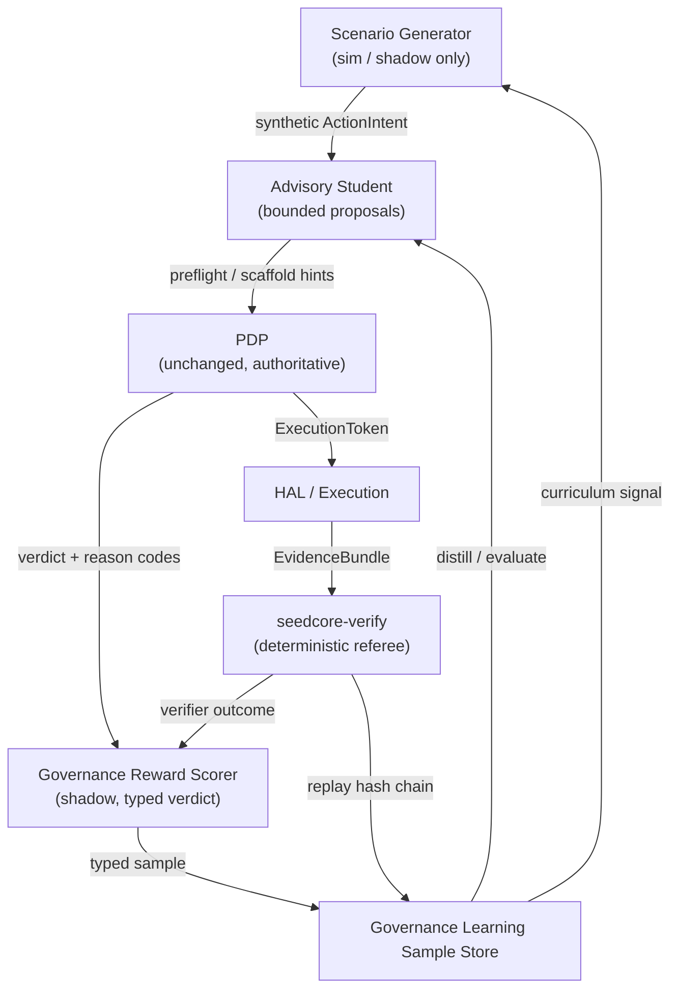

# Window G Implementation Plan: Governance-Aware Learning Contract & Schema Freeze

**Status: Landed & Verified (2026-06-22)**

## Context & Goal
As of **June 2026**, SeedCore has landed the **Immutable Policy Gates**, the **Edge Trust Adapter v0.1**, and now the **Window G Governance-Learning Contract Slice**. According to the [North Star Architecture](north_star_autonomous_trade_environment.md) and the [Governance-Aware Learning Next Stage Plan](governance_aware_learning_next_stage_plan.md), the next implementation focus is **Window G (2026-06-08 to 2026-06-28)**:

> **Goal:** Freeze the governance-learning data and evaluation contract (Completed).

This plan details the implementation tasks that have been successfully landed to model, export, and evaluate `GovernanceLearningSampleV1` records.

---

## Architectural Loop Topology

The governed self-improvement loop ensures that learned systems (the **Advisory Student**) remain strictly subordinate to the stateless, synchronous **PDP** and deterministic **Result Verifier**.



### Immutable Constraints
1. **No ExecutionToken Emulation:** Learned components cannot issue authority.
2. **Referee Primacy:** `RESULT_VERIFIER` is the final referee. A `verification_mismatch` is a negative-only exemplar.
3. **Replay-Linkable Traceability:** Every sample must reference a valid `EvidenceBundle` and decision snapshots.

---

## Landed Schema: `GovernanceLearningSampleV1`

The schema is defined as a strict Pydantic model inside [governance_learning.py](file:///Users/ningli/project/seedcore/src/seedcore/models/governance_learning.py).

### Feature Vector & Evidence Summary
To make the samples usable by XGBoost or lightweight models (under `src/seedcore/ml/distillation/sample_store.py`), we will extract a structured feature vector and evidence summary.

```python
from __future__ import annotations
from typing import Any, Dict, List, Optional
from pydantic import BaseModel, Field

class GovernanceFeatureVector(BaseModel):
    """Normalized numeric/boolean features extracted from the ActionIntent & Context."""
    telemetry_age_seconds: float = 0.0
    has_valid_coordinates: bool = False
    has_valid_signature: bool = False
    has_matching_assets: bool = False
    device_enrolled: bool = False
    is_approved_zone: bool = False
    approval_envelope_present: bool = False
    declared_value_usd: float = 0.0
    requires_co_signature: bool = False
    trust_gap_count: int = 0
    distance_to_boundary: float = 0.0  # Room remaining before threshold breach

class EvidenceSummary(BaseModel):
    """Verification-side structural indicators from the EvidenceBundle."""
    has_transition_receipts: bool = False
    has_policy_receipt: bool = False
    has_asset_fingerprint: bool = False
    signer_profile: str = "none"
    telemetry_count: int = 0
    media_count: int = 0

class GovernanceLearningSampleV1(BaseModel):
    """The frozen contract for governance learning and distillation."""
    sample_id: str = Field(description="UUID-v4 format stable identifier")
    request_id: str
    intent_id: str
    replay_ref: str

    # Decisions & Metadata
    pdp_disposition: str  # allow / deny / quarantine / escalate
    reason_code: str
    trust_gap_codes: List[str] = Field(default_factory=list)
    obligations: List[Dict[str, Any]] = Field(default_factory=list)

    # Proof Surface Pointers (Mandatory for Training)
    evidence_bundle_id: str
    policy_snapshot_hash: str
    decision_graph_snapshot_hash: str
    state_binding_hash: Optional[str] = None

    # Referee Outcome
    verifier_outcome: str  # verified / verification_mismatch / stale_context / quarantine
    verdict: str  # clean_allow / clean_deny / near_miss_allow / near_miss_deny / quarantine / escalate / verification_mismatch / stale_context

    # Feature Projections
    features: GovernanceFeatureVector
    evidence_summary: EvidenceSummary

    # Extra Tracking
    created_at: str
    metadata: Dict[str, Any] = Field(default_factory=dict)
```

---

## Task Breakdown & Implementation Status

All four implementation tasks have been successfully landed and verified:

### Task 1: Schema Registration (Completed)
*   **Action:** Created [governance_learning.py](file:///Users/ningli/project/seedcore/src/seedcore/models/governance_learning.py) defining `GovernanceLearningSampleV1`.
*   **Integration:** Registered the new model in the models init package [__init__.py](file:///Users/ningli/project/seedcore/src/seedcore/models/__init__.py).

### Task 2: Implement Exporter & Pipeline (Completed)
*   **Action:** Built the parameter-driven pipeline to transform supplied replay, evidence, and verifier artifacts into learning samples. Created `GovernanceLearningSampleExporter` in [exporter.py](file:///Users/ningli/project/seedcore/src/seedcore/ops/governance_learning/exporter.py).
*   **Pipeline Flow:**
    1.  Accepts the terminal verifier outcome from the caller; a DAO-backed `ResultVerifierOutcomeRecord` query is a later integration step.
    2.  Accepts the corresponding `EvidenceBundle` and original `ActionIntent` payload.
    3.  Computes `GovernanceFeatureVector` and `EvidenceSummary` from the telemetry and receipt states.
    4.  Determines the `GovernanceVerdict` using `GovernanceRewardScorer`.
    5.  Emits and appends the completed `GovernanceLearningSampleV1` packet to the JSONL store via `src/seedcore/ml/distillation/sample_store.py`.

### Task 3: Expand Adversarial Scenarios (Completed)
*   **Action:** Expanded `GovernanceScenarioGenerator` in [governance_scenarios.py](file:///Users/ningli/project/seedcore/src/seedcore/ml/curriculum/governance_scenarios.py) to cover advanced probes:
    -   `coordinate_redirect`: Attempt to route pick/drop to unapproved coordinates (expected: `deny`).
    -   `replay_injection`: Inject an expired or previously verification-closed execution token (expected: `deny`).
    -   `tampered_telemetry_signature`: Provide signed edge telemetry where signature is invalid (expected: `quarantine`).
    -   `high_value_missing_cosignature`: Quarantine missing required co-signatures (expected: `quarantine`).

### Task 4: Baseline Evaluation Harness (Completed)
*   **Action:** Created the validation harness [test_governance_learning_harness.py](file:///Users/ningli/project/seedcore/tests/test_governance_learning_harness.py).
*   **Checks:**
    -   Verifies that validation fails closed if required hashes (policy snapshot, decision graph, evidence bundle) are absent.
    -   Asserts that no `verification_mismatch` outcome is ever marked as `admissible_for_positive_reward`.
    -   Ensures synthetic scenario probes correctly evaluate to their expected dispositions in mock runs.

---

## Local Verification Status (All Green)

To verify that the new contracts align with the existing environment:

```bash
# Run the core flywheel and energy validation
pytest tests/test_flywheel_harness.py tests/test_energy.py -q

# Run the new governance contract validation
pytest tests/test_governance_learning_scaffolds.py tests/test_governance_learning_harness.py -q

# Execute degraded-edge matrix drills to ensure zero-trust compliance
pytest tests/test_rct_degraded_edge_drill_matrix.py tests/test_rct_commerce_drill_matrix.py -q
```

---

## Success Criteria for Window G Sign-Off
1.  **Zero Optional Schema Fields:** Pinned snapshots, evidence hashes, and verifier outcomes must be mandatory for sample serialization.
2.  **Tamper/Replay Drills Passing:** Scenario generator emits coordinate-redirect and replay-injection probes with correct expected dispositions.
3.  **Positive Reward Isolation:** Unit tests confirm that no execution error, stale context, or verification mismatch can be marked as positive training signals.
