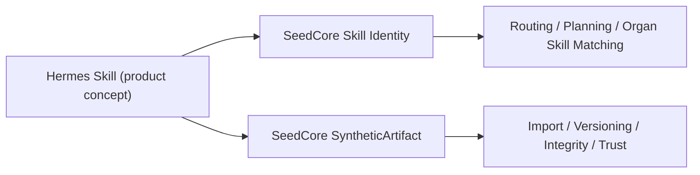

# Hermes Skill As SyntheticArtifact

Date: 2026-04-16  
Status: Draft modeling note for documentation

This note proposes how a "Hermes Skill" can be described in SeedCore terms
without forcing the concept into the wrong runtime category.

## Short Answer

A Hermes Skill should be modeled as **two connected things**, not one:

- a **runtime `skill` identity** in the agent layer
- a **synthetic `artifact` projection** that packages the skill into a
  portable, hashable, inspectable object

That split matches the current SeedCore architecture:

- `skill` is already a first-class agent-layer concept in Migration 008
- `artifact` is already the right home for lineage, versioning, integrity, and
  replay-oriented references

In other words:

> A Hermes Skill is what the system can do. A SyntheticArtifact is the
> reproducible package that describes, exports, or attests to that skill.

## Why This Split Fits SeedCore

SeedCore already treats **skills** and **artifacts** as different categories:

- skills participate in agent routing and capability identity
- artifacts participate in lineage, integrity, publication, and replay

This distinction is visible in the current repo:

- `skill` is a dedicated table and graph-node type in
  [`deploy/migrations/008_hgnn_agent_layer.sql`](/Users/ningli/project/seedcore/deploy/migrations/008_hgnn_agent_layer.sql:82)
- skills can be addressed through `start_skill_ids` in graph dispatch flows in
  [`src/seedcore/dispatcher/graph_dispatcher.py`](/Users/ningli/project/seedcore/src/seedcore/dispatcher/graph_dispatcher.py:409)
- artifacts are a first-class graph/runtime category in
  [`src/seedcore/graph/loader.py`](/Users/ningli/project/seedcore/src/seedcore/graph/loader.py:56)
- SeedCore design notes consistently reserve artifacts for replayable,
  evidence-friendly outputs in
  [`docs/design-notes.md`](/Users/ningli/project/seedcore/docs/design-notes.md:51)

If we model a Hermes Skill as **only** a skill, we lose packaging and
versioned exchange semantics.

If we model it as **only** an artifact, we lose the runtime meaning that a
skill has in routing, specialization, and execution.

## Recommended Documentation Model

### 1. Runtime identity

Use the existing SeedCore `skill` concept for the canonical runtime identity.

Recommended fields:

- `skill_name`: stable runtime name such as `hermes.customer_support`
- `meta.origin_system`: `"hermes"`
- `meta.skill_kind`: `"external_skill"`
- `meta.summary`: short human description
- `meta.capability_tags`: routing-oriented tags

This is the thing an organ, agent, or planner can reference when it needs to
say "this system has or requires this skill."

### 2. Synthetic artifact projection

Represent the Hermes Skill package/export/bundle as a SeedCore artifact with a
synthetic subtype.

Recommended documentation label:

- `SyntheticArtifact`

Recommended repo-aligned storage/category language:

- `Artifact`
- `artifact_type = "synthetic_skill_package"`

Alternative if we want the external name to remain explicit:

- `artifact_type = "hermes_skill"`

The first option is better if we expect more synthetic artifact families later.

## Core Semantics

The SyntheticArtifact is not "the skill itself."

It is the **portable manifestation** of the skill, for example:

- a prompt-and-tool bundle
- a packaged skill manifest
- a versioned skill definition exported from Hermes
- an attested skill release prepared for SeedCore ingestion

That means the artifact should answer questions like:

- what exact skill definition was imported?
- which version or release does this represent?
- what tools, prompts, schemas, or policies are bound to it?
- what hash identifies this package?
- what provenance or trust evidence accompanies it?

## Proposed Canonical Shape

```json
{
  "artifact_id": "artifact:synthetic-skill:hermes.customer_support:2026-04-16",
  "artifact_type": "synthetic_skill_package",
  "synthetic_artifact_kind": "HermesSkill",
  "display_name": "Hermes Customer Support Skill",
  "version": "2026.04.16",
  "status": "active",
  "skill_ref": {
    "skill_name": "hermes.customer_support",
    "origin_system": "hermes"
  },
  "package_manifest": {
    "entrypoint": "skills/customer_support/SKILL.md",
    "tool_contracts": [
      "seedcore.owner_context.preflight",
      "seedcore.agent_action.evaluate"
    ],
    "inputs_schema_ref": "schema:hermes.customer_support.input.v1",
    "outputs_schema_ref": "schema:hermes.customer_support.output.v1"
  },
  "provenance": {
    "source_url": "hermes://skills/customer_support",
    "exported_at": "2026-04-16T09:00:00Z",
    "publisher": "hermes-control-plane"
  },
  "integrity": {
    "artifact_hash": "sha256:...",
    "manifest_hash": "sha256:..."
  },
  "trust": {
    "signer": "kms://hermes-release",
    "trust_profile": "external_skill_release"
  }
}
```

## Documentation-Level Relationship Model



The key documentation claim is:

- **Skill identity** answers "what capability is this?"
- **SyntheticArtifact** answers "what exact packaged definition are we talking
  about?"

## Suggested Graph Interpretation

SeedCore does not currently define a first-class `SyntheticArtifact` node type.
For docs, the cleanest interpretation is:

- keep `SyntheticArtifact` as a **documentation concept**
- map it onto the existing `artifact` category in the actual runtime model

That gives us this conceptual graph:

- `Skill` node: runtime capability identity
- `Artifact` node: synthetic package for that skill
- optional edges:
  - `DESCRIBES` or `PACKAGES` from artifact to skill
  - `PROVIDES` from organ to skill
  - `USES` or `REQUIRES` from tasks/contracts to skill

The current repo already supports skill node creation and addressing, but not a
special artifact-to-skill edge vocabulary yet. So this relationship should be
documented first as a semantic model, not presented as already-implemented
schema.

## Minimal Rules For Documentation

If we describe Hermes Skills this way across docs, the language should stay
consistent:

- call the runtime thing a **Skill**
- call the portable/versioned thing a **SyntheticArtifact**
- when using repo-native terms, call it an **Artifact** with a synthetic skill
  subtype
- do not collapse routing identity and package identity into one object

## Recommended One-Sentence Framing

A Hermes Skill should be documented in SeedCore as a first-class runtime
`skill` plus a synthetic `artifact` projection that captures the versioned,
portable, and integrity-bound package for that skill.

## Recommendation

For SeedCore documentation, the best default is:

- **Concept name**: `HermesSkillArtifact`
- **SeedCore category**: `SyntheticArtifact`
- **Runtime mapping**: `Artifact`
- **Artifact subtype**: `synthetic_skill_package`
- **Linked runtime identity**: `skill_name`

That gives us room to add other synthetic artifact families later, while
keeping Hermes Skill explicit where product-facing docs need it.
