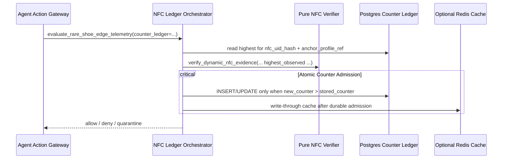

# Persistent Ledger for Monotonic Counters Plan

Date: 2026-06-12
Status: Planned implementation track for persistent NFC scan counter tracking
Related:
- [Virtual NFC Simulation Plan](virtual_nfc_simulation_plan.md)
- [`NfcVerificationContext`](../../src/seedcore/ops/evidence/nfc_verification.py)
- [`verify_dynamic_nfc_evidence`](../../src/seedcore/ops/evidence/nfc_verification.py)
- [`nfc_counter_ledger.py`](../../src/seedcore/ops/evidence/nfc_counter_ledger.py)

## Purpose

Currently, the `highest_observed_scan_counter` is passed to `verify_dynamic_nfc_evidence` via `NfcVerificationContext` at runtime. This requires upstream callers to fetch the last known counter value from somewhere and supply it, making the verifier state-dependent on ambient query patterns.

To prevent clone and replay attacks across separate workflows or nodes, SeedCore needs a **persistent, monotonic counter ledger** that is admitted atomically by the authority-path orchestration layer.

The pure verifier remains deterministic and fixture-friendly. It accepts a typed `highest_observed_scan_counter` in context and does not instantiate Redis, Postgres, or any ambient store. Stateful ledger admission is explicit through `verify_dynamic_nfc_evidence_with_counter_ledger(...)`.

This plan details:
1. Schema and database design for storing counters.
2. Redis-backed synchronous hot path checks for P99 latency.
3. Postgres-backed cold store for durable lineage.
4. Error-handling and fail-closed posture for state outages.

## Target Architecture



## Implementation Steps

### Step 1: Database Migration (Postgres)

We will define a new table `nfc_monotonic_counters` to store the authoritative, durable history of observed counters.

```sql
CREATE TABLE nfc_monotonic_counters (
    nfc_uid_hash VARCHAR(128) NOT NULL,
    anchor_profile_ref VARCHAR(255) NOT NULL,
    highest_scan_counter INT NOT NULL DEFAULT -1,
    last_observed_at TIMESTAMP WITH TIME ZONE NOT NULL,
    last_workflow_join_key VARCHAR(255) NOT NULL,
    updated_at TIMESTAMP WITH TIME ZONE NOT NULL DEFAULT NOW(),
    PRIMARY KEY (nfc_uid_hash, anchor_profile_ref),
    CHECK (highest_scan_counter >= -1)
);
```

- Target file: `deploy/migrations/136_nfc_monotonic_counters.sql`.

### Step 2: Redis Counter Cache Service

For synchronous PDP evaluations, reading from Postgres can introduce unacceptable latency jitter. We will store the active monotonic counter values in Redis.

- **Redis Key Format:** `nfc:counter:{nfc_uid_hash}|{anchor_profile_ref}`
- **Cache Strategy:**
  - Read from Redis first.
  - If cache miss, fetch from Postgres and populate Redis.
  - Treat Postgres as the durable admission authority.
  - Update Redis only after durable admission succeeds.

### Step 3: Add an Explicit Ledger Orchestrator

Instead of making `verify_dynamic_nfc_evidence` query storage directly, keep the pure verifier read-only and add an explicit orchestration helper.

1. Introduce `NfcCounterLedger` representing lookup and atomic admission.
2. Add `verify_dynamic_nfc_evidence_with_counter_ledger(...)` for authority paths.
3. Query the ledger for the current highest counter value.
4. Call the pure verifier with that value in `NfcVerificationContext`.
5. If verified and allowed, atomically admit the new counter.
6. If a concurrent admission wins first, return `deny` with `dynamic_nfc_proof_invalid`.

### Step 4: Fail-Closed Posture

If the durable counter ledger is unavailable or throws an error:
- Do NOT assume a default counter value of `-1` (which would permit any scan counter).
- Immediately return `quarantine` with reason code `counter_store_unavailable`.
- Prevent execution token issuance.

## Test & Validation Plan

1. **Unit Tests:**
   - Verify persistent update works when consecutive scans are performed.
   - Verify that concurrent duplicate counter scans are rejected.
2. **Degraded Edge Drills:**
   - Simulate a Redis connection failure and verify the verifier immediately returns `quarantine`.
   - Verify Postgres reconnection recovers the Redis cache on cache miss.
