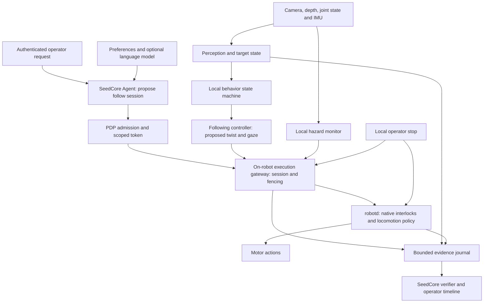

# Microduck Owner Recognition And Following

Date: 2026-09-22
Status: Research and proposed implementation; no robot adapter or following behavior implemented by this document

## Recommendation

Build a bounded `follow_person` skill above Microduck's existing locomotion
policy. SeedCore should connect person observations, enrolled identity, behavior
state, execution authority and outcome evidence. A deterministic local controller
should produce movement commands; `robotd` should retain balance and motor control.

The first useful demonstration is: an enrolled adult starts a short session,
the robot follows their visible marker in a supervised, level, bounded area,
and it stops when the target becomes ambiguous, observations become stale,
the path is blocked, or authority ends. Describe this as marker-associated
following, not verified biometric owner recognition or unrestricted home autonomy.

Keep the existing [M0–M4 integration gates](microduck_integration_plan.md).
Perception replay and behavior development can proceed alongside them, but
physical following depends on a working bounded motion session. Recognition
alone does not fill that gap.

## Inspected Baseline

Local source revisions inspected, not claims about an installed robot:

| Repository | Revision |
| --- | --- |
| SeedCore | `c5423efee556440f761e201feab02a56848a6923` |
| Microduck | `2703e0900da3e3d84114461ca91400c374d1d741` |
| Microduck RL | `cb70b792312d559a4da09064d92009079671815f` |

Microduck had pre-existing local simulator/script changes. Those files were not
used to establish upstream behavior and were not modified for this study.

| Finding | Implication |
| --- | --- |
| SeedCore has gateway/PDP/token/revocation and evidence foundations, but no Microduck driver in `src/seedcore/hal/drivers` | Implement the execution boundary before claiming governed physical following |
| `BaseRobotDriver` and HAL state handling are substantially shaped around Reachy poses; `emergency_stop` documentation says to stop motors | Add an explicit mobile-base/session capability; do not translate a biped's controlled halt into unconditional torque-off |
| `RobotCognitivePlanner` emits advisory proposals; `TeamMission` requires at least two robots and uses round closure | Reuse proposal/admission principles, but create a single-robot continuous skill supervisor; do not force one duck through team rounds |
| Microduck's observation contract is 61 inputs and 14 policy outputs, with a 13-value command block | Owner imagery belongs upstream of this policy; changing its input layout would break the deployment contract |
| `robot.move` takes `vx`, `vy`, `vyaw`; the protocol documents 20–50 Hz continuous intent | A local following controller can use the existing command vocabulary |
| `robot.look` accepts a trunk-frame target and runs gaze IK; `robot.head` accepts joint targets | Reuse gaze support after checking the selected policy, reachable range and camera geometry |
| Intent slots use last-writer-wins; `robot.stop` writes a zero twist | Stop is not an exclusive ownership latch; another accepted writer can command motion again |
| The native deadman defaults to 500 ms and zeroes stale twist | This is a source default, not a measured physical stopping bound, perception timeout or sufficient session watchdog |
| `duck-detect` is a single-class detector for other Microducks; `pet-detect` detects head scratching from audio | Neither provides person detection or owner identity |
| The ToF implementation exposes an 8×8 grid; sensor presence and calibration vary by profile | Do not assume a dense depth camera, full obstacle coverage or cliff detection |

SeedCore anchors: [HAL interface](../../../src/seedcore/hal/interfaces.py),
[HAL service](../../../src/seedcore/hal/service/main.py),
[robot contracts](../../../src/seedcore/robotics/contracts.py),
[cognitive proposals](../../../src/seedcore/robotics/cognitive.py), and
[coordinator](../../../src/seedcore/robotics/coordinator.py).
Pinned upstream source links are collected below.

Some upstream design prose lags code. For example, the NPU bring-up document
describes detector wiring as future work, while the inspected `mediad` code
already starts a detector and publishes sightings. Use executable code and
tests for the selected revision, then verify the installed build.

## Architecture And Deployment



Deploy the gateway, authority deadlines and independent native watchdog on the
robot. Start heavier person perception on a nearby laptop/edge computer over
WebRTC; measure whether a small detector/tracker can later fit on the board.
Microduck's maintained FAQ specifies WebRTC as the default media/control path;
`media.stream` is a frames-only fallback, not a complete following connection.
Route all motion ingress through the reviewed execution boundary even when
media and control share a WebRTC session.

Cloud services can handle conversation, enrollment administration, model
evaluation and delayed evidence upload. Neither cloud inference nor a SeedCore
Ray/database round trip should be needed for the next balance tick or a stop.
If offboard perception disappears, local enforcement must stop the task.

Initial engineering targets, to benchmark rather than advertise as guarantees:

| Work | Candidate cadence | Requirement |
| --- | --- | --- |
| Language understanding and skill selection | On requests/events | Never required to refresh motion |
| Person/marker detection and tracking | 10–20 updates/s if sustainable | Bound capture-to-use age, not just average inference time |
| Following controller and session checks | 20–50 updates/s | Match the pinned native intent interface without building queues |
| Native policy | 50 Hz source baseline | Preserve measured timing under perception/media load |
| Evidence upload | Asynchronous batches | Local required records survive temporary network loss |

The existing duck-detector benchmark is not a person-detector benchmark. Check
CPU, NPU compatibility, temperature and worst-case latency with camera encode
and walking active. Use latest-sample processing and bounded queues; a backlog
of correctly detected old frames is unsuitable for control.

## Identity Is Separate From Tracking And Permission

Maintain three separate identifiers:

- `principal_id`: the authenticated person/account that may grant the session;
- `subject_id`: the enrolled person selected as its target;
- `track_id`: a temporary observation track, scoped to a tracker boot/session.

A person detector answers “someone is visible.” A tracker answers “this appears
to be the same moving object.” An identity resolver supplies evidence that the
track corresponds to the selected subject. None of these observations creates
an owner grant. An owner may also explicitly authorize following another adult.

Recommended progression:

| Method | Good use | Limitation |
| --- | --- | --- |
| Known-size AprilTag/visual marker selected during authenticated setup | First reproducible target association and approximate relative pose | Must be visible; copied or exchanged tags are not cryptographic proof of identity |
| Person detector plus temporal tracking | Maintain continuity through ordinary motion | A track can switch at crossings or occlusion; it is not identity |
| Optional enrolled face verification | Strengthen association when a usable face is visible | A low camera and a person walking away often provide no usable face |
| Body appearance/re-identification | Additional association evidence | Clothing changes and similar people cause ambiguity; never sufficient to grant authority |
| Authenticated wearable with suitable ranging | Later corroboration under occlusion | Requires hardware; ordinary BLE signal strength does not establish precise bearing/range |

AprilTag supports pose estimation from tag size and camera intrinsics
([upstream library](https://github.com/AprilRobotics/apriltag)). Place the pilot
marker where the low camera can actually see it from behind; validate size,
range, lighting and motion blur. Retain reprojection error and pose uncertainty.
Do not assume that a chest badge or an unobstructed face stays in view.

Enrollment should explicitly select the target and processing/retention scope.
Store optional biometric templates separately with restricted access and a
deletion path. General memory may hold “prefers more following distance”; it
must not hold an implicit enduring permission to follow or export camera data.

Track association should gate on geometry, continuity, evidence quality and
competing candidates. Scores from different models are not interchangeable
probabilities. Calibrate thresholds on robot-view recordings, require stable
association over multiple observations, and stop on uncertainty. Do not switch
to the nearest visible person after losing the target. Reappearance alone must
not revive an interrupted session.

## Perception And Local World State

Use a compact state estimate rather than a full digital world model initially:
target bearing/range and uncertainty, track/subject binding, nearby hazards,
robot posture/health, source ages, behavior state and active authority.

The perception contract needs capture time, source sequence, coordinate frame,
calibration revision, detector/tracker revision and validity/uncertainty. Preserve
both capture and receive times. Map remote clocks explicitly; a newly received
old image must not become fresh. A repeated cached frame must not refresh the
observation deadline merely because its transport is alive.

Transform target measurements through the actual moving head:

```text
target_in_base(t) = T_base_from_camera(joints(t), calibration) * target_in_camera(t)
```

Interpolate time-aligned joint state and account for camera rotation/cropping.
An image-space horizontal offset is not automatically a body yaw error. If the
head is already turned, steering from that offset alone can turn the base the
wrong way. The current duck detector's normalized `bearing()` is not a calibrated
angle in radians.

For the marker pilot, calibrated tag pose can supply target range. For markerless
following, evaluate calibrated depth association or another measured range
source. Bounding-box height alone is too ambiguous to treat as an accurate
distance. An 8×8 ToF cell can mix the person, floor and background; reject invalid
or conflicting readings rather than averaging them into apparent confidence.

Target sensing and obstacle sensing have different jobs. The head looking at
the owner may remove the floor from view. If the available sensors cannot cover
the intended path, restrict the workspace and motion or add sensing. Missing
returns are not proof of free space. The pilot excludes stairs, ledges and
unobserved reverse/lateral motion; these exclusions need an actual supervised
workspace, not merely a text field in a token.

## Behavior And Motion

Use a deterministic state machine for the first version:

| State | Behavior and exit |
| --- | --- |
| `IDLE` | No following; wait for a request |
| `ACQUIRE` | Observe and associate the selected target without translating; head movement needs its own admitted scope |
| `READY` | Target stable and fresh; required sensors and authority valid |
| `FOLLOW` | Produce bounded twist/gaze while every guard holds |
| `HOLD_DISTANCE` | Zero translation inside the preferred distance band; remains active only with valid guards |
| `BLOCKED` / `TARGET_LOST` | Stop, explain the reason, and end the pilot attempt; no blind pursuit |
| `STOPPED` | Terminal after cancel, deadline, revocation or preemption; fresh admission required |
| `FAULT` | Native response for a fall, invalid state or unhealthy device; recovery is a separately admitted skill |

For the pilot, even reacquisition after interruption requires renewed admission.
A later profile could permit a bounded stationary search, but turning or scanning
is physical action and needs reviewed scope. Do not autonomously walk to the last
known owner location or stand back up beside someone's feet.

Start with forward movement and turning, with lateral/reverse velocity zero.
Given target horizontal range `r`, desired distance `r*`, and base-frame bearing
`theta`, an illustrative controller is:

```text
vx_candidate   = clamp(k_range * (r - r*), 0, permitted_forward_speed)
vy_candidate   = 0
vyaw_candidate = clamp(k_bearing * theta, -permitted_yaw_rate, permitted_yaw_rate)
```

Apply a distance deadband, alignment gate before translation, measured command
slew limits, target/obstacle validity checks and the final session envelope.
When too close, stop; do not automatically back into an unseen area. When the
person moves faster than the accepted gait can follow, fall behind and stop at
the tracking limit instead of raising the speed cap. Avoid integrator windup.

This is a controller sketch, not a deployment-ready algorithm. Saturating a
velocity command does not guarantee the same bound on actual motion. Ordinary
command smoothing must not delay a protective stop beyond the reviewed native
response. Do not add filtering to learned joint actions without matched training
and sim2real evaluation.

Choose stopping margins from measurements. A rough flat-ground check is:

```text
required_clearance >= v * T + v^2 / (2 * a_min) + uncertainty_margin
```

Here `v` conservatively bounds actual speed, `T` includes sensing age, processing,
transport and response initiation, and `a_min` is a measured conservative
deceleration. A biped's steps, falls and a moving person require further margin;
this equation is not a safety proof. Measure stop initiation and observed motion
cessation separately. If the sensor horizon is shorter than required clearance,
reduce speed or deny that operating profile.

Use obstacle stopping before route-around behavior. Nav2 provides useful
references for a dynamic-target following controller and an independent
collision monitor with source-age checks, but adding Nav2 would also require
validated transforms, odometry, footprint, sensors and a Microduck command bridge.
It does not identify an owner or confer safe biped navigation. Its defaults are
not Microduck limits.
([Following server](https://ros-navigation.github.io/mkdocs.nav2.org/rolling/configuration_and_development/configuration_guide/others/configuring_following_server/),
[collision monitor](https://ros-navigation.github.io/mkdocs.nav2.org/rolling/configuration_and_development/configuration_guide/core_servers/collision_monitor/configuring_collision_monitor_node/).)

## SeedCore Execution Changes

Follow the existing [execution contract](robot_execution_contract.md). Introduce
a versioned signed binding for the session specification; do not casually add
keys to frozen `ExecutionToken` constraints or assume arbitrary metadata is
authenticated.

Proposed specification fields, not current API fields:

| Contract | Required contents |
| --- | --- |
| `FollowSessionSpec` | Principal/grant, target enrollment reference, robot/endpoint, skill and policy digests, profile, distance band, command bounds, allowed directions, duration, required observations and maximum ages |
| `TargetObservation` | Source/boot/sequence, capture/receive times, frame/calibration, track and subject-association evidence, position/velocity estimates, covariance/quality, competing candidates |
| `MotionLease` | Claimed token/action, immutable spec hash, session/ownership epoch, monotonic deadline, revocation freshness, terminal/stop state |
| `CommandFrame` | Session/epoch/sequence, source observation references, generation deadline, twist/gaze and controller version |
| `FollowOutcome` | Requested result, actual terminal reason, observation/command coverage, posture and stopping evidence, assurance level and verifier disposition |

Claim one token once to start one session. Command refreshes remain inside it;
they do not re-spend the token or extend its expiry. Every command must pass
ownership, sequence, observation-age, health, envelope, revocation-freshness and
deadline checks. For target/hazard freshness, anchor validity to actual capture
and measurement events, not repeated predictions or repeated gateway sends.

The execution gateway should be the only autonomous writer. Inventory native
WebRTC, Unix socket, gamepad, BLE skill calls and local tools. Either route them
through the boundary, isolate them, or give reviewed operator paths explicit
preemption that fences autonomous writers. Restrict the native socket and reject
stale ownership epochs at the effective last writable boundary. A lock inside
one Python process cannot fence another client that reaches `robotd` directly.

Stopping must latch the session terminal before later motion can be accepted.
Then invoke the reviewed native halt behavior and observe the outcome. Upstream
`robot.stop` alone does not latch cancellation and does not necessarily cancel
every discrete learned maneuver. Admit only the validated walking/standing
profile for this skill. Keep motor enable, rise, recovery and policy replacement
as separate operations.

Keep the native deadman effective if the gateway crashes. A frozen perception
process with a healthy gateway is a different failure: the gateway must not keep
refreshing an obsolete command. On reboot/reconnect, discard queued motion,
reconcile unfinished evidence and require new admission. Remote revocation
during a partition is bounded by the local authority freshness deadline, not
instantaneously knowable.

## Concrete Repository Work

These are proposed additions, not files created by this study:

| Location | Work |
| --- | --- |
| `src/seedcore/robotics/perception/contracts.py` | Typed observations, time/frame/calibration binding and invalid-data rejection |
| `src/seedcore/robotics/identity/` | Enrollment references, association decisions and explicit ambiguity |
| `src/seedcore/robotics/skills/follow_person.py` | Deterministic state machine and controller with injectable clock/sensors |
| `src/seedcore/robotics/sessions/` | Single-robot skill lifecycle, ownership epochs, revocation/deadline enforcement and durable reconciliation |
| `src/seedcore/hal/drivers/microduck.py` | Pinned protocol mapping, state/health, twist/gaze and profile-specific halt; no remote raw joint writes |
| HAL interfaces/service and edge deployment | Mobile-base capability, signed admission mapping, enforced ingress coverage and independent watchdogs |
| Existing evidence/verifier surfaces | Action-bound journal, terminal reasons, observation coverage and outcome predicates |
| `tests/robotics/` and `scripts/robotics/` | Replay fixtures, fault injection, simulator bring-up and supervised measurement harness |

Keep module boundaries even if the first perception/controller prototype shares
one edge process. Do not add a distributed service for every conceptual layer.
The on-robot authority/watchdog boundary must remain independent of that process.

The language model can select `follow_person`, interpret “stay a little farther
back,” and explain an interruption. Preferences are clamped to admitted limits;
larger changes need new admission. A separate LLM agent per frame or per motor
adds latency without supplying the required control guarantees.

## Evidence, Evaluation And Delivery Gates

Record admission, target binding, model/calibration revisions, controller state
transitions, relevant source sequences/ages, requested and accepted commands,
native limits, stops and outcome coverage. Evidence upload cannot block control.
Keep a bounded required journal plus explicitly consented incident media where
needed; raw continuous video is not the default audit format.

Separate the task result from the evidence verdict. A correctly documented stop
on lost tracking is a verified interruption, not successful following and not
automatically a security quarantine. Missing or contradictory evidence can make
the outcome uncertain. A signed observation proves its provenance/integrity
under capture assumptions, not that the person was really the owner. Identity
accuracy requires independent labeled evaluation.

| Gate | Deliverable | Acceptance evidence |
| --- | --- | --- |
| F0, alongside M0–M1 | Read-only person/marker observation replay | Camera geometry, capture timestamps, range error and ambiguous crossings tested |
| F1, M2–M3 prerequisite | Bounded twist session and reliable termination | Invalid/expired authority rejected; stop latch, competing writers, stale command and process failure tested |
| F2 | Marker following in Microduck simulation | Tracking, spacing, gait response, loss and obstruction scenarios with pinned policy/model |
| F3, after M4 measurements | Short supervised hardware following | Measured tracking and stop behavior under declared lighting/floor/sensor/compute profile |
| F4 | Optional markerless association and richer interaction | Independent identity-error evaluation; no widening of authority on recognition |
| F5 | Route-around obstacles or room navigation | Validated localization, sensing coverage, dynamic obstacle handling and separate hardware acceptance |

Required failure scenarios include two people crossing; copied/swapped marker;
owner turning away; long and short occlusion; frozen video with a live socket;
reordered frames; moving head with delayed joint state; invalid or absent depth;
obstacle entering the path; a person approaching the stopped duck; owner outrunning
the gait; low battery/thermal load/fall; planner/gateway crash; network partition;
clock rollback; revoked session; a second motion writer after stop; reboot and
evidence-buffer exhaustion.

Report false target switches and false identity acceptance separately from
missed detections. Measure distance error, time within the desired band, tracking
availability, p95/p99 observation age, timing overruns, stop initiation/cessation
and distance, and journal gaps. Use independent ground truth for physical spacing
and identity where practical. Record trial counts and conditions; zero observed
failures in a small trial is not proof of zero risk. Set numeric pass limits from
the selected profile before acceptance testing, rather than choosing them after
seeing the results.

No RL retraining is needed merely to recognize a person. First evaluate the
existing gait under bounded commands. Train only if measured behavior exposes
a locomotion gap, such as low-speed turning or gaze stability, while preserving
the 61/14 contract and matched normalization/export. Training and memory updates
produce candidates; neither authorizes deployment or a wider motion envelope.

## Intelligence Beyond Following

The same target state, skill lifecycle and bounded authority can support greeting
an enrolled person, looking toward a speaker, waiting when someone pauses,
remembering a preferred distance, and explaining “I stopped because I lost
track of you.” Add each physical behavior with its own supported profile and
evidence. Greeting, speech understanding and personalization can improve the
experience before attempting general autonomous navigation.

The key platform enhancement is a reusable connection from uncertain perception
to an accountable, interruptible skill. Owner following is its first complete
application: recognition selects a target, the controller follows it, SeedCore
limits the attempt, and evidence describes what actually happened.

## Pinned Upstream Source References

- [Microduck command schema and units](https://github.com/pollen-robotics/microduck/blob/2703e0900da3e3d84114461ca91400c374d1d741/duck-ipc-proto/src/lib.rs): continuous/discrete methods and `MoveParams`.
- [Intent storage and stop semantics](https://github.com/pollen-robotics/microduck/blob/2703e0900da3e3d84114461ca91400c374d1d741/robotd/src/intents.rs): timestamps, independent slots and zero-twist stop.
- [Native safety implementation](https://github.com/pollen-robotics/microduck/blob/2703e0900da3e3d84114461ca91400c374d1d741/duck-control/src/safety.rs): deadman default and gating behavior.
- [Observation contract](https://github.com/pollen-robotics/microduck/blob/2703e0900da3e3d84114461ca91400c374d1d741/duck-control/src/obs.rs): command layout and normalization conventions.
- [Media and detector integration](https://github.com/pollen-robotics/microduck/blob/2703e0900da3e3d84114461ca91400c374d1d741/mediad/src/main.rs), [duck detector](https://github.com/pollen-robotics/microduck/blob/2703e0900da3e3d84114461ca91400c374d1d741/duck-detect/src/lib.rs), [petting detector](https://github.com/pollen-robotics/microduck/blob/2703e0900da3e3d84114461ca91400c374d1d741/pet-detect/README.md).
- [Sensor implementation](https://github.com/pollen-robotics/microduck/blob/2703e0900da3e3d84114461ca91400c374d1d741/tof/src/sensor.rs) and [maintained consumer FAQ](https://github.com/pollen-robotics/microduck/blob/2703e0900da3e3d84114461ca91400c374d1d741/docs/faq.md).
- [RL velocity recipe](https://github.com/pollen-robotics/microduck_rl/blob/cb70b792312d559a4da09064d92009079671815f/src/mjlab_microduck/tasks/microduck_velocity_env_cfg.py): command training and head/body tracking terms.

External AprilTag and Nav2 references above were consulted on 2026-09-22;
they are design references, not validated Microduck integrations. This study
performed source inspection, not hardware experiments or controller benchmarks.
