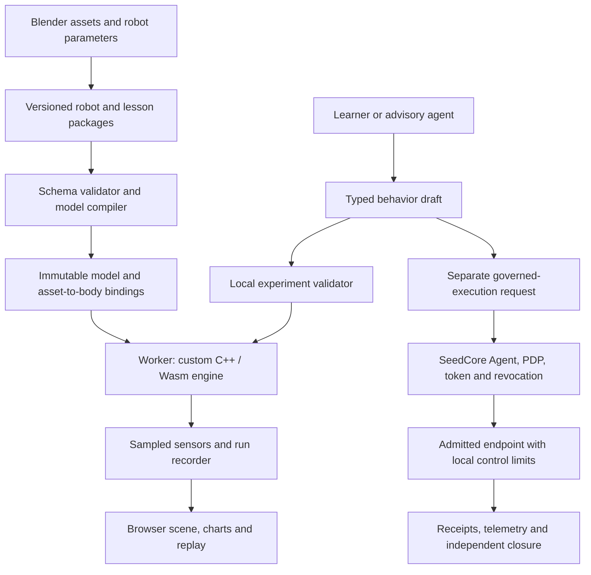

# Mini Robot Simulator: Implementation Architecture

Date: 2026-10-05

Status: Engineering plan grounded in the current repository. The planar-arm
browser prototype, local SIM-1 and the narrow SIM-2 C++/Wasm/checkpoint slice
are implemented; general dynamics and later stages remain proposed.

Implementation update, 2026-10-07: SIM-1 now has TypeScript-owned v2 contracts,
a narrow immutable planar model compiler, model/run-recipe SHA-256 identities,
exact-tick bounded control inputs, three reusable transferable snapshot buffers,
backpressure, observation-coverage checks and monotonic deadline scheduling.
All 37 numerical/contract/worker/UI tests pass. The pinned local Chrome/M3 harness
retains every observation across a 250 ms UI stall and exactly matches all three
lesson traces to the JS reference. Six simulated seconds take 6.003 seconds of
active wall time in normal cases, within the declared one-timer-quantum pacing
tolerance. This is laptop engineering evidence; tablet, cross-browser and full
release budgets remain open. See the
[prototype README](../../../apps/mini-robot-simulator/README.md),
[contract documentation](../../../packages/mini-sim-contracts/README.md) and
[qualification report](../../../tools/mini-sim/qualification-2026-10-07.md).
The earlier worker isolation slice was delivered 2026-10-05.

Implementation update, 2026-10-08: the worker now uses an owned C++17 f64
WebAssembly core for controlled RK4 integration. Native C++ and Wasm reproduce
all three 2,880-tick reference traces within 1e-8, with a measured maximum error
of 3.997e-14 on this Mac. Complete paused-boundary checkpoints bind the actual
Wasm bytes, model and recipe and preserve state, controls and pending inputs.
Learners can save progress and resume through a fresh worker run; the existing
experiment download remains recorded playback. The specialized allocation-free
C ABI uses caller-owned model/state buffers; general opaque handles are deferred.
See [core documentation](../../../packages/mini-physics/README.md) and
[numerical evidence](../../../tools/mini-sim/physics-qualification.json).
The [SIM-2 browser report](../../../tools/mini-sim/qualification-2026-10-08.md)
records the local performance pass and an earlier loaded timing miss.
This does not close the general-engine, real-robot or release-device gates.

## 1. Decision

Build a browser learning product backed by an original, independently testable
C++ physics library, compiled both natively and to WebAssembly. Keep SeedCore's
trust runtime as a separate integration boundary. Children open a link, choose
a prepared robot and conduct an experiment; engine development remains a core
research objective for the engineering team.

Borrow MuJoCo's compiled model / mutable data separation and compact C API.
Borrow Isaac Sim's asset organization, sensor interfaces and operations over
multiple instances. Use Blender to author assets, a small TypeScript browser
application to present experiments, and Godot as an optional authoring/reference
viewer. The first browser release needs neither a Godot runtime nor an Isaac
installation. MuJoCo serves as an offline numerical comparison environment.

This develops the browser/custom-engine decision in the
[Learning Studio solution](robot_learning_studio_solution.md). It supplies the
engineering sequence for that product, while the existing
[Microduck M0–M5 integration gates](microduck_integration_plan.md) continue to
govern Microduck readiness. Building this engine does not become a prerequisite
for validating SeedCore against an established Microduck simulator.

## 2. What Exists And What We Can Reuse

Original inspection baseline (before the worker update): SeedCore `8ee23e5`, PKG simulator
`b0af4e8e202b9c9394586717337106e01428c2b2`, hotel simulator
`a0fe6d8148b068637692936ff07657f92616a0b1`, and local Isaac Sim
`2469084bc328710207c6bc4ede32209082a9286c`. Paths below identify inspected
implementation surfaces; this is a focused architecture inspection, not a
certification of every app or command path.

| Surface | Observed implementation | Reuse and required change |
| --- | --- | --- |
| [Mini Robot Lab](../../../apps/mini-robot-simulator/README.md), `physics.js`, `app.js` | Original closed-form, fixed-base, planar two-joint dynamics; RK4; torque-limited controller; Canvas view; three lessons; recorded replay | Preserve lessons and equations as a reference fixture. Physics currently runs on the UI thread. There is no general model compiler, contact solver, worker, sensor system or Wasm core. |
| [Neighborhood Guide](../../../apps/neighborhood-guide/README.md) | Blender assets, metric GLB exports, Godot scenes, selectable places and replayable routes | Reuse the reviewed authoring/export process and spatial selection ideas. Its route graph and collision proxies are presentation data, not robot dynamics or evidence. |
| [PKG simulator](https://github.com/NeilLi/pkg-simulator/tree/b0af4e8e202b9c9394586717337106e01428c2b2) | Intent → draft → preflight → scenario → review workflow | Adapt the workflow into mission → model/behavior revision → experiment → comparison. Bind checks to the exact candidate digest. `policyAssistantService.ts` supplies default evidence modalities; `governedExecutionService.ts` uses illustrative hashes; `digitalTwinService.ts` accepts a model-produced verdict. These are not independent physics or authority verification. |
| [Hotel simulator](https://github.com/NeilLi/hotel-simulator/tree/a0fe6d8148b068637692936ff07657f92616a0b1) | React/Three spatial interfaces, clickable map, narrative/task context, asset storage | Extract interaction patterns from `DirectorMapLayer.tsx` and `HotelMap.tsx`; selectively port components. Keep generated ambience, random demo motion and task-submission status separate from measured robot outcomes. Do not copy the whole hotel backend into the simulator. |
| [HAL simulator driver](../../../src/seedcore/hal/drivers/robot_sim_driver.py) | PyBullet wrapper or in-memory pose fixture; PyBullet startup failure can select the fixture | Add a separately named custom-engine profile when it is ready. Require explicit engine identity and capabilities; a requested physics profile must fail initialization if unavailable. |
| [Simulator actuator adapter](../../../src/seedcore/hal/robot_sim/actuator/actuator_adapter.py) and [HAL service](../../../src/seedcore/hal/service/main.py) | Adapter checks token identifier presence; broader verification/revocation checks live at service boundaries | Direct adapter calls do not establish signature, expiry or revocation enforcement. A future integration must enter and verify the full admitted path. |
| [Robot team coordinator](../../../src/seedcore/robotics/coordinator.py) | Mandatory dispatch/verifier/halt ports, closure barrier and uncertainty handling | Reuse for later multi-robot missions. `TeamMission` requires 2–32 robots; the first one-arm lesson should not fabricate a team to fit it. |
| [Verification contracts](../../../ts/packages/contracts/src/verificationSurfaceContracts.ts) | Policy, receipt and verification presentation contracts oriented around transfers | Reuse the distinction between requested, admitted and verified. Do not relabel a local experiment as a custody/robot verification record. |
| [Reachy demo server](../../../apps/mini/robot_sim_server.py), [hotel event adapter](../../../apps/hotel_demo/hotel_event_adapter.py), [Edge Guardian](../../../apps/edge_guardian/README.md) | Pose-and-delay gRPC fixture; UI-event mapping; Tuya-oriented edge application | Useful interface examples, not a reusable multibody solver. Keep their transport and device dependencies outside the browser engine. |

The current 12 numerical tests passed on 2026-10-05. They cover the two-link
model only. No new contact, 3D, browser-performance or hardware result is claimed.

## 3. Architecture: Compile Once, Step Explicitly



| Layer | Owns | Must stay outside it |
| --- | --- | --- |
| C++ kernel | Kinematics, dynamics, constraints, integration, bounded memory and diagnostics | DOM, assets downloading, LLMs, authorization, rendering |
| Model compiler | Validation, unit/frame conversion, topology, fixed indexing and capacities | Runtime scene editing during a step |
| Worker runtime | Tick scheduling, bounded behavior interpreter, sensors, checkpoint/restore, per-run recording | Hardware endpoints or credentials |
| Browser application | Lesson cards, object selection, controls, explanation and render interpolation | Writing authoritative simulated body poses from animation |
| Optional SeedCore bridge | Governed request admission, endpoint binding and evidence ingestion | Substituting an agent's explanation for a verifier |

Start with TypeScript and a minimal build toolchain as the worker/contracts are
introduced; retain the current Canvas lesson during migration. Add a small
Three.js view when the first 3D model is validated. Hotel's React components can
be adapted if needed, but adopting its entire dependency set is unnecessary.
Use WebGL rendering initially and treat WebGPU as a measured later option.

MuJoCo explicitly separates a compiled `mjModel` from mutable `mjData` and
preallocates runtime working memory. That is the architectural precedent for
the proposed kernel, not a claim that our new implementation inherits its
accuracy or performance. [MuJoCo overview](https://mujoco.readthedocs.io/en/stable/overview.html).

## 4. Asset Format And Model Compiler

Use a small, versioned package with a JSON manifest, GLB visual assets, explicit
physics descriptors, sensor definitions and lesson metadata. USD's hierarchical
prims, typed properties and asset composition are useful precedents. Initial
packages implement a deliberately small schema, with pinned references and
explicit overrides; they are not USD-compatible files or a reimplementation
of its composition engine. [OpenUSD introduction](https://openusd.org/release/intro.html).

Maintain three distinct structures:

1. **Presentation hierarchy:** nested visual objects and selection paths.
2. **Articulation topology:** rigid bodies and joint connections used by dynamics.
3. **Bindings:** stable identifiers mapping visual nodes, sensor mounts and lesson
   objects to compiled body/joint indices.

A visual parent is not automatically a physical joint. Store persistent IDs
independently of editable display names. The compiler emits source-to-index
maps so clicking an elbow can highlight its joint axis, torque and observations.

The proposed first descriptor includes schema version, source/license metadata,
asset digests, frame conventions, body inertial frames, masses, full symmetric
inertia tensors, joint axes/origins/types, actuator limits, collision proxies
and supported sensor declarations. Lesson overrides such as payload mass are
validated before compilation and produce a new model digest. Never infer
calibrated mass or inertia from a pretty mesh. Primitive teaching models may
use an explicitly identified analytic density/inertia recipe.

Use SI units and a right-handed Z-up physics world, with quaternion order
declared as `xyzw`. Convert GLB's Y-up presentation at a single tested boundary.
The existing planar engine's Y-up frame also needs an explicit embedding;
do not silently reinterpret its saved runs. Validate frame round trips, scale,
rotation, inertia transforms, finite values, physical inertia constraints,
acyclic topology, unique identifiers and capacity limits before stepping.

Initial input is the native descriptor. Add an offline URDF importer for a
declared subset after tree dynamics works; MJCF and USD conversion follow
specific model needs. Each importer emits a support report and rejects
unsupported dynamics features. Parsing XML is only a small part of supporting
joint conventions, transmissions, defaults, contacts or closed mechanisms.

Blender remains a developer/creator tool. Export reviewed GLB geometry and
mount metadata; supply physics parameters separately. A child starts with a
validated package and never needs to install Blender or Godot.

## 5. Kernel And State Contract

Use C++20 internally, a small versioned C ABI, CMake, and Emscripten for Wasm.
Begin with double-precision dynamics and a single simulation thread in a
dedicated worker. Keep float rendering buffers distinct. Choose small math
dependencies deliberately; do not pull a desktop renderer or USD runtime into
the kernel. Pin toolchains and compiler flags; avoid fast-math in the reference
build. Emscripten was not available on the inspected host's PATH, so native and
Wasm build qualification remains implementation work.

Proposed data boundaries:

| Structure | Contents |
| --- | --- |
| `SimModel` | Immutable topology, inertias, coordinate offsets, limits, collision shapes, sensor declarations, model digest and supported features |
| `SimState` | Tick, `q[nq]`, `v[nv]`, actuator internal state and applicable persistent constraint state |
| `SimWorkspace` | Preallocated transforms, Jacobians, factorization buffers, contacts, acceleration and diagnostics |
| `RunCheckpoint` | State plus engine/build/profile identity, controller/interpreter state, pending tick-addressed inputs, sensor history/delay queues, RNG state and solver warm starts when used |
| `ObservationFrame` | Named channels with tick, frame, units, validity, sample sequence and source |

Generalized positions and velocities need separate dimensions: a floating body
can use seven position coordinates and six velocities. Integrate orientation
on its rotation representation rather than adding velocity directly to four
quaternion components. Acceleration and solved contact forces are generally
derived outputs, not a sufficient resume state. MuJoCo's state documentation
also distinguishes integration inputs from cached outputs and scopes exact
reproducibility to a version and architecture. [State and reproducibility](https://mujoco.readthedocs.io/en/stable/computation/index.html).

The proposed C ABI exposes opaque model/state handles with explicit ownership:
`compile`, `create_state`, `step_n`, `observe`, `checkpoint`, `restore`,
`step_batch` and `destroy`. These names are design placeholders, not existing
APIs. Return status plus diagnostics; reject mismatched versions/digests and
invalid buffer lengths. No C++ containers or exceptions cross the ABI. Inspect
workspace capacity at creation and report contact overflow explicitly.

Separate **recorded playback** from **resuming simulation**. Current JSON samples
support the former. A resumable checkpoint requires all future-influencing
state. Content hashes identify a run/package; they do not authenticate a user's
browser observations.

## 6. Physics Research Sequence

The first general solver targets small rigid-body trees. Keep each capability
behind a declared model profile; reject unsupported features at compile time.

| Stage | Implementation | Numerical exit gate |
| --- | --- | --- |
| Smooth reference | Port the existing two-link equations and RK4 to native C++/Wasm | Existing invariants still pass; fixed input traces agree across JS/native/Wasm within declared tolerances |
| General tree | Spatial transforms, fixed/revolute/prismatic joints, FK and Jacobians; RNEA bias/inverse dynamics; CRBA mass matrix; factorized solve | Hand-derived one/two-link cases, Jacobian finite differences, positive-definite inertia, inverse/forward round trips and matched MuJoCo fixtures |
| Floating bodies | Free-base representation and orientation integration | Free fall, free rotation, momentum and orientation-normalization tests |
| First contacts | Bounded primitive collision pairs, plane/sphere/box cases, contact manifolds and impulse constraints | Drop, resting contact and frictionless impact tests with penetration and energy-error budgets |
| Friction and limits | Documented friction-pyramid approximation, projected Gauss-Seidel impulse solve, joint limits, warm starts | Sliding/deceleration, incline, loaded joint stop, resting stack and timestep/iteration sweeps |
| Robot fidelity | Identified actuator lag, saturation, friction/backlash as needed; supported imported robot | Held-out measured trajectories and task-level comparisons; numerical and physical-model errors reported separately |

RNEA solves inverse dynamics; it is not a substitute for a forward dynamics
algorithm. Initially compute bias and the mass matrix, then solve the linear
system by factorization. Add ABA as an optimized forward solver only after
the reference tree implementation provides an independent comparison. This
staging favors inspectable results on small robots. See
[MIT's multibody dynamics treatment](https://underactuated.mit.edu/multibody.html)
for generalized-coordinate equations and frame conventions.

Keep RK4 for the smooth reference model. Use a separately versioned
semi-implicit, velocity-level contact step for the first contact profile.
Specify restitution thresholds, stabilization/compliance and friction rules.
PGS is an implementation choice, not equivalent to MuJoCo's full contact model.
There is no universal stable 2–5 ms timestep: choose and qualify a timestep per
model/controller/contact profile. General convex collision, mesh collision,
closed loops, tendons, deformables, differentiation and GPU physics are later
research items; do not imply support through an importer.

Use MuJoCo comparisons first on matched contact-free models with identical
inertial and actuator definitions. For contact models with different laws,
compare analytic expectations, envelopes and convergence; identical long
trajectories are not a valid blanket criterion. Keep the oracle out of the
browser production dependency graph.

## 7. Workers, Sensors And Batch Execution

The worker owns an integer physics tick and fixed step. Each command carries
run ID, model revision, sequence and application tick. It acknowledges the tick
actually applied. Old-revision commands and observations are rejected. Execute
bounded chunks, yield to process stop/reset messages, and cap queued work.
Rendering interpolates immutable snapshots; it does not choose the physics
timestep. Under load, slow simulated time and report it rather than enlarge the
step or quietly discard physics ticks. Hidden tabs pause local lessons.

Start with transferable snapshot buffers and a bounded reusable buffer pool.
Transferred buffers change ownership; do not detach the engine's live Wasm
memory. Dedicated workers can use message passing without shared memory.
[Worker data transfer](https://developer.mozilla.org/en-US/docs/Web/API/Web_Workers_API/Transferable_objects).
Pthreads/shared memory can be a later build profile; their hosting isolation
requirements add deployment work. [Emscripten pthread requirements](https://emscripten.org/docs/porting/pthreads.html).
Serve the Wasm application over HTTP(S); the existing direct-file launch is
only a property of the current simple JS prototype.

Sensor definitions contain type, mounted frame, sample period, noise model,
latency and configuration digest. Use integer tick periods initially; reject
unsupported rates. Every reading carries acquisition tick, delivery tick,
sequence, validity and source. Keep ideal truth and noisy measurements distinct.
Isaac's sensor interfaces demonstrate validity/time metadata and separate
authoring/runtime objects; its articulation APIs illustrate batch-shaped
operations. These are conceptual references, not APIs we will expose directly.
[Isaac sensors](https://docs.isaacsim.omniverse.nvidia.com/latest/py/source/extensions/isaacsim.sensors.experimental.physics/docs/index.html),
[Isaac articulation APIs](https://docs.isaacsim.omniverse.nvidia.com/latest/py/source/extensions/isaacsim.core.experimental.prims/docs/index.html).

Implement encoders first, then IMU, contact and ray-distance sensors as their
physics capabilities arrive. An accelerometer reports sensor-frame specific
force, `R_world_from_sensor^T * (a_sensor_world - gravity_world)`. Include angular
acceleration and centripetal terms for an offset mount. Test rest, free fall and
a rotating offset sensor. Actuator command is not measured joint effort; an
unsupported channel is invalid rather than populated with a plausible substitute.
Camera RGB/depth needs a separate render-sensor adapter with an exact pose/tick
binding; record images for playback and declare GPU reproducibility limits.

Use simulation ticks for experiments and trusted wall-clock time for future
authorization expiry/freshness checks. Pausing a lesson cannot extend a physical
execution token. After each integrated state update, refresh the derived data
needed by observations; tag interval impulses with their interval, not a
misleading instantaneous timestamp.

`step_batch` initially runs CPU loops over independent states sharing one model.
Expose arrays such as `q[environment, nq]` and `v[environment, nv]`, per-instance
controls/seeds, reset masks and status. Group different topologies into separate
batches. Reset controller, sensor and constraint history for each reset instance.
An interaction between two robots belongs to one simulated world, not two
independent batch entries. Batch APIs alone do not provide GPU acceleration.

## 8. Make Agents Useful To Beginners

Preserve the existing loop: **choose → predict → run → compare → explain**.
Start with an arm reaching a star; later add a gripper moving a block and a
wheeled robot stopping at an obstacle. Introduce a walking Microduck only after
floating-base/contact/actuator qualification. A beautiful duck animation must
not imply that those capabilities exist.

| Agent role | Concrete artifact | Deterministic boundary |
| --- | --- | --- |
| Mission assistant | A supported lesson ID, goal and bounded parameter draft | Lesson schema and capability validation |
| Robot builder | A patch to allowed model parameters, with units and affected parts | Compiler checks, a new digest and invalidation of old results |
| Experiment assistant | One baseline and one controlled variation | Run recipe fixes model, controller, seed and measurement definitions |
| Tutor | Explanation linked to sample IDs and computed metrics | Metrics come from recorded observations; text cannot set success |
| Research assistant | Candidate parameter fits and comparison reports | Held-out evaluation and human-reviewed promotion |

For “make the arm carry a heavier toy,” the assistant proposes a supported
payload change, shows the added mass and motor limit, asks for a prediction,
and compares baseline/candidate gap and torque traces. Changing mass must use a
valid inertia recipe and create a distinct run. The tutor can explain a measured
torque limit, but cannot claim stall from target error alone.

Beginner blocks compile to a bounded interpreter: set joint target, wait for
valid sensor condition with timeout, stop, and bounded repeat. Define maximum
steps and duration; missing or stale readings take a visible timeout path.
No LLM call or generated JavaScript runs in the physics tick. Advisory agents
are optional network services with server-held credentials. Prepared lessons
remain usable without accounts or model-provider keys. Keep raw voice/camera
collection off by default and use accessible labels, keyboard controls and
expandable technical detail.

## 9. SeedCore Integration Profiles

Keep these product profiles distinct; names here are proposed simulator
configuration, not new fields in existing execution tokens.

| Profile | Execution and result |
| --- | --- |
| Local learning | Browser-only experiment; no hardware routes or execution authority. User-controlled records are labeled local simulation. |
| Governed simulation | Server-resolved simulator endpoint; existing Agent/PDP/token/revocation flow; instrumented telemetry and verifier closure. Browser exports alone cannot establish this status. |
| Supervised hardware | Separate admitted robot endpoint; bounded session, robot-side control/watchdog, measured telemetry and hardware acceptance gates. |

The future bridge submits high-level skill requests through existing admission
and binds server-selected engine/model/profile identity to the supported
versioned contracts. Do not add ad hoc keys to the frozen token constraints.
Separate the outcome of policy evaluation, numerical validity, lesson completion
and physical readiness. None implies the others. Replaying a successful local
run never sends a hardware command. A worker crash marks a local run incomplete;
a bridge or browser disconnect cannot be the sole physical stop mechanism.

Before advertising governed simulation, verify signature, scope, endpoint,
expiry, replay and revocation rejection at the actual ingress, with no direct
adapter bypass. Require closed-loop telemetry and incomplete-result handling.
The existing in-memory fallback is a concrete integration gap to address in
that profile, not a reason to modify unrelated HAL behavior during this design.

## 10. Build Sequence And Reviewable Deliverables

Use SIM stages to distinguish engine work from Studio A stages and Microduck M
stages. These are dependency gates, not promised calendar delivery dates.

| Stage | Deliverable | Acceptance before advancing |
| --- | --- | --- |
| SIM-1 | Worker isolation and versioned run/model/command contracts around the current JS engine | Same three lessons; identical tick inputs survive UI stalls; stale messages rejected; stop/reset acknowledged; no silent truncation of a run |
| SIM-2 | C++ two-link core, C ABI, native and Wasm builds, complete checkpoint/restore | Original invariant suite ported; JS/native/Wasm trace comparisons; restore-and-continue equals uninterrupted run within documented build-specific tolerances |
| SIM-3 | General tree compiler/dynamics, encoders and a small 3D browser scene | One-, two- and three-link fixtures; frame and inertia checks; unsupported models rejected; first MuJoCo comparison reports |
| SIM-4 | Floating bodies, primitive contacts, friction/limits, IMU/contact/ray sensors | Analytic contact/sensor cases, solver diagnostics and convergence sweeps pass; beginner interaction lesson grounded in measurements |
| SIM-5 | Independent-instance batches and optional native Python/Gymnasium wrapper | Scalar/batch equivalence, per-instance reset isolation, headless determinism and measured throughput/memory |
| SIM-6 | Validated robot imports and governed SeedCore simulator bridge | Explicit capabilities, no fixture fallback, denied-token cases and verified/incomplete closure; Microduck claims still satisfy M0–M3 |

The narrow **SIM-2 port and checkpoint slice is implemented**. Next is SIM-3:
compiled small-tree dynamics, encoders and a 3D scene, gated by independent
one-/two-/three-link numerical fixtures. Broader release-device and performance
checks remain open. General physics expansion must preserve the current lessons
and the tested build, worker and checkpoint boundaries.

Repository layout: the application, contract package, tooling and fixture paths
now exist, including `packages/mini-physics/` for SIM-2:

```text
apps/mini-robot-simulator/        learner UI, worker adapter, lessons and assets
packages/mini-physics/           CMake, C ABI, core source, native tests, Wasm build
packages/mini-sim-contracts/     schemas, TypeScript bindings, golden message fixtures
tools/mini-sim/                 asset compilation, import reports, oracle comparisons
tests/mini-sim/                 versioned models, controls and numerical acceptance cases
src/seedcore/hal/drivers/        later explicit custom-engine adapter
```

Use a kernel owner, browser/product owner and numerical reviewer; one person
may fill multiple roles, but review the physics separately from visual approval.
Contact and actuator fidelity are the principal research uncertainties. Set
estimates after SIM-2 measures build overhead and SIM-3 establishes solver scope.

## 11. Acceptance Targets And Evidence

Initial engineering budgets below are proposed targets, not benchmark results.
Pin a representative low-power laptop and tablet, OS/browser versions and exact
model before using them as a release gate.

| Dimension | Proposed first-release target |
| --- | --- |
| Convenience | Open an HTTPS link; no install/account required for prepared lessons; cached lessons can reopen offline after initial load |
| Transfer size | Core app plus compressed Wasm ≤ 5 MiB; first lesson assets ≤ 5 MiB; lazy-load further lessons |
| Startup | First interactive lesson within 5 s on a declared 20 Mbit/s, 50 ms latency cold-load test |
| Responsiveness | p95 visual frame interval ≤ 33 ms and local stop acknowledgement ≤ 100 ms for the qualified lesson/device |
| Physics | At least 1× real time for the qualified small-robot profile, with zero silently skipped physics ticks; emit runtime slowdown diagnostics |
| Memory | ≤ 128 MiB Wasm linear memory for that profile; separately measure browser/renderer memory |
| Learning | In a moderated pilot, at least 4 of 5 first-time learners complete predict/run/compare within 10 minutes and identify one changed variable; report age range and assistance rather than generalize from five users |

Numerical gates must declare physical units and tolerances per fixture: inertia
identities and derivative checks; conservation/dissipation in applicable models;
step refinement; penetration/impulse/friction residuals; commanded versus applied
effort; sensor validity/rate/latency; checkpoint continuation; and batch isolation.
Record engine/compiler/model/controller versions, seed, timestep, solver settings,
browser/device, observation coverage and errors. Compare float values by
appropriate tolerances across platforms rather than promise bitwise equality.

Run curriculum usability, numerical validity and future governance acceptance
as separate suites. Simulator reward or a tutor's verdict cannot promote a
controller to hardware. A cross-engine match is useful software evidence; real
robot fidelity additionally needs calibrated parameters and held-out measurements.

Original architecture-inspection verification (before the worker update):

```bash
node --test apps/mini-robot-simulator/physics.test.cjs
```

Result at that inspection: 12 passed, 0 failed. The subsequent SIM-1 implementation
and
its 37 checks and local browser measurements are recorded at the top of this
document and in the prototype README. Repeat with
`node tools/mini-sim/verify.cjs` from the repository root. Neither change introduces
a deployment, external-project
modification or hardware experiment.

## 12. Source And Version Notes

The linked MuJoCo, OpenUSD, Emscripten and Isaac documentation was consulted on
2026-10-05. `stable`/`latest` URLs can change: implementation must pin the actual
oracle/exporter/toolchain version and save its fixture configuration.

The inspected Isaac checkout also contains a newer library-style example at
`source/examples/series/falling_cube/simulate_cube/main.py`, separating stage
authoring, physics-manager setup and stepping, plus a mounted-frame IMU example
at `source/examples/series/physics_sensors/imu_sensor/imu.py`. Its older
`source/deprecated/isaacsim.core.prims/python/impl/articulation.py` is explicitly
deprecated. Do not mix these examples and documentation generations into one
untested Isaac integration. The recommendation here borrows design principles
and does not depend on an Isaac runtime API or claim an Isaac installation test.
