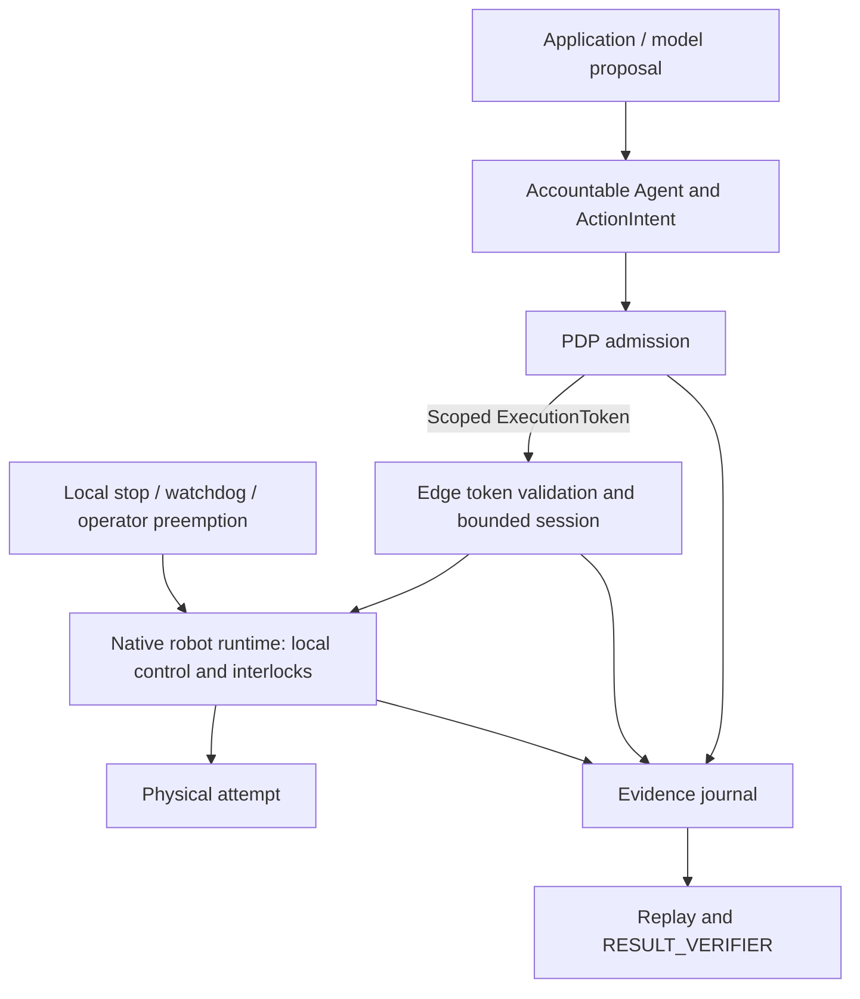

# Robot Execution And Evidence Contract

Date: 2026-09-20
Status: Proposed robotics extension; not an implemented schema or hardware safety claim

This proposal refines the [Microduck integration plan](microduck_integration_plan.md).
Existing [policy gates](../policy_gate_matrix.md) and
[token lifecycle rules](../trust-runtime/execution_token_lifecycle_management.md)
remain authoritative. No new token type, deny code or frozen constraint field
is introduced by this document.

## Three Responsibilities, Different Deadlines



| Responsibility | What it decides | Timing requirement |
| --- | --- | --- |
| Admission | Principal, delegated scope, skill, endpoint and reviewed limits | Before a new bounded session; never a per-joint cloud call |
| Edge enforcement and local control | Whether current commands remain within admitted and physical limits | Independent local deadlines, even if the planner or control plane disappears |
| Evidence closure | Whether captured evidence supports the declared result | Bounded closure deadline; cannot delay local interruption |

The SeedCore edge boundary validates authority and command envelopes. The native
controller owns balance, joint control and device-specific safety. Neither may
widen the admitted scope. Local safety may always narrow or terminate an
attempt. A local stop requires no new cloud authorization; a remote cancellation
uses the existing authenticated, policy-admitted halt/revocation path. Neither
route implicitly authorizes resume, motor enable or a new posture transition.

## Proposed Session Binding

Use the existing `ExecutionToken` as the authority carrier. Before implementation,
specify a versioned mapping from the following concepts into canonical intent,
token/payload binding and evidence schemas. Signatures must cover that mapping;
unbound metadata is not an enforcement control.

| Binding | Required meaning |
| --- | --- |
| Principal and delegation | Owner/operator, accountable Agent, effective grant and approval context |
| Endpoint and profile | Enrolled robot, controller/runtime, simulation or hardware identity |
| Behavior | Skill package/version/digest and learned-policy artifact digest, when used |
| Command envelope | Allowed operation, parameter ranges, units, coordinate frame and maximum duration |
| Environment | Reviewed workspace/profile, required observations and their freshness limits |
| Time and ownership | Start deadline, token expiry, session duration, exclusive controller ownership |
| Closure | Required evidence types, signer assurance, completion/interruption predicate and deadline |

Only request constraints that the selected adapter can observe and enforce.
For example, a geofence requires a defined frame, localization and uncertainty
handling; a torque limit requires a supported calibrated control/measurement
path. A declared capability or velocity command cap does not prove an observed
physical speed bound. Unsupported required constraints must deny admission.

Do not extend `EXECUTION_TOKEN_CONSTRAINT_KEYS` casually. Version schema changes,
canonicalization and Python/Rust/TypeScript verification fixtures together;
preserve existing RCT checks.

## Session Lifecycle And Time

One single-use token admits one session. A proposed lifecycle is:

```text
proposed -> denied
        -> admitted -> claimed -> active -> completed / interrupted / uncertain
                                            -> evidence closure or quarantine
```

Claim the token once. Within the active session, authenticated command refreshes
carry a session binding and monotonically increasing sequence, not repeated
token claims. Reject duplicates, stale commands and any changed binding. A
refresh cannot extend expiry or authorize a new skill. Terminal sessions cannot
be reopened; renewed work requires fresh admission and reconciliation.

At admission, validate expiry using a trusted wall-clock policy with bounded
skew. Convert the permitted remaining lifetime to a local monotonic deadline
that cannot increase after clock changes. Enforce token expiry, maximum session
duration, latest-command age and revocation freshness independently. A live
transport heartbeat cannot substitute for fresh intent.

The pilot profile must record control period/jitter, maximum command age,
revocation-staleness limit, local stop-response budget, allowable stopping
distance and evidence-closure deadline. Select numbers from the pinned runtime
and supervised measurements; generic frequency ranges are not acceptance gates.

## Partitions, Revocation And Recovery

Local hazards, local stop input and stale commands trigger the reviewed local
response without waiting for Redis, Ray, a remote PDP or evidence upload. A
biped may need controlled deceleration or a supported posture response; do not
equate “fail closed” with cutting motor power in every physical state.

For the initial profile, admit no new remote sessions while authority context
or revocation state is stale. An already admitted session may run only while
all its local bounds remain valid, including the configured revocation freshness
budget. On breach, terminate the task using the reviewed local response.
Instantaneous delivery of a remote revocation during a partition is impossible;
document and measure the maximum permitted disconnected authority window.

A dedicated offline-admission mode would need locally verifiable policy,
delegation and revocation freshness rules. It is separate future work, not an
implicit fallback when the server is unavailable.

Restart or reconnect invalidates active session assumptions. Reconcile robot
state, outstanding claims, local stop state and incomplete evidence before a
new admission. Do not replay queued movement or automatically resume. Process
or multi-controller ownership requires durable fencing before crash-resume or
multi-replica deployment; current in-memory team reservations are insufficient.

## Boundary Coverage And Skill Isolation

Inventory direct SDK calls, Unix sockets, BLE, WebRTC, gamepads, local tools,
debug endpoints and update paths. Each must be governed, disabled/isolated, or
an explicitly reviewed local operator path with ownership and preemption rules.
A wrapper around one API cannot support a claim that all robot motion is
governed. Local operator intervention must be visible and must fence remote
commands before control is handed back.

Keep untrusted skill code away from motor devices, native control sockets,
signing keys, token minting and policy administration. See the
[skill package proposal](robot_skill_contract.md). The trusted deployment
profile must enforce token requirements and exclude development bypasses; the
current HAL's configurable token setting alone is not proof of universal
enforcement.

## An Evidence Timeline With Explicit Limits

For each attempt, correlate principal/delegation, intent and command hash,
policy version and decision, token/session identity, endpoint, runtime and model
digests, sequence/timing records, relevant observed state, local interventions,
actuator acknowledgements and verifier disposition. Preserve clock uncertainty,
missing intervals, saturation and stop reasons rather than fabricating continuity.

Distinguish four questions:

1. Was the request admissible under the recorded authority and policy?
2. Was a bounded command dispatched and acknowledged by the intended endpoint?
3. What physical state was actually observed, with what coverage and uncertainty?
4. Does that evidence satisfy this skill's completion or interruption predicate?

Acknowledgement does not answer the last two. Evidence may support a verified
record of interruption while the requested task remains incomplete. Missing
observations cannot close as a successful task. A team progression gate needs
the required successful task outcome, not merely a valid signature on a stop.

Replay verifies captured decisions and evidence consistency. Replaying a model's
perception additionally requires retained sensor input, preprocessing, model
version and relevant nondeterministic state. A rendered reconstruction is an
explanation, not proof of the unobserved physical scene.

Signed telemetry proves integrity and signer provenance only under the stated
key and capture-path assumptions. An edge-process signature is not a sensor
signature or hardware attestation. Calibration faults, sensor drift and a
compromised signer can produce validly signed but inaccurate observations.
Record assurance level and use freshness, plausibility and independent checks
where the profile requires them. Signature failures prevent trusted closure;
the local response depends on whether the failed stream is required for control.

Use bounded local buffering so evidence upload never blocks control. A full or
unavailable journal must block new sessions and trigger the profile's defined
response for an active attempt; do not silently discard mandatory evidence.

## Privacy And Operator Presentation

Default to the minimum action metadata and bounded telemetry needed for the
declared proof. Raw camera/audio capture is a separately permissioned resource.
Define collection purpose, access, retention/deletion, local versus remote
processing and export permissions before enabling it. A hash cannot recreate
deleted media; report when deletion or redaction limits later reconstruction.

The operator timeline should show requested action, granted limits, observed
attempt, interruption and closure separately. Plain reasons such as “command
expired” or “observation missing” are more useful than a generic “safe” badge.
Owner grants, guest requests and bystander capture are distinct contexts. A
persona, inferred identity or spoken request cannot expand a grant.

## Acceptance Evidence

Use the [Microduck acceptance cases](microduck_integration_plan.md#acceptance-cases)
as the device-specific suite. Add clock rollback, stale revocation state,
buffer exhaustion, unsupported constraints, alternate-ingress attempts and
permission changes during a session. Fault injection must demonstrate both the
local response and the resulting evidence disposition.

These tests establish behavior only for the tested profile. They do not certify
physical safety or resolve an incomplete sensor picture. Hardware acceptance
and any expansion of workspace, speed or autonomy require separate review.
