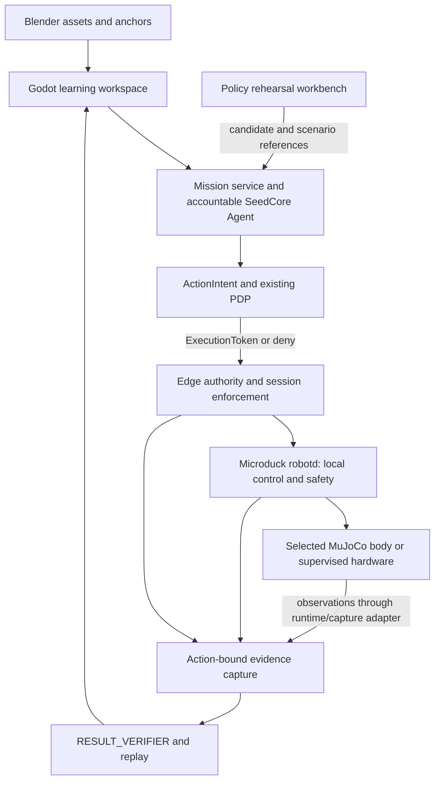

# Robot Learning Studio: Formal Solution

Date: 2026-10-01

Status: Proposed solution and staged implementation specification; studio and Microduck integration are not implemented by this document

Audience: Product, curriculum, application, runtime and robotics contributors

## Follow-up Product Decision

On 2026-10-01, the user selected browser delivery without installation and
development of a new physics engine as a core research objective. The initial
[Mini Robot Lab prototype](../../../apps/mini-robot-simulator/README.md) now
implements an isolated two-joint planar arm with custom dynamics and three
beginner experiments. It does not implement governed robot execution or
Microduck simulation.

For the end-user simulator, this decision supersedes the Godot-first delivery
choice below. The original Blender/Godot/MuJoCo architecture remains a reference
for asset authoring and governed integration, while the mission workflow,
authority boundaries and evidence requirements continue to apply where relevant.
The custom engine's next numerical research gates are recorded in its README.

## 1. Decision And Intended Outcome

Build a mission-based learning application above SeedCore. A learner describes
a small robot behavior, edits a concrete scene and behavior, predicts the result,
rehearses it, and inspects evidence of the attempt. SeedCore agents translate
requests into bounded proposals and explain observations. SeedCore governs
execution authority; the native robot runtime retains motor control and local
safety responsibilities.

Use Blender for authored assets and visual explanations, Godot for the learner's
interactive workspace, and the selected Microduck MuJoCo/runtime pair for body
simulation. Use the existing `pkg-simulator` and `hotel-simulator` as specific
design and integration references, as assessed below.

The first outcome is **a beginner can modify one bounded forward-movement
behavior, predict its effect, and explain why the attempt completed, stopped,
or remained unverified**. Increased adoption by nontechnical adults and children
is a product hypothesis to test; it is not established demand.

This solution refines the earlier mission-based Blender/Godot proposal. It does
not promote a studio ahead of the [active M0–M3 queue](../current_next_steps.md).
Lesson design and a recorded-trace prototype can proceed alongside that queue.
Live execution depends on the [Microduck integration plan](microduck_integration_plan.md).
The [execution contract](robot_execution_contract.md), [skill package proposal](robot_skill_contract.md),
[policy gates](../policy_gate_matrix.md) and [flywheel boundary](../seedcore_flywheel_harness.md)
remain authoritative within their stated scopes. No token type, frozen token
constraint, production endpoint or new policy deny code is introduced here.

## 2. What The Reference Projects Contribute

The following observations come from source inspection, not live acceptance
tests. References P1–P5 and H1–H5 are pinned in section 12.

| Observed surface | Useful pattern | Adaptation for robot learning | Boundary or gap |
| --- | --- | --- | --- |
| `pkg-simulator` Policy Assistant (P1) | Five steps: intent, typed draft, preflight, scenario pack, review/commit | Goal → behavior draft → readiness → experiments → review attempt | Current step progression checks result presence; the new flow must bind successful checks to the exact current candidate |
| Policy Assistant service and tests (P2) | Backend calls, reason codes, factual field references, ordered writes and explicit partial failure | Explain a blocked attempt from recorded fields; preserve exact retry identity | Current fixtures include assumed evidence availability and synthetic provenance; obtain actual evidence for admitted runs |
| Sandbox execution timeline (P3) | Proposal, evaluation, token and audit stages are inspectable | Show requested behavior, admission, dispatch, observations and closure on one timeline | Its local token digest and audit hash use `simpleHash`; these are illustrative records, not signed runtime authority or authenticated execution evidence |
| Digital Twin Critic (P4) | Assistant critique of a candidate against described constraints | Suggest missing tests and explain possible problems | It calls an LLM; its `passed` value cannot approve motion or replace deterministic verification |
| PDP infrastructure plan (P5) | Authority scope, freshness, materialized context and replay | Include stale context, changed policy and missing evidence in lesson scenarios | This source is a planning baseline; its proposed infrastructure is not established by the document |
| Hotel lobby, map and agent interaction (H1) | Select a place or agent, inspect context, converse in the scene | Click Duck, a marker or sensor to obtain a task-specific explanation | Narrative world updates and random agent movement are presentation state, not robot telemetry |
| Hotel request builders (H2) | Convert a selected object into a structured request with related subjects and a bounded fact bundle | Convert a selected robot/marker into a typed proposal and explicit context references | Room requests are advisory and include client defaults such as `DIRECTOR`; never carry these defaults into real authority |
| Wearable Story Studio (H3) | Intent, candidate, preview, review, submission and run-linked history | Persist a mission draft and its asset/behavior revisions across experiments | Its `done` state follows task creation; robot completion must wait for the required verifier outcome |
| Hotel task client (H4) | Task IDs, status and an SSE log stream | Correlate work and show progress without blocking the scene | Task logs and task completion are not sufficient evidence of physical completion |
| Hotel asset and simulation helpers (H5) | Cache generated assets and keep scene interactions responsive | Reuse immutable lesson assets; support an explicit offline illustration mode | Browser cache is not an evidence journal; concierge task failures are caught while ticket creation continues |

The synthesis is a **spatial learning workspace with a guided experiment flow
and an evidence timeline**. Reuse proven interaction structures and contract
ideas; inspect and test any code selected for extraction. React components do
not transfer directly into Godot, and neither simulator is a Microduck physics
or hardware acceptance environment.

## 3. Learners, Roles And Product Surface

The initial audience is a nontechnical adult or a child learning with an adult.
Use the same mission model with different language, reading support and depth.
Avoid requiring accounts with model-provider credentials, a blank Blender
project or a working robot for the first lesson.

| Role | Default experience | Authority |
| --- | --- | --- |
| Learner | Prepared scenes, editable blocks, predictions, simulation and replay | May author proposals within the configured learning workspace; learning progress does not grant robot permissions |
| Instructor/operator | Assign lessons, review scope, inspect readiness and reconcile failures | Authenticated owner delegation and deployment policy determine permitted operations |
| Developer | Inspect generated contracts, assets, adapters and traces | Development access remains separate from policy administration and physical execution |

These are proposed application roles, not new authority levels in SeedCore.
An avatar, selected role, inferred identity or chat statement cannot establish
the underlying principal or delegation.

The Godot workspace has five visible areas:

1. **Mission card:** goal, starting conditions and a plain-language completion criterion.
2. **Scene:** Duck, relevant objects, selectable parts and a prediction marker.
3. **Behavior strip:** supported blocks and parameters with units.
4. **Experiment controls:** preview, simulate, stop and replay; hardware is a separately selected, reviewed mode.
5. **Result timeline:** requested, permitted, observed and verified states, with expandable technical detail.

Default language is “Ready to simulate”, “Request blocked”, “Stopped early” or
“Result not verified”. Technical reason codes remain available in the inspector.
Separate recorded facts, derived measurements and assistant explanations; each
explanation cites the relevant observation or decision reference.

Offer progressive depth within the same mission: Explore (guided interaction),
Build (blocks and sensor conditions), Inspect (typed commands and traces), and
Research (model and policy comparisons). Advanced editing is optional. Provide
keyboard navigation, labels beyond color, captions and text equivalents for
audio, and reduced-motion presentation. Voice and raw camera capture are off by
default and require separate data-purpose, access and retention decisions.

## 4. First Mission And Learning Sequence

### Mission L1: A Short Move, Then Stop

**Goal:** from a prepared starting state on a flat simulated floor, request one
bounded forward movement and observe the resulting stop. A prediction marker
expresses the learner's expectation; it is not initially a navigation target or
an enforced geofence.

| Step | Learner action | Agent/system output | Learning objective |
| --- | --- | --- | --- |
| Describe | “Take a short step forward and stop.” | Supported behavior draft; clarify that this is a brief velocity request, not a promise of exactly one gait step | Intent versus executable capability |
| Build | Select an allowed duration and move the prediction marker | Versioned scene and parameterized behavior; limits resolved from the selected profile | Time, distance and coordinate frames |
| Predict | Mark the expected endpoint and give a short reason | Saved prediction separate from measured state | Form a testable hypothesis |
| Check | Inspect readiness and experiment cases | Capability, profile, freshness and evidence requirements; explicit missing prerequisites | Preconditions and permission |
| Simulate | Run the normal case | One governed attempt against the selected simulated endpoint | Request versus physical-model response |
| Compare | Inspect endpoint and velocity traces | Requested/observed overlay, stop events and verifier disposition | Control error and measurement limits |
| Investigate | Select an interrupted-command scenario | Separate attempt with controlled fault injection and trace | Watchdogs and stale intent |
| Explain | Explain the difference before opening the hint | Evidence-grounded feedback and one next experiment | Causal reasoning and independent understanding |

The instructor selects a compatible walking policy and permitted starting
posture. Startup, motor enable and stand-up are explicit operations with their
own reviewed conditions. Do not inherit an upstream launcher that automatically
stands the robot as an unrequested side effect of opening the lesson.

Completion is a profile-defined predicate: accepted bounded motion, required
observation coverage, and observed stop within declared tolerances. Command
acknowledgement alone is insufficient. Simulation ground truth and controller
odometry are different sources; hardware distance claims require a declared
measurement method and uncertainty. If the needed observation is unavailable,
report the narrower result that can be established.

### Curriculum After L1

| Mission | Concrete activity | Deeper concept | Dependency |
| --- | --- | --- | --- |
| L2: Where is forward? | Rotate a scene frame and compare arrows/observations | Coordinate transforms and joint/frame naming | Validated scene-to-runtime transform |
| L3: What can Duck see? | Move an object through a displayed sensor field | Sensor frames, occlusion, freshness and uncertainty | Implemented sensor adapter; clearly distinguish generated sensor data |
| L4: Why was that blocked? | Compare scope, expiry and unavailable-capability cases | Delegation, deterministic policy and limits | Governed simulation admission |
| L5: Why did it stop? | Compare lost input, local preemption and missing telemetry | Independent watchdogs, interruption and evidence closure | Fault injection and trusted closure |
| L6: Can we improve it? | Compare a baseline and a candidate across recorded cases | Evaluation, generalization and regression | Pinned simulator and reviewed experiment recipe |

Agents supply hints, examples and draft artifacts, then reduce assistance.
Assessment includes a changed scene or parameter the learner has not rehearsed.
An assistant-generated answer is not evidence that the learner understood the
concept. RL training and policy promotion enter only after the existing M5
requirements; learning results cannot authorize installation or motion.

## 5. Architecture And Source Of Truth



All new mission-service and studio adapters in this diagram are proposed. The
existing SeedCore gateway/PDP/HAL/evidence foundation supplies the governed
path; its presence does not establish Microduck integration coverage.

### Component Ownership

| Component | Owns | Implementation decision |
| --- | --- | --- |
| Blender | Visual geometry, materials, assembly views and named lesson anchors | Start with prepared editable assets; export GLB for Godot |
| Godot | Scene interaction, behavior editor, prediction and result presentation | New small application, proposed path `apps/robot-learning-lab`; reuse selected patterns from the existing neighborhood application |
| Mission service | Immutable candidate references, experiment orchestration and progress projection | Add a narrow server-side adapter to existing SeedCore services; keep robot credentials out of the client |
| SeedCore Agent/cognitive services | Typed proposals, scoped work and explanations | One accountable robot Agent initially; specialist functions need not be separate long-running agents |
| PDP and edge boundary | Admission, token/session checks, scope, freshness and revocation | Reuse existing contracts; version any required robotics extensions explicitly |
| Native runtime and MuJoCo | Local control and selected body dynamics | Pin and validate the actual runtime/model/policy combination |
| Evidence capture/verifier | Authenticated observations, outcome predicates and closure | Persist independently of Godot rendering and chat history |
| `pkg-simulator` | Reference workbench for scenario and policy review | Retain as an optional operator surface; no React workbench rewrite is required for L1 |
| `hotel-simulator` | Reference for spatial interaction, draft history and task progress | Extract patterns and narrowly reviewed helpers; no dependency on the whole hotel application |

The learner can start with fixtures and recorded traces offline. Live governed
simulation requires the relevant SeedCore services and validated simulator;
missing services produce an explicit unavailable state. Keep provider keys and
privileged tool execution server-side. A packaged local launcher is a later
installation deliverable, not an assumed existing capability.

### Three Execution Profiles

| Profile | State authority | Allowed claim |
| --- | --- | --- |
| Illustration | Local scene/script and labeled fixtures | Demonstrates a concept or intended sequence |
| Body simulation | Pinned Microduck runtime, MuJoCo model and captured observations | Describes the tested simulated attempt and its coverage |
| Supervised hardware | Enrolled endpoint and declared telemetry capture path | Describes the observed physical attempt within its measured profile |

Replay is a view of one of these profiles, not a new execution profile. Keep
profile and endpoint identity on every run. There is no silent hardware-to-sim
fallback and no conversion of illustrative telemetry into evidence.

For body simulation, Godot consumes state snapshots; MuJoCo is the body-state
source. Never advance the same robot independently with Godot physics and
MuJoCo. Rendering interpolation must be labeled as presentation and excluded
from verifier inputs. Freeze or mark stale displays when observations stop.
Scrubbing a completed replay cannot dispatch commands. Pausing a viewer must
not freeze the simulator under a still-running wall-clock controller; stop and
reconcile an active attempt before changing its time base or resetting its body.

### Asset And Scene Contract

Maintain a versioned scene manifest with asset IDs/digests, meters/radians,
explicit coordinate transforms, stable object and joint names, anchor frames,
collision-model references and lesson metadata. Validate Blender-to-Godot and
runtime-to-view transforms with known points and orientations.

The first lesson uses a prepared flat-floor physics scene and a matching visual
scene. GLB import does not establish a valid MJCF dynamics model. Later scene
authoring needs a constrained converter or reviewed physics-scene authoring
step for supported collision shapes, mass, inertia, friction and sensor frames.
Unsupported physical edits block body simulation until represented and checked.
Visual decoration is recorded separately; a cosmetic change cannot silently
change the robot's mass or controller model. All physics-affecting changes
invalidate prior experiment acceptance.

## 6. Agent Responsibilities And Concrete Deliverables

| Function | Inputs | Inspectable output | Restriction |
| --- | --- | --- | --- |
| Mission guide | Learner goal, lesson level, supported capabilities | Mission card, assumptions and completion criterion | Unsupported requests become explicit gaps or smaller tasks |
| Scene assistant | Approved asset catalog and scene constraints | Blender change recipe, asset diff and scene manifest candidate | No implicit physics or hardware compatibility claim |
| Behavior assistant | Mission and capability schema | Blocks plus typed behavior proposal | Cannot select credentials, grant scope, mint tokens or issue raw motor writes |
| Experiment assistant | Candidate and reviewed scenario templates | Experiment pack with predicted outcomes and fault cases | Fault injection restricted to declared simulation fixtures |
| Explanation assistant | Decision records, observations and verifier result | Plain explanation with factual references and a follow-up exercise | Cannot manufacture telemetry, approve execution or override closure |

Use SeedCore's existing Agent and cognitive abstractions for accountability and
advisory planning. Preserve typed, finite, bounded proposals and server-owned
endpoint/tool bindings. The implemented [team runtime](multi_robot_team_architecture.md)
is useful later for coordination, but `TeamMission` currently requires 2–32
robots. Do not fabricate a second robot or alter that contract merely to run L1.
Use the existing single-agent gateway path and the planned Microduck adapter.

Generated Blender recipes or lesson code are candidate artifacts. Run selected
build tools in an isolated authoring environment with scoped filesystem access;
that environment has no robot control socket, policy credentials or signing
keys. Prefer approved behavior blocks for the first release. Arbitrary learner
code requires a separately implemented and tested sandbox.

## 7. Proposed Application Contracts And Lifecycle

These names describe new application records, not shipped SeedCore schemas.
Map execution fields into existing canonical contracts only after schema review.

| Record | Minimum content | Trusted owner |
| --- | --- | --- |
| MissionDraft | ID/revision, learner goal, lesson, scene reference, prediction, behavior draft, completion criterion | Mission authoring service; advisory |
| SceneManifest | Visual/physics digests, units, transforms, anchors and supported profile | Reviewed asset pipeline |
| BehaviorCandidate | Version/digest, capability names, typed parameters, units/frames, observation requirements and limits requested | Authoring service; request only |
| ExperimentPack | Version, candidate digest, runtime/model/profile references, cases, expected decisions/outcomes and fault definitions | Reviewed experiment registry |
| ReadinessRecord | Candidate/context/profile digest, checks, actual evidence references, freshness and invalidation conditions | Server-side preflight and deterministic validators |
| AttemptRecord | Mission revision, principal/Agent, action/task/session/endpoint IDs, profile, policy/model digests, commands, observations and closure references | Execution/evidence services |
| LearningReflection | Prediction, learner explanation, hint usage and assessment | Learning store, separate from authority and physical evidence |

Each candidate fingerprint covers the behavior, relevant scene/physics inputs,
robot profile, runtime/policy identity and experiment-pack version. Editing any
covered input invalidates dependent readiness, scenario results and review.
Authority-context changes, expiry and revocation invalidate permission even
when the authored candidate is unchanged. Results remain visible as history.

```text
draft -> candidate -> checked -> experiments reviewed -> request attempt
                                                     -> denied / needs review
                                                     -> admitted -> active
                                                          -> completed / interrupted / uncertain
                                                          -> evidence closure
```

Keep three independent result dimensions: policy decision, attempt outcome,
and evidence disposition. A verified interruption is not mission completion;
a denied request is not a failed physical movement. Learning assessment is a
fourth, separate dimension.

The application adapter needs the following logical operations; exact routes
are an implementation task:

- save/revise a draft and validate its schema;
- obtain read-only profile/capability/state projections with timestamps;
- prepare and evaluate a versioned experiment pack;
- request an attempt through the existing Agent Action Gateway;
- request cancellation through the authenticated admitted halt/revocation path;
- read attempt progress and obtain verifier-backed replay records.

Existing gateway route handlers include `/agent-actions/evaluate` and
`/agent-actions/execute` in `agent_actions_router.py`; their registered API prefix,
request schema and robotics mapping must be verified during integration. The
hotel's advisory `/pkg/evaluate_async` and task-emission helpers do not replace
that execution boundary. A preflight result is advisory readiness, not reusable
execution permission. Policy edits/promotion, behavior installation and each
motion attempt are distinct operations.

Restrict native control sockets, raw motor devices and alternate command
ingress to reviewed identities. Inventory BLE, WebRTC, gamepad and local-tool
paths before claiming coverage; permitted local operator paths must preempt
and fence remote commands. Isolate simulation profiles from hardware endpoints.
A transparent proxy or UI restriction is insufficient enforcement.

Admit one single-use token for one bounded session. Within the session, refresh
commands with authenticated sequence and freshness bindings; refresh cannot
extend expiry, widen scope or reopen a terminal session. Keep cloud/LLM calls
outside the local control loop. Local stop and watchdogs remain available
without a new cloud decision; remote cancellation uses the admitted path.

Retry a draft save or query using its stable operation identity. Never retry
an ambiguous motion dispatch automatically. Reconcile action/session state,
halt or revoke as required, and obtain fresh admission before renewed motion.
For multi-write authoring operations, retain partial success and exact retry
references, following P2's useful pattern. No generic “Try again” button may
repeat a potentially delivered robot command.

## 8. Scenario Pack, Evidence And Acceptance

Use deterministic fixtures with expected results. Assistant-generated cases
are candidates for review. Numeric command, timing, stopping, uncertainty and
freshness bounds must be frozen from the selected profile before executing the
acceptance suite; this document supplies no universal hardware limit.

| Case | Required behavior | Evidence/learner result |
| --- | --- | --- |
| Normal bounded movement | Admit once, dispatch within envelope, observe local termination | Required observations satisfy the declared completion predicate |
| Missing, forged, expired or wrong-endpoint token | Reject dispatch | Distinct decision reason; no claimed movement |
| Reused token or duplicate command sequence | No second attempt or stale refresh | Recorded replay/sequence handling |
| Parameter or unsupported capability outside profile | Reject before motion | Identify the unsupported field; preserve draft for correction |
| Stale state or authority context | No new admission | Source and age are visible |
| Command stream lost while transport remains alive | Local stale-intent response within profile bound | Record last valid command, stop initiation and observed response |
| Revocation or local preemption | End refresh/attempt within the reviewed bound; no automatic resume | Interruption evidence and separate task-completion status |
| Missing or contradictory observations | No successful completion closure | Show missing intervals/uncertainty, not an invented trajectory |
| Candidate edited after checks | Invalidate dependent checks/review | Require checks for the new fingerprint |
| Restart or reconnect | Reconcile; never replay buffered motion | Outstanding attempt remains interrupted/uncertain until settled |
| Requested hardware unavailable | Explicit unavailable state | No fallback simulation presented as hardware |
| Evidence buffer unavailable/full | Block new admission; active session uses declared local response | No silent evidence loss or false closure |
| Scene/runtime frame or model mismatch | Reject experiment readiness | Explain mismatched model/transform references |
| Physics runs too slowly or render client disappears | Apply declared simulator/session response independently of UI | Mark timing-invalid runs; preserve failure evidence |

Fault injection modifies the test harness, never operational authority or
physical controller protections. Expired-token, stale-context and missing-data
tests should exercise the actual relevant boundary, not merely change a badge.

Record source profile, candidate/scene/runtime/model/policy identity, principal,
action/session/endpoint bindings, command and observation sequence coverage,
capture timestamps with clock mapping, stop/preemption events and verifier
references. Display measured values, estimates and rendering interpolation
separately. SSE can carry progress projections, but reconnect must reload the
authoritative attempt snapshot; log-stream completion cannot close the attempt.

Store mandatory evidence in the backend/edge journal, independent of browser
cache. Cache rebuildable visual assets by digest. Define retention separately
for lesson progress, execution records and optional media. Exporting a lesson
must exclude credentials and raw personal media by default. Signature validity
establishes provenance/integrity under capture assumptions, not sensor truth.

## 9. Delivery Plan And Repository Placement

The following A-stages are application milestones, not replacements for M0–M5.
Each ends with reviewable artifacts and a measurable gate.

| Stage | Deliverable and proposed location | Dependency / exit gate |
| --- | --- | --- |
| A0: Prove the lesson | Mission card, prepared scene, recorded normal/interrupted/unknown traces; `docs/development/robotics/` and later `apps/robot-learning-lab/` | Can run without keys or hardware; every fixture is labeled; novice can explain differing outcomes |
| A1: Observe the body | Godot state adapter and scene manifest; proposed `apps/robot-learning-lab/adapters/` | M0–M1; correct units/frames, stale-state display, explicit endpoint identity and no unrequested motion |
| A2: Admit one experiment | Mission-service mapping plus Microduck session adapter; proposed additions under `src/seedcore/robotics/` and existing HAL integration | M2; all relevant authority/session negative cases prevent unintended dispatch |
| A3: Explain verified outcomes | Evidence projection, replay and deterministic scenario pack; proposed fixtures under `tests/fixtures/robot_learning/` | M3; normal, denied, interrupted and insufficient-evidence runs remain distinct |
| A4: Supervised physical lesson | One enrolled robot/profile, operator review and local stop workflow | M4 plus learning acceptance; repeatable measured outcomes and reconciliation |
| A5: Reuse and deepen | Second skill/lesson using the same contracts; later policy comparison | Skill conformance/reuse demonstrated before a general studio; M5 governs RL candidates |

Directories above are proposed placement, not existing deliverables. Keep the
current [neighborhood application](../../../apps/neighborhood-guide/README.md)
as the source for selected Blender/GLB, camera and interaction patterns. Build
the initial learning application independently so city behavior does not become
a robotics dependency. Keep policy-review UI in `pkg-simulator` optional until
the shared contracts and one end-to-end experiment are established.

Suggested ownership: product/curriculum owns mission and learner acceptance;
application engineering owns Godot/Blender and accessible explanations;
runtime engineering owns gateway mappings, authority and evidence; robotics
engineering owns pinned simulator/runtime, motion/stop behavior and measured
hardware profile. One person may fill several roles, but each gate has a named
reviewer and retained evidence.

## 10. Success Measures And Verification Plan

Run a small formative study with nontechnical adults and separately supervised
child learners. Record first successful experiment time, independent parameter
changes, correct prediction/explanation, hint use, recovery from a blocked case,
and whether participants distinguish illustration, simulation and hardware.
Collect only the lesson data required for the agreed study.

Proposed initial product gate: at least four of five participants in each tested
cohort complete L1 within a 20-minute facilitated session and explain one unseen
interruption case with at most one hint. These are experiment targets, not
validated results or a general claim about children. Record setup/support time
and revise the lesson when participants repeatedly need infrastructure help.

Engineering acceptance requires all mandatory scenario cases for the selected
profile, exact candidate/result binding and truthful outcome presentation.
Select the timing/resource budget at A1 and test it on the intended computer;
do not assume GPU training infrastructure is required for introductory lessons.

During implementation, add focused tests for candidate invalidation, units and
transforms, result-source labeling, duplicate dispatch, stale observations,
reconnect/reconciliation, UI outcome mapping and learner/operator separation.
Run actual simulator fault cases for control/evidence claims. Use the existing
Microduck plan's verification commands when touching trust-runtime surfaces.
Repeated deterministic gate failures stop autonomous retries and surface the
verifier output and runbook for review.

This documentation task performed source inspection and documentation checks
only. It did not execute either reference application, run robot simulation,
validate external services, operate hardware or establish production readiness.

## 11. Decisions Still Required Before Implementation

1. Freeze the first learner cohort and lesson language; validate A0 before expanding content.
2. Select the M0 runtime/model/policy pair and machine profile; record actual RPC and telemetry schemas.
3. Define single-robot ownership, approved startup posture, cancellation, deadlines and recovery semantics.
4. Map proposed application records to canonical gateway/evidence schemas without unbound enforcement metadata.
5. Choose retained observations, completion predicates and uncertainty handling for L1.
6. Review extracted source code and licensing/asset provenance before distribution; resolve installation and support ownership.

## 12. Source Record

Inspected on 2026-10-01. The requested projects resolve locally to
`/Users/ningli/project/pkg-simulator` and `/Users/ningli/project/hotel-simulator`.
Both tracked source trees were clean when inspected. Hotel also contained an
untracked `hotel-simulator.zip`; it was not used. Findings refer to source code,
not README claims alone. No changes were made to either reference repository.

| Ref | Pinned source | Evidence used |
| --- | --- | --- |
| P1 | [PolicyAssistantPage.tsx](https://github.com/NeilLi/pkg-simulator/blob/b0af4e8e202b9c9394586717337106e01428c2b2/pages/PolicyAssistantPage.tsx) | Step order, result-presence gating, editing and review state |
| P2 | [policyAssistantService.ts](https://github.com/NeilLi/pkg-simulator/blob/b0af4e8e202b9c9394586717337106e01428c2b2/services/policyAssistantService.ts) and [service tests](https://github.com/NeilLi/pkg-simulator/blob/b0af4e8e202b9c9394586717337106e01428c2b2/services/policyAssistantService.test.ts) | Drafts, preflight assumptions, scenario payloads, factual references and partial-write handling; tests inspected, not run |
| P3 | [governedExecutionService.ts](https://github.com/NeilLi/pkg-simulator/blob/b0af4e8e202b9c9394586717337106e01428c2b2/services/governedExecutionService.ts) | Local evaluation, illustrative token and hash-chain construction |
| P4 | [digitalTwinService.ts](https://github.com/NeilLi/pkg-simulator/blob/b0af4e8e202b9c9394586717337106e01428c2b2/services/digitalTwinService.ts) | LLM critique and generated validation fields |
| P5 | [PDP infrastructure plan](https://github.com/NeilLi/pkg-simulator/blob/b0af4e8e202b9c9394586717337106e01428c2b2/docs/SEEDCORE_PDP_SIMULATOR_INFRA_PLAN.md) | Proposed freshness, authority and materialization workstreams |
| H1 | [App.tsx](https://github.com/NeilLi/hotel-simulator/blob/a0fe6d8148b068637692936ff07657f92616a0b1/App.tsx), [VirtualLobby.tsx](https://github.com/NeilLi/hotel-simulator/blob/a0fe6d8148b068637692936ff07657f92616a0b1/components/VirtualLobby.tsx), [AgentChatInterface.tsx](https://github.com/NeilLi/hotel-simulator/blob/a0fe6d8148b068637692936ff07657f92616a0b1/components/AgentChatInterface.tsx) | Spatial selection, generated sensory values, narrative state and agent conversation |
| H2 | [pkgRequests.ts](https://github.com/NeilLi/hotel-simulator/blob/a0fe6d8148b068637692936ff07657f92616a0b1/services/pkgRequests.ts) | Advisory request builders, client role defaults and selected-object context |
| H3 | [WearableStoryStudio.tsx](https://github.com/NeilLi/hotel-simulator/blob/a0fe6d8148b068637692936ff07657f92616a0b1/components/DIYEra/WearableStoryStudio.tsx) | Draft/preview/review flow, run-linked history and task-submission status |
| H4 | [seedcoreService.ts](https://github.com/NeilLi/hotel-simulator/blob/a0fe6d8148b068637692936ff07657f92616a0b1/services/seedcoreService.ts) | Task API client and SSE progress stream |
| H5 | [assetStore.ts](https://github.com/NeilLi/hotel-simulator/blob/a0fe6d8148b068637692936ff07657f92616a0b1/services/assetStore.ts) and [simulationUtils.ts](https://github.com/NeilLi/hotel-simulator/blob/a0fe6d8148b068637692936ff07657f92616a0b1/utils/simulationUtils.ts) | Browser asset cache, random grid movement and concierge error handling |
| S1 | SeedCore baseline `29868f6ce97a7ef4741885ea6fc5b6e158f5c957`; [robotics contracts](../../../src/seedcore/robotics/contracts.py), [gateway](../../../src/seedcore/api/routers/agent_actions_router.py), [existing Godot application](../../../apps/neighborhood-guide/README.md) | Existing integration surfaces and remaining boundaries |
| M1 | [Microduck simulation](https://github.com/pollen-robotics/microduck/blob/2703e0900da3e3d84114461ca91400c374d1d741/docs/robot/simulation.md) and [architecture](https://github.com/pollen-robotics/microduck/blob/2703e0900da3e3d84114461ca91400c374d1d741/docs/design/architecture.md) | Runtime/MuJoCo seam, launcher posture behavior and documented driver limitations |

The local Microduck checkout contained modifications to its simulation guide
and launcher. M1 above uses committed content, including a `git show HEAD` read
of the simulation guide; local modifications are not adopted as upstream facts.
This research reference is newer than the existing [source ledger](microduck_source_ledger.md)
and does not replace its selected research snapshots or establish a compatible
runtime/RL pair. M0 still owns selection and executable verification.
