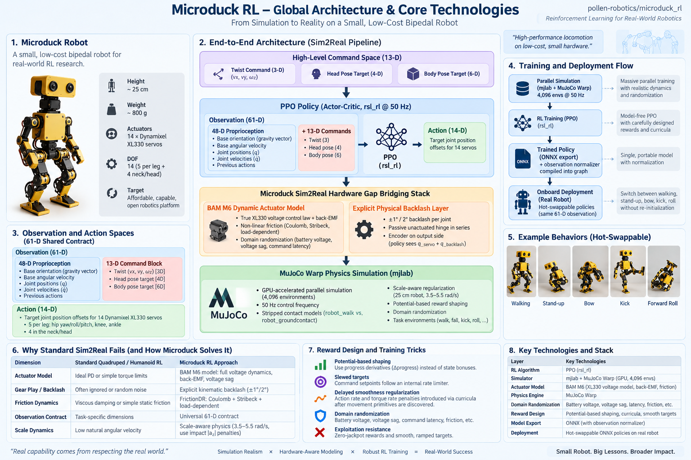

# Supplied Microduck RL Architecture Infographic

Received: 2026-09-21
Status: User-supplied reference image; claims reconciled in the revised studies

The user asked to incorporate elements from this image into related docs.
The image is source material, not an instruction to run training, deploy a
policy, operate hardware or change SeedCore's authority boundary. Its upstream
commit, author and production method were not supplied.

Original title: **Microduck RL – Global Architecture & Core Technologies**.
The image names `pollen-robotics/microduck_rl`, but does not pin a revision.
The preserved PNG is byte-for-byte the supplied attachment:

```text
SHA-256: 8b58ee6d647c4ab8e3a3aef9c5fa1475b36e0966705ad231414dd14794630842
```



## Reading Map

| Image panel | Elements carried into the docs | Destination |
| --- | --- | --- |
| 1. Robot | Approximate dimensions, policy joints versus physical actuators | [Architecture study](../microduck_architecture_study.md) |
| 2. Architecture | Commands, actor observations/actions, actuator model and simulation | [RL study](../microduck_rl_study.md#training-loop-and-deployment-path) |
| 3. Observation/action spaces | 48 + 13 input grouping, 14 outputs, ordering and semantics | [Actor contract](../microduck_rl_study.md#actor-observation-and-action-contract) |
| 4. Training/deployment | Parallel simulation, PPO, normalized ONNX export and runtime handoff | [RL study](../microduck_rl_study.md#evaluation-and-export-handoff) |
| 5. Behaviors | Walking, stand-up, bow, kick and roll with status qualifications | [Behavior families](../microduck_rl_study.md#behavior-families-and-policy-switching) |
| 6. Sim2real comparison | Actuator fidelity, friction, backlash and contact models | [Sim-to-real study](../microduck_rl_study.md#sim-to-real-and-domain-randomization) |
| 7. Training techniques | Progress rewards, gradual targets, curricula and exploitation checks | [Reward design](../microduck_rl_study.md#reward-design-and-training-lessons) |
| 8. Technology stack | mjlab, MuJoCo Warp, PPO/rsl_rl, BAM and ONNX responsibilities | [Stack mapping](../microduck_rl_study.md#training-loop-and-deployment-path) |

## Interpretation Limits

The [source ledger](../microduck_source_ledger.md#architecture-infographic-reconciliation-2026-09-21)
separates supported details, revision-dependent examples and corrections.
In particular, the diagram's 14-actuator shorthand, backlash notation,
generic head/body pose labels and seamless policy switching must not be copied
directly into a hardware or permission contract.

The comparison with “standard” sim2real approaches is explanatory framing,
not a benchmark of all other robotics systems. The image supplies no measured
SeedCore results, policy artifact hashes, hardware qualification or evidence
that a depicted behavior is ready for a customer deployment.
