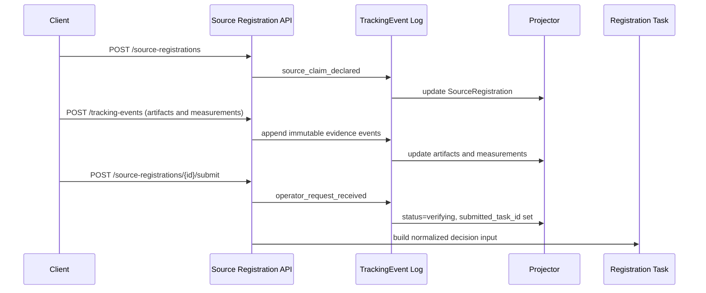

# Source Registration Tracking Event Sequence

This document freezes the minimal step-by-step path from governed ingress to decision input.

## 1. Create registration

Call `POST /api/v1/source-registrations` with the header claim fields:

- `source_claim_id`
- `lot_id`
- `producer_id`
- `rare_grade_profile_id`
- `claimed_origin.altitude_meters`
- `collection_site`
- `collected_at`

This creates the `SourceRegistration` row and projects the initial `source_claim_declared` event.

## 2. Add evidence

Call `POST /api/v1/tracking-events` for each artifact and measurement event.

Required happy-path evidence for policy evaluation:

- artifacts: `honeycomb_macro_image`, `seal_macro_image`
- measurements: `oxygen_level`, `humidity`, `gps`, `pollen_count`, `purity_score`, `spectral_match_score`

Projection rules:

- artifact events populate `SourceRegistrationArtifact`
- measurement events populate `SourceRegistrationMeasurement`
- duplicate telemetry replays do not create duplicate measurement rows
- GPS evidence carries `lat`, `lon`, and `altitude_meters` at the top level and in `metadata`

## 3. Submit for decision

Call `POST /api/v1/source-registrations/{registration_id}/submit`.

This:

- records an `operator_request_received` submit event
- moves the registration to `verifying`
- links `submitted_task_id`
- builds normalized decision input from deterministically ordered artifacts, measurements, and tracking events

## Reference fixtures

- happy path create payload: `examples/source_registration_tracking_events/happy_path.create_registration.json`
- happy path tracking events: `examples/source_registration_tracking_events/happy_path.tracking_events.json`
- deny path create payload: `examples/source_registration_tracking_events/deny_path.create_registration.json`
- deny path tracking events: `examples/source_registration_tracking_events/deny_path.tracking_events.json`

